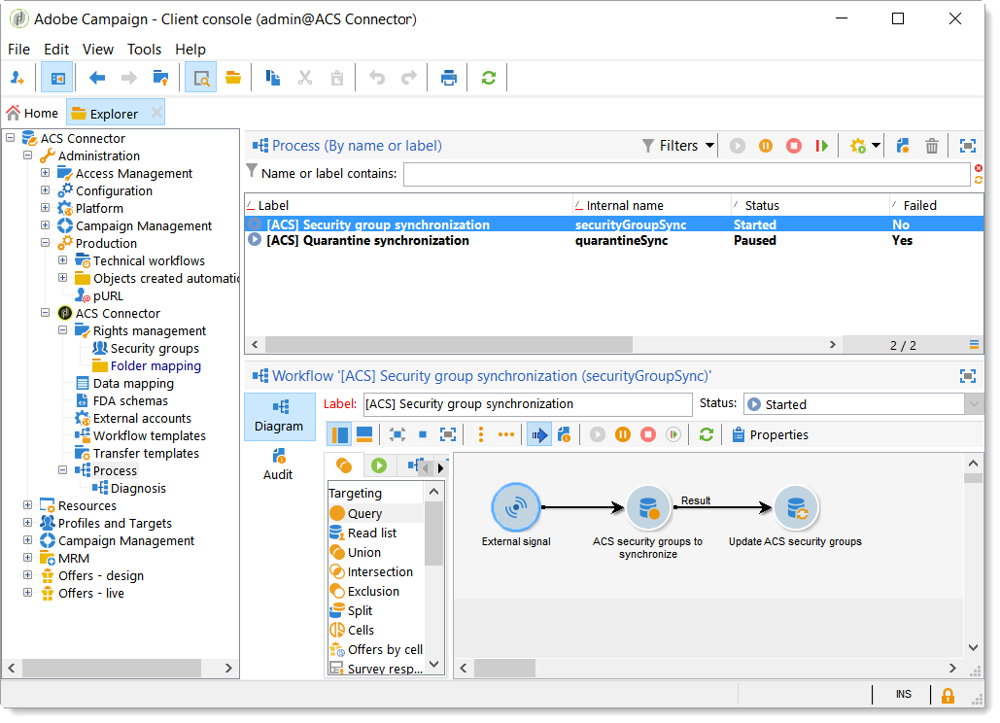

# ACS Connector原理和資料週期{#acs-connector-principles-and-data-cycle}

## 簡介 {#introduction}

ACS Connector橋接器Adobe Campaign v7和Adobe Campaign Standard。 這是Campaign v7中的整合功能，可自動將資料複製到Campaign Standard，將兩個應用程式的最佳功能結合在一起。 Campaign v7提供進階工具，可管理主要行銷資料庫。 從Campaign v7進行資料復寫，可讓Campaign Standard在方便使用的環境中運用豐富的資料。

有了ACS Connector，數位行銷人員會繼續使用Campaign Standard來設計、鎖定和執行行銷活動，而Campaign v7是專為資料導向的使用者（例如資料庫行銷人員）量身打造。

>[!IMPORTANT]
>
>ACS Connector僅隨附於Adobe Campaign Prime產品。 如需如何授權Adobe Campaign Prime的詳細資訊，請連絡您的客戶經理。
>
>ACS Connector僅適用於托管和混合體系結構。 它不適用於完整的內部部署安裝。
>
>若要使用此功能，您必須使用Adobe ID(IMS)連線至Campaign。 請參閱 [透過Adobe ID連線](../../integrations/using/about-adobe-id.md).

本文檔介紹ACS連接器功能。 以下各節提供了有關功能如何複製資料的資訊，以及如何使用已複製配置檔案的說明。

* [程式](#process):ACS Connector概述及資料復寫的管理方式。
* [實作](#implementation):概述如何開始使用ACS Connector，以及如何複製基本和高級資料的說明。
* [同步設定檔](../../integrations/using/synchronizing-profiles.md):如何復寫設定檔以及如何使用設定檔建立傳送的指示。
* [同步受眾](../../integrations/using/synchronizing-audiences.md):有關如何在Campaign v7中定位收件者清單，然後複製清單以Campaign Standard為對象的說明。
* [同步Web應用程式](../../integrations/using/synchronizing-web-applications.md):如何將Campaign v7網頁應用程式連結至Campaign Standard的說明。
* [疑難排解ACS連接器](../../integrations/using/troubleshooting-the-acs-connector.md):查看常見問題的解答。

>[!NOTE]
>
>根據授權合約，ACS Connector隨Campaign v7一併提供。 若要使用ACS Connector，請確定您可以在Campaign v7和Campaign Standard之間切換。 如果您不確定版本及其隨附的功能，請聯絡您的管理員。

## 程序 {#process}

### 資料複製 {#data-replication}

ACS Connector會定期從Campaign v7複製以下項目到Campaign Standard:

* **收件者**
* **訂閱**
* **服務**
* **登陸頁面**

預設情況下，ACS Connector的定期複製為每15分鐘一次。 定期複製的跨度可以根據您的需求進行調整。 如果需要變更，請聯絡您的顧問。

收件者、訂閱、服務和登錄頁面的資料復寫是增量式的，這表示只有新收件者和對現有收件者的修改會從Campaign v7複製到Campaign Standard。 不過，對象的復寫會在單一例項中發生。 您可以在Campaign v7中建立受眾，然後複製一次以進行Campaign Standard。 復寫是立即的，無法配置以進行定期更新。 如需指示，請參閱 [同步受眾](../../integrations/using/synchronizing-audiences.md).

>[!NOTE]
>
>請耐心等待大型資料庫的初始複製，因為它可能需要數小時。 但是，後續複製是增量的，而且速度要快得多。

ACS Connector會定期從Campaign Standard複製到Campaign v7:

* **[!UICONTROL Delivery IDs]**
* **[!UICONTROL Email broad logs]**
* **[!UICONTROL Email tracking logs]**

復寫傳送ID和電子郵件記錄檔可讓您從Campaign v7存取v7收件者的傳送歷史記錄和追蹤資料。

>[!IMPORTANT]
>
>只有電子郵件廣播和追蹤記錄會從Campaign Standard複製到Campaign v7。

### 資料同步 {#data-synchronization}

ACS連接器會同步Campaign v7和Campaign Standard之間的隔離。

例如，從Campaign v7複製到Campaign Standard的設定檔包含電子郵件地址。 如果電子郵件地址被Campaign Standard隔離，則資料會在下次同步期間傳遞至Campaign v7。 如需隔離的詳細資訊，請參閱 [隔離管理](../../delivery/using/understanding-quarantine-management.md) 和 [Campaign Standard隔離](https://experienceleague.adobe.com/docs/campaign-standard/using/testing-and-sending/monitoring-messages/understanding-quarantine-management.html).

### 使用複製的配置檔案 {#using-replicated-profiles}

Campaign Standard和促銷活動v7可使用復寫的設定檔來定位行銷活動中的工作流程。

有關如何使用複製的配置檔案在Campaign Standard中發送傳送的說明，請參見 [同步設定檔](../../integrations/using/synchronizing-profiles.md). 提供其他指示，說明如何在Campaign v7和Campaign Standard之間共用取消訂閱資料。

### 限制 {#limitations}

複製的設定檔可供傳送，但Campaign Standard有特定限制。 請檢閱下列項目，了解如何妥善管理這些項目。

* **Campaign Standard的唯讀設定檔**:複製的配置檔案在Campaign Standard中為只讀。 不過，您可以在Campaign v7中編輯收件者，修改會由ACS Connector以Campaign Standard方式自動更新。
* **在Campaign Standard中建立的設定檔**:ACS Connector將收件者資料從Campaign v7複製到Campaign Standard。 因此，源自Campaign Standard的設定檔不會復寫至Campaign v7。
* **基本的收件者資料以進行Campaign Standard**:ACS Connector會複製適合Campaign Standard的收件者資料。 它包括收件者的姓名、地址、電子郵件地址、行動電話號碼、家庭電話號碼，以及其他相關聯繫資訊。 如果Campaign v7中可用的其他收件者欄位和自訂定位表格對您的工作流程至關重要，請洽詢您的顧問。
* **匯入隔離的設定檔**:不想聯絡的設定檔清單可匯入至Campaign v7，或以隔離的設定檔Campaign Standard。 設定檔的狀態會包含在應用程式之間的隔離同步中，且不會用於傳送。
* **取消訂閱Campaign Standard中的服務**:從Campaign Standard到Campaign v7不會同步選擇取消訂閱傳送。 不過，您可以設定Campaign Standard傳送，將其取消訂閱連結導向至Campaign v7。 按一下取消訂閱連結的收件者的設定檔會在Campaign v7中更新，且資料會複製到Campaign Standard。 請參閱 [變更取消訂閱連結](../../integrations/using/synchronizing-profiles.md#changing-the-unsubscription-link).
* 只有電子郵件廣播和追蹤記錄會從Campaign Standard複製到Campaign v7。

### 帳單 {#billing}

您要傳送傳遞、Campaign v7或Campaign Standard的應用程式選項不會影響帳單。 帳單資訊可在Campaign v7和Campaign Standard之間調節。 因此，如果您使用這兩個應用程式將傳送給相同的收件者，則仍會計為一個作用中的設定檔。

## 實作 {#implementation}

ACS Connector有兩種實作類型。 兩者皆由Adobe Campaign諮詢團隊執行。

>[!IMPORTANT]
>
>本節內容僅供專家使用者使用，讓他們全面了解實作程式及其主要步驟。
>
>請勿自行嘗試執行任何這些實作。 這一點嚴格保留給Adobe Campaign顧問。

此 **基本實施** 可讓您復寫收件者（現成可用欄位）、服務與訂閱、網頁應用程式和對象。 這是從Campaign v7到Campaign Standard的單向復寫。

此 **進階實作** 將允許您執行更複雜的使用案例，例如，如果您有其他收件者欄位或自訂收件者表格（例如交易表）。 請參閱 [進階實作](#advanced-implementation).

### 安裝套件 {#installing-the-package}

若要使用功能，請 **[!UICONTROL ACS Connector]** 需要安裝軟體包。 這一律由Adobe技術管理員或顧問執行。

與ACS連接器相關的所有技術元素均可在 **[!UICONTROL Administration > ACS Connector]** 瀏覽器的節點。

### 技術和復寫工作流程 {#technical-and-replication-workflows}

安裝套件後，以下提供兩個技術工作流程： **[!UICONTROL Administration > ACS Connector > Process]**.

>[!IMPORTANT]
>
>請勿嘗試修改這些工作流程。 它們絕不應出錯或暫停。 若發生此情況，請聯絡您的Adobe Campaign顧問。

* **[!UICONTROL `[ACS] Quarantine synchronization`]** (quarantineSync):此工作流程會同步所有隔離資訊。 Campaign v7中的所有新隔離區都會複製到Campaign Standard。 所有與Campaign Standard的新隔離都會複製到Campaign v7。 這可保證所有排除規則都在Campaign v7和Campaign Standard之間同步。
* **[!UICONTROL `[ACS] Security group synchronization`]** (securityGroupSync):此工作流程用於權限轉換。 請參閱 [權限轉換](#rights-conversion).

以下復寫工作流程可作為「可供使用」範本使用。 這些建議必須由您的Adobe Campaign顧問實作。

* **[!UICONTROL `[ACS] Profile replication`]** (newProfileReplication):此增量工作流將收件人複製到Campaign Standard。 依預設，它會複製所有現成可用的收件者欄位。 請參閱 [預設收件者欄位](#default-recipient-fields).
* **[!UICONTROL `[ACS] Service replication`]** (newServiceReplication):此增量工作流將所選服務複製到Campaign Standard。 請參閱使用案例 [同步Web應用程式](../../integrations/using/synchronizing-web-applications.md).
* **[!UICONTROL `[ACS] Landing pages replication`]** (newLandingPageReplication):此增量工作流將選定的Web應用程式複製到Campaign Standard。 Campaign v7網頁應用程式將顯示為Campaign Standard中的登錄頁面。 請參閱使用案例 [同步Web應用程式](../../integrations/using/synchronizing-web-applications.md).
* **[!UICONTROL `[ACS] New replication`]** (newReplication):此增量工作流是可用於複製自定義表的示例。 請參閱 [進階實作](#advanced-implementation).
* **[!UICONTROL `[ACS] Delivery-message replication`]** (newDlvMsgQualification):此增量工作流程會將傳遞訊息從Campaign Standard複製到Campaign v7。
* **[!UICONTROL `[ACS] Profile delivery log replication`]** (newRcpDeliveryLogReplication):此增量工作流程會將傳送ID、電子郵件廣泛記錄和電子郵件追蹤記錄檔從Campaign Standard複製到Campaign v7。 它只會考量從Campaign Standard傳送至屬於Campaign v7之nms:recipients表格一部分之設定檔的傳送。
* **[!UICONTROL `[ACS] New delivery log replication`]** (newRcpDeliveryLogReplication):此增量工作流程會將傳送ID、電子郵件廣泛記錄和電子郵件追蹤記錄檔從Campaign Standard複製到Campaign v7。 它只考慮從Campaign Standard傳送至屬於Campaign v7特定表格一部分的設定檔（以定義nms:recipients以外的內容）的傳送。

### 預設收件者欄位 {#default-recipient-fields}

如果您有任何其他欄位或自訂表（例如，交易表），預設情況下將不會複製這些欄位或自訂表。 需要執行進階設定。 請參閱 [進階實作](#advanced-implementation).

您會在下方找到隨基本實施複製的收件者欄位清單。 這些是現成可用的欄位：

<table> 
 <tbody> 
  <tr> 
   <td> <strong>標籤</strong>  </td> 
   <td> <strong>內部名稱</strong>  </td> 
  </tr> 
  <tr> 
   <td> 來源Id  </td> 
   <td> @sourceId  </td> 
  </tr> 
  <tr> 
   <td> 建立日期  </td> 
   <td> @created  </td> 
  </tr> 
  <tr> 
   <td> 修改日期  </td> 
   <td> @lastModified  </td> 
  </tr> 
  <tr> 
   <td> 電子郵件  </td> 
   <td> @email  </td> 
  </tr> 
  <tr> 
   <td> 姓氏  </td> 
   <td> @lastName  </td> 
  </tr> 
  <tr> 
   <td> 名字  </td> 
   <td> @firstName  </td> 
  </tr> 
  <tr> 
   <td> 中間名  </td> 
   <td> @middleName  </td> 
  </tr> 
  <tr> 
   <td> 行動裝置  </td> 
   <td> @mobilePhone  </td> 
  </tr> 
  <tr> 
   <td> 出生日期  </td> 
   <td> @birthDate  </td> 
  </tr> 
  <tr> 
   <td> 性別  </td> 
   <td> @gender  </td> 
  </tr> 
  <tr> 
   <td> 稱呼  </td> 
   <td> @salutation  </td> 
  </tr> 
  <tr> 
   <td> 不再聯絡（透過任何管道）  </td> 
   <td> @blackList  </td> 
  </tr> 
  <tr> 
   <td> 不再透過電子郵件聯絡  </td> 
   <td> @blackListEmail  </td> 
  </tr> 
  <tr> 
   <td> 不再透過簡訊聯絡。  </td> 
   <td> @blackListMobile  </td> 
  </tr> 
  <tr> 
   <td> 電話  </td> 
   <td> @phone  </td> 
  </tr> 
  <tr> 
   <td> 傳真  </td> 
   <td> @fax  </td> 
  </tr> 
  <tr> 
   <td> 地址1（公寓）  </td> 
   <td> [位置/@address1]  </td> 
  </tr> 
  <tr> 
   <td> 地址2  </td> 
   <td> [位置/@address2]  </td> 
  </tr> 
  <tr> 
   <td> 地址3（數字和街道）  </td> 
   <td> [位置/@address3]  </td> 
  </tr> 
  <tr> 
   <td> 地址4（縣）  </td> 
   <td> [位置/@address4]  </td> 
  </tr> 
  <tr> 
   <td> 郵遞區號  </td> 
   <td> [位置/@zipCode]  </td> 
  </tr> 
  <tr> 
   <td> 城市  </td> 
   <td> [位置/@city]  </td> 
  </tr> 
  <tr> 
   <td> 州/省代碼  </td> 
   <td> [位置/@stateCode]  </td> 
  </tr> 
  <tr> 
   <td> 國家/地區代碼  </td> 
   <td> [位置/@countryCode]  </td> 
  </tr> 
 </tbody> 
</table>

### 權限轉換 {#rights-conversion}

在Campaign v7和Campaign Standard中，權限的處理方式不同。 在Campaign v7中，權限管理是以資料夾為基礎，而在Campaign Standard中，權限管理則是以單位存取（組織/地理單位）為基礎。 Campaign Standard用戶屬於包含限制上下文的安全組。 因此，必須轉換Campaign v7權限系統，才能符合Campaign Standard。 執行權限轉換有數種方式。 您會在下方找到實作的範例。

1. 在 **[!UICONTROL Administration > ACS Connector > Rights management > Security groups]**，請使用 **[!UICONTROL Synchronize]** 按鈕，檢索所有Campaign Standard安全組。 會排除現成可用的Campaign Standard群組。

   

1. 如果您的權限管理是基於資料夾的，請轉至 **[!UICONTROL Administration > ACS Connector > Rights management > Folder mapping]** 並將每個需要的資料夾與安全群組對應。

   

1. 然後，復寫工作流程將使用此資訊，並將對應的組織/地理單位新增至要復寫的每個物件。

### 進階實作 {#advanced-implementation}

本節將說明進階實作的一些可能性。

>[!IMPORTANT]
>
>此資訊只能用作一般准則。 請洽詢您的Adobe Campaign顧問以進行實作。

進階實作會根據客戶需求，新增自訂復寫工作流程。 以下是一些範例：

* 傳遞復寫
* 行銷活動復寫
* 程式複製
* 種子成員複製
* 異動復寫
* 等。

**在收件者上復寫延伸欄位**

在基本實作中，會複製現成可用的收件者欄位。 如果要複製已新增至收件者結構的自訂欄位，則需加以識別。

1. 在 **[!UICONTROL Administration > ACS Connector > Data mapping]**，請在 **[!UICONTROL nms:recipient]** 表格。

   

1. 選擇要複製的其他欄位和其他需要的資訊（索引、連結、標識鍵）。

   

1. 開啟專用的設定檔復寫工作流程（不是範本，而是工作流程例項本身）。 修改 **[!UICONTROL Query]** 和 **[!UICONTROL Update data]** 活動以包含這些欄位。 請參閱 [技術和復寫工作流程](#technical-and-replication-workflows).

   

   

**複製自訂設定檔表格**

在基本實作中，會複製現成可用的收件者表格。 如果您新增自訂收件者表格，以下是您識別表格的方式。

1. 在 **[!UICONTROL Administration > ACS Connector > Data mapping]**，請在自訂設定檔表格上建立定位對應。

   

1. 定義要複製的標識資料、索引、連結和欄位。

   

1. 如果您的權限管理是以資料夾為基礎，請前往 **[!UICONTROL Administration > ACS Connector > Rights management > Folder mapping]**，並為連結至自訂表格的資料夾定義安全性群組。 請參閱 [權限轉換](#rights-conversion).
1. 使用 **[!UICONTROL New replication]** 包含自訂表格和要復寫的欄位的工作流程（非範本，而是工作流程例項本身）。 請參閱 [技術和復寫工作流程](#technical-and-replication-workflows).
