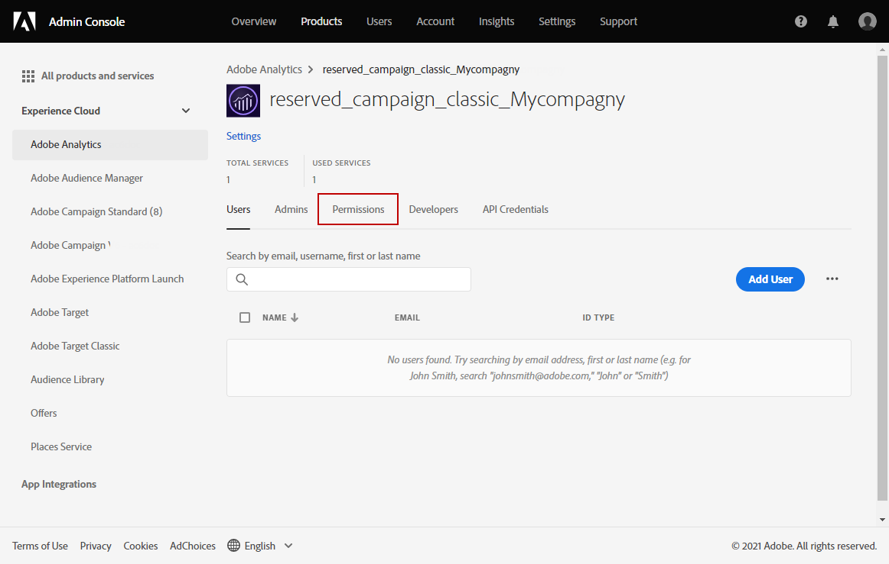
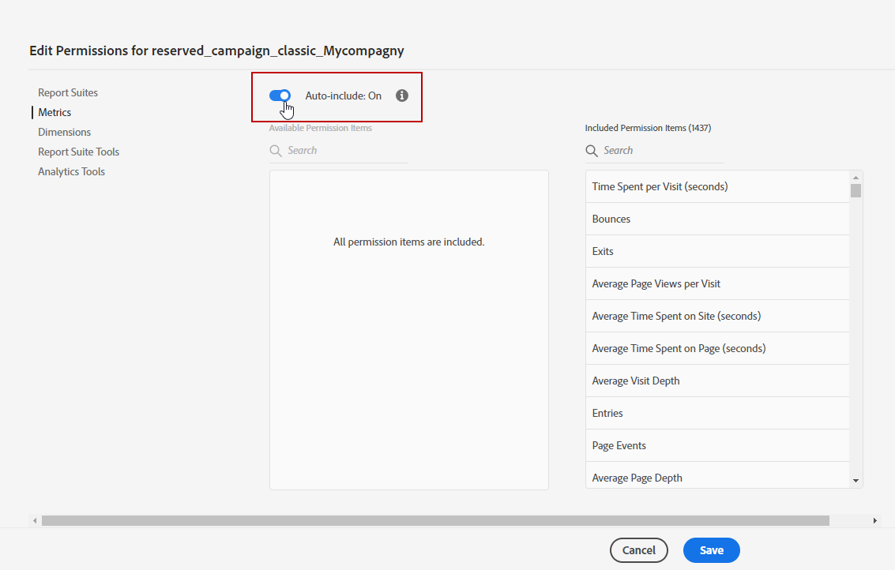

# Adobe Analytics 連接器佈建 {#adobe-analytics-connector-provisioning}

>[!CAUTION]
>
> 這些步驟應該只能由混合及內部部署實作來執行。
>
>針對託管和促銷活動Managed Services實作，請聯絡[Adobe客戶服務](https://helpx.adobe.com/tw/enterprise/admin-guide.html/enterprise/using/support-for-experience-cloud.ug.html)團隊。

Adobe Campaign Classic與Adobe Analytics驗證之間的整合可支援Adobe Identity Management服務(IMS)：

* 如果您管理已移轉的外部帳戶，您必須實作Adobe IMS並透過Adobe ID連線至Adobe Campaign。

  請注意，通過 IMS 登錄Adobe ID用戶必須是 Adobe Analytics 中帳戶的數據連接器的&#x200B;**擁有者，並且具有下面](#analytics-product-profile)提到的[產品設定檔**&#x200B;的許可權&#x200B;**。**

問題是数据連接器的所有者與登錄到Campaign並嘗試與Analytics集成的用戶不同用戶。

* 如果您要實作新的連接器，則Adobe Systems IMS 是選用的。 如果沒有Adobe ID使用者，Adobe Campaign將使用技術用戶來同步Adobe Analytics。

要使此集成正常工作，您必須創建一個將專門用於Analytics連接器的Adobe Analytics產品設定檔。 然後，需要創建開發人員控制台專案。

>[!AVAILABILITY]
>
> Adobe Systems將棄用服務帳戶 （JWT） 憑據，Campaign與Adobe Systems解決方案和應用的集成現在必須依賴 OAuth 伺服器到伺服器憑據。 
>
> * 如果您已實作與Campaign的傳入整合，您必須移轉您的技術帳戶，如[本檔案](https://developer.adobe.com/developer-console/docs/guides/authentication/ServerToServerAuthentication/migration/#_blank)所詳述。 現有 [服務帳戶 （JWT） 憑據](oauth-technical-account.md) 將繼續工作，直到 2025 年 6 月 30 日。 
>
> * 如果您已實作傳出整合(例如Campaign-Analytics整合或Experience Cloud Triggers整合)，則這些整合要到2025年6月30日才會停止運作。 不過，在該日期之前，您必須將您的Campaign環境升級至v7.4.1，並將您的技術帳戶移轉至OAuth。

## 建立Adobe Analytics產品設定檔 {#analytics-product-profile}

產品設定檔可決定使用者對不同Analytics元件的存取層級。

如果您已有Analytics產品配置檔，則仍應創建一個專門用於Analytics連接器的新Adobe Analytics產品設定檔。 這會確保您的產品設定檔為此整合設定正確的許可權。

如需產品配置檔的詳細資訊，請參閱 [管理控制面板檔](https://helpx.adobe.com/mt/enterprise/admin-guide.html)。

1. [在管理主控台](https://adminconsole.adobe.com/)中，選擇您的Adobe Analytics **[!UICONTROL Product]**。

   

1. 按一下&#x200B;**[!UICONTROL New Profile]**。

   

1. **[!UICONTROL Product profile name]**&#x200B;添加 ，我們建議使用以下語法：`reserved_campaign_classic_<Company Name>`。然後，按下 **[!UICONTROL Next]**。

   此&#x200B;**[!UICONTROL Product profile]**&#x200B;應專用於Analytics Connector，以防止設定錯誤錯誤。

1. 開啟您新建立的&#x200B;**[!UICONTROL Product profile]**&#x200B;並選取&#x200B;**[!UICONTROL Permissions]**&#x200B;標籤。

   

1. 按一下「**[!UICONTROL Edit]**」設定不同的功能，並按一下加號(+)圖示來選取要指派給您&#x200B;**[!UICONTROL Product profile]**&#x200B;的許可權。

   有關如何管理許可權的詳細資訊，請參閱[Admin Console檔案](https://helpx.adobe.com/mt/enterprise/using/manage-permissions-and-roles.html)。

1. 針對&#x200B;**[!UICONTROL Report Suites]**&#x200B;功能，新增您稍後需要使用的&#x200B;**[!UICONTROL Report Suites]**。

   如果您沒有任何報表套裝，可以按照以下步驟建立報表套裝。

   

1. 針對該功能 **[!UICONTROL Metrics]** ，請添加稍後需要配置的 **[!UICONTROL Metrics]** 。

   如果需要，您可以打開包含自動選項，該選項會將每個許可權項添加到包含的清單中，並自動添加新的權限項。

   

1. 針對該功能 **[!UICONTROL Dimensions]** ，請添加 **[!UICONTROL Dimensions]** 將來配置所需的內容。

   確保選擇的維度與要在外部帳戶中配置的維度匹配，並與 Adobe Analytics 中的相應 eVar 編號保持一致。

1. 針對該功能 **[!UICONTROL Report Suite Tools]** ，請添加以下許可權：

   * **[!UICONTROL Report suite Mgmt]**
   * **[!UICONTROL Conversion variables]**
   * **[!UICONTROL Success events]**
   * **[!UICONTROL Custom data Warehouse report]**
   * **[!UICONTROL Data sources manager]**
   * **[!UICONTROL Classifications]**

1. 針對&#x200B;**[!UICONTROL Analytics Tools]**&#x200B;功能，新增下列許可權：

   * **[!UICONTROL Code Manager - Web services]**
   * **[!UICONTROL Logs - Web services]**
   * **[!UICONTROL Web services]**
   * **[!UICONTROL Web service access]**
   * **[!UICONTROL Calculated metric creation]**
   * **[!UICONTROL Segment creation]**

您的產品設定檔現已設定完成。 然後，您需要建立OAuth專案。

## 建立Oauth專案 {#create-adobe-io}

若要繼續設定Adobe Analytics聯結器，請存取Adobe Developer主控台並建立您的OAuth伺服器對伺服器專案。

有關詳細文檔，請參閱 [此頁面](oauth-technical-account.md#oauth-service) 。

## 設定與使用 {#adobe-analytics-connector-usage}

在[Adobe Campaign v8檔案](https://experienceleague.adobe.com/en/docs/campaign/campaign-v8/connect/ac-aa){target="_blank"}中瞭解如何使用Adobe Campaign和Adobe Analytics。