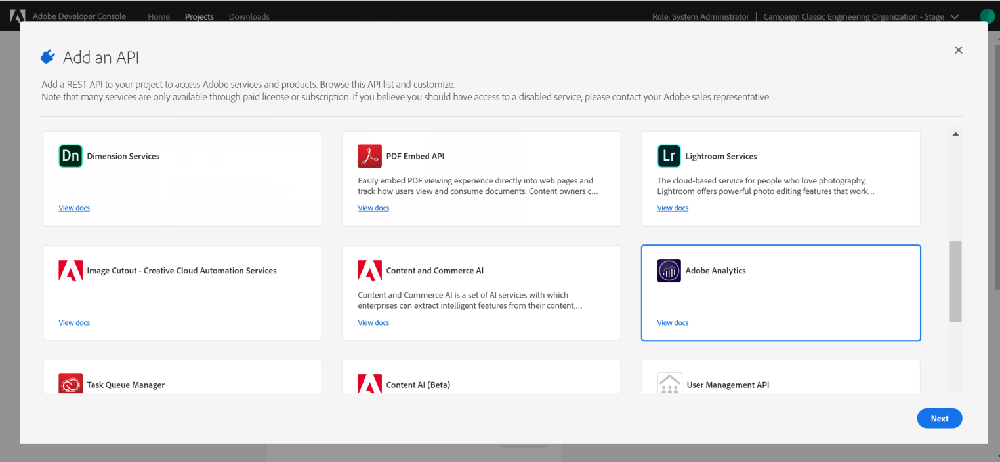

# 為Adobe Experience Cloud觸發器設定Adobe I/O {#configuring-adobe-io}

## 必要條件 {#adobe-io-prerequisites}

開始此實作前，請檢查您有：

* Adobe Campaign的最新版本：19.1.8或20.2.1版及更高版本，
* 有效的IMSOrgID:身分管理系統(IMS)組織識別碼是Adobe Experience Cloud中的唯一識別碼，尤其用於VisitorID服務和IMS單一登入(SSO),
* a開發人員存取IMS組織。

>[!NOTE]
>
>如果您需要請求IMS組織的系統管理員權限，請依照本頁中詳細 [的程式](https://helpx.adobe.com/ca/enterprise/admin-guide.html/ca/enterprise/using/manage-developers.ug.html) ，為所有產品設定檔提供此存取權。


## 步驟1:建立／更新Adobe I/O專案 {#creating-adobe-io-project}

1. 存取Adobe I/O，並與系統管理員登入IMSorg。

   >[!NOTE]
   >
   > 請確定您已登入正確的IMSorg入口網站。

1. 從例項設定檔案ims/authIMSTAClientId擷取現有整合用戶端ID。 非現有或空屬性表示未配置客戶端ID。

   >[!NOTE]
   >
   >如果您的用戶端ID是空的，您可以直接 **[!UICONTROL Create a New project]** 在Adobe I/O中使用。

1. 使用擷取的用戶端ID來識別現有專案。 尋找與前一步驟中擷取的用戶端ID相同的現有專案。

   

1. 選擇 **[!UICONTROL + Add to Project]** 並選擇 **[!UICONTROL API]**。

   

1. In the **[!UICONTROL Add an API]** window, select **[!UICONTROL Adobe Analytics]**.

   

1. 選擇 **[!UICONTROL Service Account (JWT)]** 作為驗證類型。

   

1. 如果您的用戶端ID為空，請選 **[!UICONTROL Generate a key pair]** 取以建立公用和私用鑰匙對。

   

1. 上傳您的公開金鑰，然後按一下 **[!UICONTROL Next]**。

   

1. 選擇名為 **Analytics-&lt;組織名稱>的產品設定檔** ，然後按一下 **[!UICONTROL Save configured API]**。

   

1. 從您的專案中，選 **[!UICONTROL Service Account (JWT)]** 取並複製下列資訊：
   * **[!UICONTROL Client ID]**
   * **[!UICONTROL Client Secret]**
   * **[!UICONTROL Technical account ID]**
   * **[!UICONTROL Organization ID]**

   

## 步驟2:在Adobe Campaign中新增專案認證 {#add-credentials-campaign}

若要在Adobe Campaign中新增專案認證，請在Adobe Campaign例項的所有容器上，以&#39;neolane&#39;使用者身分執行下列命令，將認證插入 **[!UICONTROL Technical Account]** 例項設定檔案中。

```
nlserver config -instance:<instance name> -setimsjwtauth:Organization_Id/Client_Id/Technical_Account_ID[/Client_Secret[/Base64_encoded_Private_Key]]
```

>[!NOTE]
>
>您應將私密金鑰編碼為base64 UTF-8格式。 請記得在編碼新行之前，先從索引鍵中移除新行，但私密金鑰除外。 私密金鑰必須與用來建立整合的金鑰相同。

## 步驟3:更新流水線標籤 {#update-pipelined-tag}

若要更 [!DNL pipelined] 新標籤，您必須在設定檔 **config-&lt; instance-name >.xml中，將驗證類型更新為Adobe I/O專案，如下所示** :

```
<pipelined ... authType="imsJwtToken"  ... />
```

>[!NOTE]
>
>如果您使用舊版的「觸發器整合」使用舊版JWT Token，您也應新增Adobe I/O API，以在第一步中詳細說明，以自動移轉至新的「觸發器驗證」。 [!DNL Adobe Analytics]
