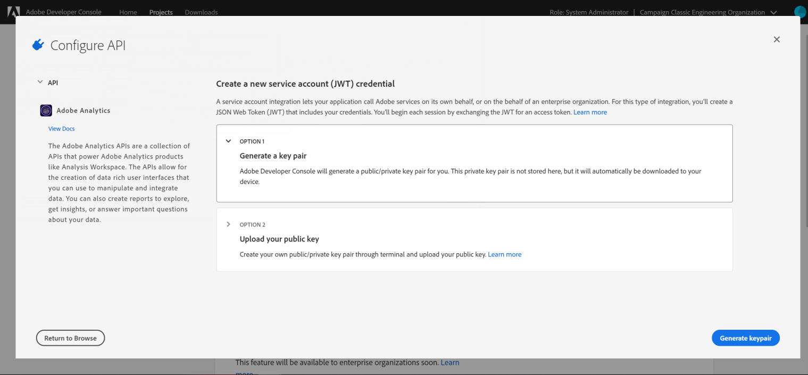

# 為 Adobe Experience Cloud 觸發器配置 Adobe I/O {#configuring-adobe-io}

>[!CAUTION]
>
>如果您使用舊版的觸發器整合（透過oAuth驗證）,**您必須依照**&#x200B;下方所述移至Adobe I/O。 舊版驗證模式將於 2021 年 4 月 30 日淘汰。[進一步了解](https://experienceleaguecommunities.adobe.com/t5/adobe-analytics-discussions/adobe-analytics-legacy-api-end-of-life-notice/td-p/385411)
>
>請注意，在此移至Adobe I/O期間，某些傳入的觸發器可能會遺失。

## 必要條件 {#adobe-io-prerequisites}

此整合僅適用於&#x200B;**Campaign Classic20.3、20.2.4、19.1.8和Gold Standard 11版本**&#x200B;的起始版本。

開始此實作前，請檢查您有：

* 有效的&#x200B;**組織識別碼**:Identity Management系統(IMS)組織識別碼是Adobe Experience Cloud內的唯一識別碼，用於VisitorID服務和IMS單一登入(SSO)。 [進一步了解](https://experienceleague.adobe.com/docs/core-services/interface/manage-users-and-products/organizations.html)
* a **您組織的開發人員存取權**。  如果您需要申請IMS組織的系統管理員權限，請依照本頁](https://helpx.adobe.com/enterprise/admin-guide.html/enterprise/using/manage-developers.ug.html)中詳細說明的程式，為所有產品設定檔提供此存取權。[

## 步驟1:建立／更新Adobe I/O項目{#creating-adobe-io-project}

1. 存取Adobe I/O，並與系統管理員一起登入IMS組織。

   >[!NOTE]
   >
   > 請確定您已登入正確的組織入口網站。

1. 從例項設定檔案ims/authIMSTAClientId擷取現有整合用戶端識別碼（用戶端ID）。 非現有或空屬性表示未配置客戶機標識符。

   >[!NOTE]
   >
   >如果您的客戶識別碼為空，則可以直接在Adobe I/O中&#x200B;**[!UICONTROL Create a New project]**。

1. 使用擷取的用戶端識別碼來識別現有專案。 尋找與上一步驟中擷取的用戶端識別碼相同的現有專案。

   

1. 選擇&#x200B;**[!UICONTROL + Add to Project]**&#x200B;並選擇&#x200B;**[!UICONTROL API]**。

   

1. 在&#x200B;**[!UICONTROL Add an API]**&#x200B;窗口中，選擇&#x200B;**[!UICONTROL Adobe Analytics]**。

   

1. 選擇&#x200B;**[!UICONTROL Service Account (JWT)]**&#x200B;作為驗證類型。

   

1. 如果您的客戶端ID為空，請選擇&#x200B;**[!UICONTROL Generate a key pair]**&#x200B;以建立公用密鑰對和專用密鑰對。

   

1. 上傳您的公開金鑰，然後按一下&#x200B;**[!UICONTROL Next]**。

   

1. 選擇名為&#x200B;**Analytics-&lt;組織名稱>**&#x200B;的產品設定檔，然後按一下&#x200B;**[!UICONTROL Save configured API]**。

   

1. 從您的專案中，選擇&#x200B;**[!UICONTROL Service Account (JWT)]**&#x200B;並複製下列資訊：
   * **[!UICONTROL Client ID]**
   * **[!UICONTROL Client Secret]**
   * **[!UICONTROL Technical account ID]**
   * **[!UICONTROL Organization ID]**

   

>[!CAUTION]
>
>Adobe I/O憑證將於12個月後到期。 您每年需要產生新的索引鍵對。

## 步驟2:在Adobe Campaign添加項目憑據{#add-credentials-campaign}

要在Adobe Campaign添加項目憑據，請以「neolane」用戶身份在Adobe Campaign實例的所有容器上運行以下命令，以在實例配置檔案中插入&#x200B;**[!UICONTROL Technical Account]**&#x200B;憑據。

```
nlserver config -instance:<instance name> -setimsjwtauth:Organization_Id/Client_Id/Technical_Account_ID/<Client_Secret>/<Base64_encoded_Private_Key>
```

>[!NOTE]
>
>您應將私密金鑰編碼為base64 UTF-8格式。 請記得在編碼索引鍵之前，先從索引鍵中移除新行，私密金鑰除外。 私密金鑰必須與用來建立整合的金鑰相同。 若要測試私密金鑰的base64編碼，您可使用[此網站](https://www.base64encode.org/)。

## 步驟3:更新流水線標籤{#update-pipelined-tag}

若要更新[!DNL pipelined]標籤，您需要將驗證類型更新為Adobe I/O配置檔案&#x200B;**config-&lt; instance-name >.xml**&#x200B;中的項目，如下所示：

```
<pipelined ... authType="imsJwtToken"  ... />
```
