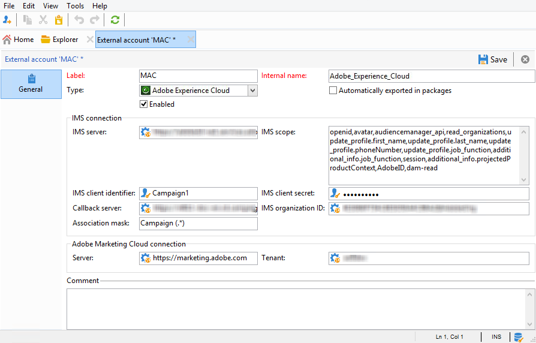

# 設定IMS{#configuring-ims}

## 必要條件 {#prerequisites}

若要使用與IMS的整合：

* 您必須擁有Adobe Experience Cloud組織和IMS ID（在您首次連線至Adobe Experience Cloud時提供）。
* 您必須在Experience Cloud中新增使用者。 有關詳細資訊，請參見[此頁面](https://docs.adobe.com/content/help/en/core-services/interface/manage-users-and-products/admin-getting-started.html)。

>[!NOTE]
>
>請確定您的使用者已連結至將與Adobe Campaign同步的Adobe Experience Cloud群組。 請參閱 [設定外部帳戶](#configuring-the-external-account)。

## 更新控制台 {#updating-the-console}

若要使用此功能，您必須安裝最新版本的主控台。

## 安裝軟體包 {#installing-the-package}

您必須安裝此 **[!UICONTROL Integration with the Adobe Experience Cloud]** 套件。 安裝整合套件與安裝標準套件相同，本頁將詳述 [此點](../../installation/using/installing-campaign-standard-packages.md)。

## 設定外部帳戶 {#configuring-the-external-account}

在中設 **定Adobe Experience Cloud外部** 帳戶 **[!UICONTROL Administration > Platform > External accounts]**。

>[!CAUTION]
>
>此配置將保留給技術管理員。

輸入以下資訊：

* 使用之IMS伺服器的連線資訊（ID和機密）。 這項資訊由Adobe支援提供。 如需詳細資訊，請參閱Adobe Experience Cloud管 [理員的常見問答集](https://docs.adobe.com/content/help/en/core-services/interface/manage-users-and-products/faq.html)。

   必須 **[!UICONTROL Callback server]** 在https中指定 **地址**。 此欄位對應您Adobe Campaign例項的存取URL。

* IMS組織ID:此資訊可在Experience Cloud(在 **[!UICONTROL Administration > Experience Cloud Details]** )上取得，並在您首次連線至Adobe Experience Cloud時提供。
* 關聯遮色片：此欄位可讓您定義語法，讓Enterprise Dashboard中的設定名稱與Adobe Campaign中的群組同步。 如果您使用語法「Campaign - tenant_id -(.*)」，則在Adobe Campaign中建立的安全性群組將會連結至Enterprise Dashboard中的設定名稱「Campaign - tenant_id - internal_name」。

   >[!CAUTION]
   >
   >關聯遮色片是透過Adobe ID進行連線以正確運作的必備工具。

* Adobe Experience Cloud連線資訊，尤其是Adobe Experience Cloud租用戶的名稱。

