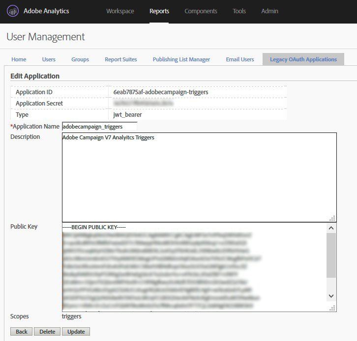

# 配置管線 {#configuring-pipeline}

驗證參數（如客戶ID、私密金鑰和驗證端點）是在實例配置檔案中配置的。
要處理的觸發器清單在選項中配置。 它是JSON格式。
觸發器會使用Javascript程式碼立即處理。 它被保存到資料庫表中，不需要即時進行進一步處理。
觸發程式可用於透過傳送電子郵件的促銷活動工作流程進行定位。 促銷活動已設定，讓同時具有觸發事件的客戶收到電子郵件。

## 必要條件 {#prerequisites}

在促銷 [!DNL Experience Cloud Triggers] 活動中使用需要：

* Adobe Campaign 6.11版組建版本8705或更新版本。
* Adobe Analytics Ultimate、Premium、Foundation、OD、Select、Prime、Mobile Apps、Select或Standard。

先決條件配置包括：

* 建立私密金鑰檔案，然後建立以該金鑰註冊的oAuth應用程式。
* 在Adobe Analytics中設定觸發器。

Adobe Analytics設定不在本檔案的範圍內。

Adobe Campaign需要Adobe Analytics提供下列資訊：

* oAuth應用程式的名稱。
* IMSOrgId,Experience Cloud客戶的識別碼。
* Analytics中設定的觸發器名稱。
* 要與Marketing資料庫協調的資料欄位的名稱和格式。

此組態的一部分是自訂開發，需要下列項目：

* 在Adobe Campaign中瞭解JSON、XML和Javascript剖析的使用知識。
* QueryDef和Writer API的使用知識。
* 使用私密金鑰進行加密和驗證的工作概念。

>[!NOTE]
>
>由於編輯JS程式碼需要技術技巧，因此在未取得適當瞭解的情況下，請勿嘗試。 <br>觸發器將保存到資料庫表。 因此，行銷營運商可在定位工作流程中安全地使用觸發資料。

## 驗證和配置檔案 {#authentication-configuration}

由於Pipeline是Adobe Experience Cloud代管，因此需要驗證。
如果Marketing伺服器是內部裝載的，當它登入Pipeline時，必須進行驗證才能建立安全的連線。
它使用一對公鑰和私鑰。 此程式與用戶／密碼的功能相同，只是更加安全。

### IMSOrgId {#imsorgid}

IMSOrgId是Adobe Experience Cloud上客戶的識別碼。
在實例serverConf.xml檔案中，在IMSOrgId屬性下進行設定。
例如：

```
<redirection IMSOrgId="C5E715(…)98A4@AdobeOrg" (…)
```

### 關鍵產生 {#key-generation}

密鑰是一對檔案。 它採用RSA格式，長4096位元組。 它可使用開放原始碼工具（例如OpenSSL）產生。 每次執行工具時，都會隨機產生新的金鑰。
為方便起見，下列步驟如下：

* ```openssl genrsa -out <private_key.pem> 4096```

* ```openssl rsa -pubout -in <private_key.pem> -out <public_key.pem>```

private_key.pem檔案示例：

```
----BEGIN RSA PRIVATE KEY----
MIIEowIBAAKCAQEAtqcYzt5WGGABxUJSfe1Xy8sAALrfVuDYURpdgbBEmS3bQMDb
(…)
64+YQDOSNFTKLNbDd+bdAA+JoYwUCkhFyvrILlgvlSBvwAByQ2Lx
----END RSA PRIVATE KEY----
```

public_key.pem檔案範例：

```
----BEGIN PUBLIC KEY----
MIIBIjANBgkqhkiG9w0BAQEFAAOCAQ8AMIIBCgKCAQEAtqcYzt5WGGABxUJSfe1X
(…)
EwIDAQAB
----END PUBLIC KEY----
```

>[!NOTE]
>
>金鑰不應由PuttyGen產生，OpenSSL是最佳選擇。

### 在Adobe Experience Cloud中建立驗證用戶端 {#oauth-client-creation}

必須在「 > >」下正確的組織帳戶中登入Adobe Analytics，以建立JWT類型的「應 **[!UICONTROL Admin]** 用程 **[!UICONTROL User Management]** 式」 **[!UICONTROL Legacy Oath application]**。

請遵循下列步驟：

1. 選擇 **[!UICONTROL Service Account (JWT Assertion)]**。
1. 輸入 **[!UICONTROL Application Name]**。
1. 註冊 **[!UICONTROL Public key]**。
1. 選擇觸發器的 **[!UICONTROL Scopes]**。

   

1. 按一下 **[!UICONTROL Create]** 並勾選並 **[!UICONTROL Application ID]** 建立 **[!UICONTROL Application Secret]** 的。

   

### Adobe Campaign Classic中的應用程式名稱註冊 {#application-name-registration}

建立的oAuth用戶端的應用程式ID必須在Adobe Campaign中設定。 您可以在流水線式元素中編輯例項設定檔案，尤其是appName屬性來完成此作業。

例如：

```
<pipelined autoStart="true" appName="applicationID" authPrivateKey="@qQf146pexBksGvo0esVIDO(…)"/>
```

### 密鑰加密 {#key-encription}

要供流水線使用，必須加密私鑰。 加密是使用cryptString Javascript函式完成的，且必須與流水線作業在相同的例項上執行。

本頁提供使用JavaScript的私密金鑰加密范 [例](../../integrations/using/pipeline-troubleshooting.md)。

加密的私密金鑰必須在Adobe Campaign中註冊。 您可以在流水線元素中編輯實例配置檔案，尤其是authPrivateKey屬性。

例如：

```
<pipelined autoStart="true" appName="applicationID" authPrivateKey="@qQf146pexBksGvo0esVIDO(…)"/>
```

### 流水線處理自動啟動 {#pipelined-auto-start}

必須自動啟動流水線處理。
若要這麼做，請將設定檔案中的元素設為autostart=&quot;true&quot;:

```
<pipelined autoStart="true" appName="applicationID" authPrivateKey="@qQf146pexBksGvo0esVIDO(…)"/>
```

### 流水線處理重啟 {#pipelined-restart}

也可以使用命令行手動啟動它：

```
nlserver start pipelined@instance
```

要使更改生效，需要重新啟動：

```
nlserver restart pipelined@instance
```

如果出現錯誤，請在標準輸出（如果您手動啟動）或流水線日誌檔案中查找錯誤。 有關解決問題的詳細資訊，請參閱本文檔的「疑難解答」部分。

### 流水線配置選項 {#pipelined-configuration-options}

| 選項 | 說明 |
|:-:|:-:|
| appName | 在Adobe Analytics中註冊的OAuth應用程式ID（應用程式ID）（公開金鑰已上傳）: 管理員>使用者管理>舊版誓言應用程式。 請參閱本[節](../../integrations/using/configuring-pipeline.md#oauth-client-creation)。 |
| authGatewayEndpoint | 取得「閘道Token」的URL。 <br> 預設值： https://api.omniture.com |
| authPrivateKey | 私密金鑰（在Adobe Analytics中上傳的公用部分）（請參閱本節）。 使用XtkSecretKey選項加密的AES: xtk.session.EncryptPassword(&quot;PRIVATE_KEY&quot;); |
| disableAuth | 停用驗證（不使用閘道Token進行連線時，只有某些開發管道端點才接受） |
| discoverPipelineEndpoint | URL，用以探索要用於此租用戶的Pipeline Services端點。 預設值： https://producer-pipeline-pnw.adobe.net |
| dumpStatePeriodSec | 在var/INSTANCE/pipelined.json中，進程內部狀態的2個轉儲之間的時段內部狀態也可以在http://INSTANCE/pipelined/status（埠7781）中按需訪問。 |
| forcedPipelineEndpoint | 禁用PipelineServicesEndpoint的發現並強制其 |
| monitorServerPort | 流水線進程偵聽此埠，以在http://INSTANCE/pipelined/status（埠7781）提供進程內部狀態。 |
| pointerFlushMessageCount | 處理此數量的消息時，偏移將保存在資料庫中。 預設值為1000 |
| pointerFlushPeriodSec | 在此期間後，偏移將保存在資料庫中。 預設值為5（秒） |
| processingJSThreads | 使用自訂JS連接器處理訊息的專用執行緒數。 預設值為4 |
| processingThreads | 使用內建代碼處理消息的專用線程數。 預設值為4 |
| retryPeriodSec | 重試之間的延遲（如果有處理錯誤）。 預設值為30（秒） |
| retryValiditySec | 如果消息在此時段後未成功處理（重試次數過多），請捨棄該消息。 預設值為300（秒） |
