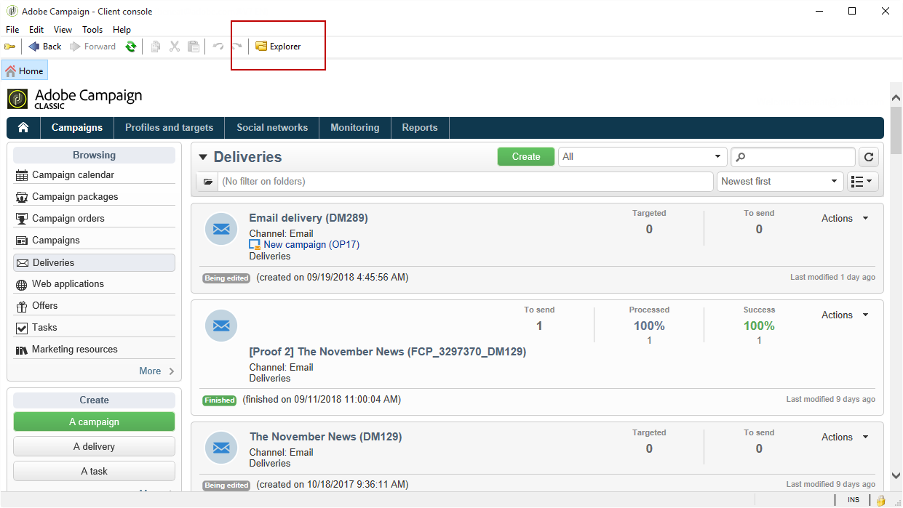

# 設定Campaign-AEM整合{#configuring-the-integration}


## Adobe Campaign中的設定步驟 {#configuring-in-adobe-campaign}

若要同時使用這兩個解決方案，您必須將其設定為彼此連線。

請依照下列步驟，在Adobe Campaign中開始設定：

1. [在Adobe Campaign中安裝AEM整合套件](#install-the-aem-integration-package-in-adobe-campaign)
1. [設定外部帳戶](#configure-the-external-account)
1. [設定AEM資源篩選](#configure-aem-resources-filtering)

適用於進階設定，例如管理個人化欄位和區塊。 請參閱Adobe Experience Manager [檔案](https://helpx.adobe.com/experience-manager/6-5/sites/administering/using/campaignonpremise.html).

### 在Adobe Campaign中安裝AEM整合套件 {#install-the-aem-integration-package-in-adobe-campaign}

您必須先安裝 **[!UICONTROL AEM integration]** 封裝。

1. 從您的Adobe Campaign執行個體中，選取 **[!UICONTROL Tools]** （從上方工具列）。
1. 選取 **[!UICONTROL Tools > Advanced > Import package...]**。

   

1. 選取 **[!UICONTROL Install a standard package]**。
1. Check **[!UICONTROL AEM integration]** 然後按一下 **[!UICONTROL Next]** 按鈕。

   

1. 在下一個視窗中，按一下 **[!UICONTROL Start]** 按鈕以開始安裝您的套件。 安裝完成後關閉視窗。

### 設定AEM運運算元的安全區域 {#configure-the-security-zone-for-aem-operator}

此 **[!UICONTROL AEM integration]** 套件會設定 **[!UICONTROL aemserver]** 運運算元。 此運運算元將用於將Adobe Experience Manager伺服器連線至Adobe Campaign。

您必須設定此運運算元的安全區域，才能透過Adobe Experience Manager連線至Adobe Campaign。

>[!CAUTION]
>
>我們強烈建議您建立專用於AEM的安全區域，以避免任何安全性問題。 如需詳細資訊，請參閱安裝 [指南](../../installation/using/security-zones.md).

如果您的Campaign執行個體是由Adobe託管，請聯絡 [Adobe客戶服務](https://helpx.adobe.com/tw/enterprise/admin-guide.html/enterprise/using/support-for-experience-cloud.ug.html) 團隊。 如果您是內部部署Campaign，請遵循下列步驟：

1. 開啟 **serverConf.xml** 設定檔。
1. 存取 **allowUserPassword** 安全區域的屬性，並將其設定為 **true**.

   這可讓Adobe Experience Manager透過登入/密碼連線Adobe Campaign。

### 設定外部帳戶 {#configure-the-external-account}

此 **[!UICONTROL AEM integration]** 套件已建立Adobe Experience Cloud的外部帳戶。 您現在需要將其設定為與您的Adobe Experience Manager執行個體連線。

若要設定AEM外部帳戶，請遵循下列步驟：

1. 按一下 **[!UICONTROL Explorer]** 按鈕。

   

1. 選取 **[!UICONTROL Administration > Platform > External accounts]**。
1. 從 **[!UICONTROL External account]** 清單，選取 **[!UICONTROL AEM instance]**.
1. 輸入AEM編寫執行個體的引數：

   * **[!UICONTROL Server]**
   * **[!UICONTROL Account]**
   * **[!UICONTROL Password]**

   >[!NOTE]
   >
   >確定您的 **[!UICONTROL Server]** 位址的結尾不是尾隨斜線。

   

1. 檢查 **[!UICONTROL Enabled]** 方塊。
1. 按一下 **[!UICONTROL Save]** 按鈕。

### 設定AEM資源篩選 {#configure-aem-resources-filtering}

此 **AEMResourceTypeFilter** 選項可用來篩選可在Adobe Campaign中使用的Experience Manager資源型別。 這可讓Adobe Campaign擷取專門設計為僅用於Adobe Campaign的Experience Manager內容。

若要檢查 **[!UICONTROL AEMResourceTypeFilter]** 選項已設定：

1. 按一下 **[!UICONTROL Explorer]** 按鈕。
1. 選取 **[!UICONTROL Administration > Platform > Options]**。
1. 從 **[!UICONTROL Options]** 清單，選取 **[!UICONTROL AEMResourceTypeFilter]**.
1. 在 **[!UICONTROL Value (text)]** 欄位，路徑應如下所示：

   ```
   mcm/campaign/components/newsletter,mcm/campaign/components/campaign_newsletterpage,mcm/neolane/components/newsletter
   ```

   或者，在某些情況下：

   ```
   mcm/campaign/components/newsletter
   ```

   

## Adobe Experience Manager中的設定步驟 {#configuring-in-adobe-experience-manager}

請依照下列步驟，在Adobe Experience Manager中開始設定：

1. 設定 **復寫** 從AEM編寫執行個體復寫至AEM發佈執行個體。

   若要瞭解如何設定復寫，請參閱Adobe Experience Manager [檔案](https://helpx.adobe.com/experience-manager/6-5/sites/deploying/using/replication.html).

1. Adobe Experience Manager Adobe Campaign透過設定專用的 **Cloud Service**.

   若要瞭解如何透過Cloud Services連結這兩個解決方案，請參閱Adobe Experience Manager [檔案](https://helpx.adobe.com/experience-manager/6-5/sites/administering/using/campaignonpremise.html#ConfiguringAdobeExperienceManager) .

1. 設定 **外部化器服務**.

   若要瞭解如何進行設定，請參閱Adobe Experience Manager [檔案](https://helpx.adobe.com/experience-manager/6-5/sites/developing/using/externalizer.html).
