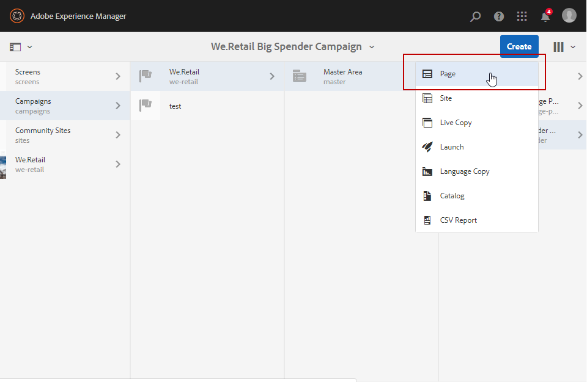
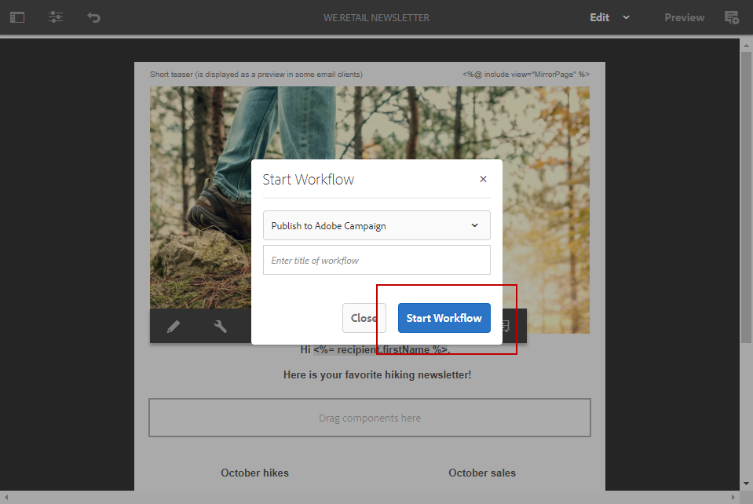
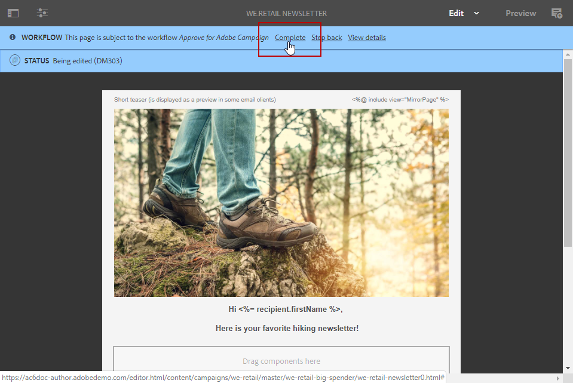

# 建立Experience Manager電子報{#creating-an-experience-manager-newsletter}

此整合可用來建立Adobe Experience Manager中的電子報，然後在Adobe Campaign中用作電子郵件促銷活動的一部分。

有關如何使用此整合的更詳細示例，請參閱本[逐步指南](https://helpx.adobe.com/campaign/kb/acc-aem.html)。

**來自Adobe Experience Manager:**

1. 在您的AEM作者例項中，按一下頁面左上方的&#x200B;**Adobe Experience**&#x200B;標誌，然後選取&#x200B;**[!UICONTROL Sites]**。

   

1. 選取 **[!UICONTROL Campaigns > Name of your brand (here We.Retail) > Main Area > Email campaigns]**。
1. 按一下頁面右上方的&#x200B;**[!UICONTROL Create]**&#x200B;按鈕，然後選擇&#x200B;**[!UICONTROL Page]**。

   

1. 選擇&#x200B;**[!UICONTROL Adobe Campaign Email (AC 6.1)]**&#x200B;範本，並為電子報命名。
1. 建立頁面後，請存取&#x200B;**[!UICONTROL Page information]**&#x200B;功能表，然後按一下&#x200B;**[!UICONTROL Open Properties]**。

   

1. 在&#x200B;**[!UICONTROL Cloud Services]**&#x200B;標籤中，選取&#x200B;**[!UICONTROL Adobe Campaign]**&#x200B;作為&#x200B;**[!UICONTROL Cloud service configuration]**，並在第二個下拉式清單中選取您的Adobe Campaign例項。

   

1. 透過新增元件（例如Adobe Campaign的個人化欄位）來編輯您的電子郵件內容。
1. 當您的電子郵件準備就緒時，請存取&#x200B;**[!UICONTROL Page information]**&#x200B;功能表，然後按一下&#x200B;**[!UICONTROL Start workflow]**。

   

1. 從第一個下拉式清單中，選擇&#x200B;**[!UICONTROL Publish to Adobe Campaign]**&#x200B;作為工作流程模型，然後按一下&#x200B;**[!UICONTROL Start workflow]**。

   

1. 然後，如同上一步，啟動&#x200B;**[!UICONTROL Approve for Campaign]**&#x200B;工作流程。
1. 免責聲明會顯示在您頁面的頂端。 按一下&#x200B;**[!UICONTROL Complete]**&#x200B;確認查看，然後按一下&#x200B;**[!UICONTROL Ok]**。

   

1. 再次按一下&#x200B;**[!UICONTROL Complete]**&#x200B;並在&#x200B;**[!UICONTROL Next Step]**&#x200B;下拉式清單中選擇&#x200B;**[!UICONTROL Newsletter approval]**。

   

您的電子報現在已可在Adobe Campaign中準備好並同步化。

**從Adobe Campaign:**

1. 在&#x200B;**[!UICONTROL Campaigns]**&#x200B;標籤中，按一下&#x200B;**[!UICONTROL Deliveries]**，然後按一下&#x200B;**[!UICONTROL Create]**。

   

1. 在&#x200B;**[!UICONTROL Delivery template]**&#x200B;下拉式清單中，選取&#x200B;**[!UICONTROL Email delivery with AEM content (mailAEMContent)]**&#x200B;範本。

   

1. 將&#x200B;**[!UICONTROL Label]**&#x200B;新增至傳送，然後按一下&#x200B;**[!UICONTROL Continue]**。
1. 按一下 **[!UICONTROL Synchronize]** 按鈕。

   如果此按鈕未顯示在您的介面中，請按一下&#x200B;**[!UICONTROL Properties]**&#x200B;按鈕並選擇&#x200B;**[!UICONTROL Advanced]**&#x200B;頁籤。 在&#x200B;**[!UICONTROL AEM account]**&#x200B;欄位中，應將&#x200B;**[!UICONTROL Content editing mode]**&#x200B;欄位設為&#x200B;**[!UICONTROL AEM]**，並搭配您的AEM例項。

   

1. 選取先前在Adobe Experience Manager中建立的傳送，然後按一下&#x200B;**[!UICONTROL Ok]**。
1. 對AEM傳送進行某些變更後，請按一下&#x200B;**[!UICONTROL Refresh content]**&#x200B;按鈕。

   

您的電子郵件現在已準備好傳送給您的觀眾。
