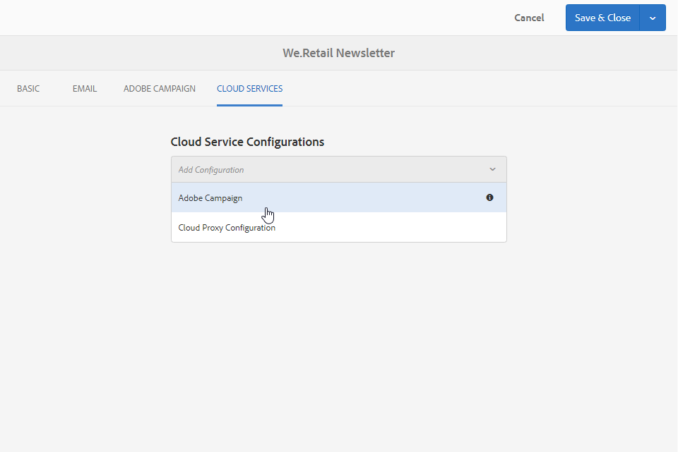
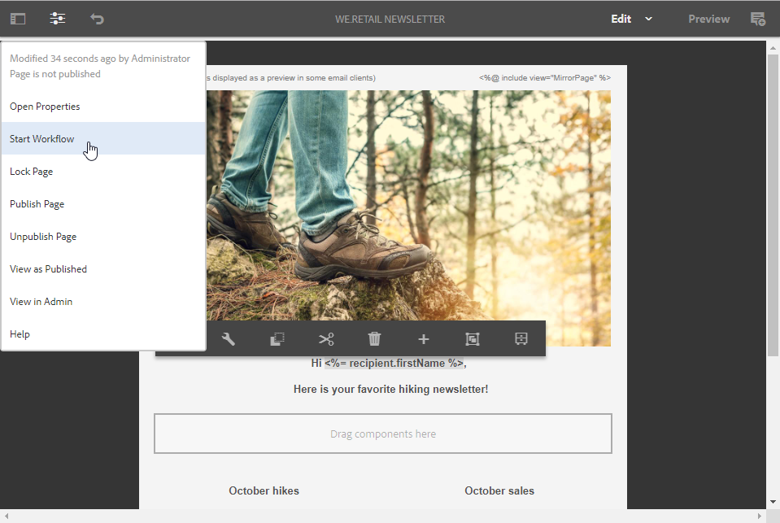
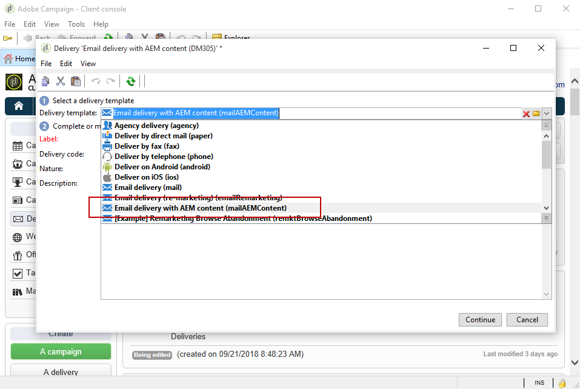

# 建立Experience Manager電子報{#creating-an-experience-manager-newsletter}

例如，此整合可用來在Adobe Experience Manager中建立電子報，然後用於Adobe Campaign，作為電子郵件促銷活動的一部分。

如需如何使用此整合的更詳細範例，請參閱此[逐步指南](https://helpx.adobe.com/campaign/kb/acc-aem.html)。

**從Adobe Experience Manager:**

1. 在您的AEM製作例項中，按一下頁面左上方的&#x200B;**Adobe Experience**&#x200B;標誌，然後選取&#x200B;**[!UICONTROL Sites]**。

   

1. 選取 **[!UICONTROL Campaigns > Name of your brand (here We.Retail) > Main Area > Email campaigns]**。
1. 按一下頁面右上方的&#x200B;**[!UICONTROL Create]**&#x200B;按鈕，然後選取&#x200B;**[!UICONTROL Page]**。

   

1. 選取&#x200B;**[!UICONTROL Adobe Campaign Email (AC 6.1)]**&#x200B;範本，並為電子報命名。
1. 建立頁面後，訪問&#x200B;**[!UICONTROL Page information]**&#x200B;菜單，然後按一下&#x200B;**[!UICONTROL Open Properties]**。

   

1. 在&#x200B;**[!UICONTROL Cloud Services]**&#x200B;標籤中，選取&#x200B;**[!UICONTROL Adobe Campaign]**&#x200B;作為&#x200B;**[!UICONTROL Cloud service configuration]**，並在第二個下拉式清單中選取您的Adobe Campaign例項。

   

1. 新增元件(例如Adobe Campaign中的個人化欄位)以編輯電子郵件內容。
1. 當您的電子郵件準備就緒時，請訪問&#x200B;**[!UICONTROL Page information]**&#x200B;菜單，然後按一下&#x200B;**[!UICONTROL Start workflow]**。

   

1. 從第一個下拉式清單中，選擇&#x200B;**[!UICONTROL Publish to Adobe Campaign]**&#x200B;作為工作流模型，然後按一下&#x200B;**[!UICONTROL Start workflow]**。

   

1. 然後，如同上一步，啟動&#x200B;**[!UICONTROL Approve for Campaign]**&#x200B;工作流程。
1. 免責聲明會顯示在頁面頂端。 按一下&#x200B;**[!UICONTROL Complete]**&#x200B;確認審核，然後按一下&#x200B;**[!UICONTROL Ok]**。

   

1. 再按一下&#x200B;**[!UICONTROL Complete]**&#x200B;並在&#x200B;**[!UICONTROL Next Step]**&#x200B;下拉式清單中選取&#x200B;**[!UICONTROL Newsletter approval]**。

   

您的電子報現已準備就緒，且已在Adobe Campaign中同步。

**從Adobe Campaign:**

1. 在&#x200B;**[!UICONTROL Campaigns]**&#x200B;標籤中，按一下&#x200B;**[!UICONTROL Deliveries]**，然後按一下&#x200B;**[!UICONTROL Create]**。

   

1. 在&#x200B;**[!UICONTROL Delivery template]**&#x200B;下拉式清單中，選取&#x200B;**[!UICONTROL Email delivery with AEM content (mailAEMContent)]**&#x200B;範本。

   

1. 新增&#x200B;**[!UICONTROL Label]**&#x200B;至您的傳送，然後按一下&#x200B;**[!UICONTROL Continue]**。
1. 按一下 **[!UICONTROL Synchronize]** 按鈕。

   如果此按鈕未出現在您的介面中，請按一下&#x200B;**[!UICONTROL Properties]**&#x200B;按鈕並選擇&#x200B;**[!UICONTROL Advanced]**&#x200B;頁簽。 **[!UICONTROL Content editing mode]**&#x200B;欄位應在&#x200B;**[!UICONTROL AEM account]**&#x200B;欄位中以您的AEM例項設為&#x200B;**[!UICONTROL AEM]**。

   

1. 選取先前在Adobe Experience Manager中建立的傳送，然後按一下&#x200B;**[!UICONTROL Ok]**。
1. 對您的AEM傳送進行某些變更後，請按一下&#x200B;**[!UICONTROL Refresh content]**&#x200B;按鈕。

   

您的電子郵件現在已準備好傳送給您的對象。
