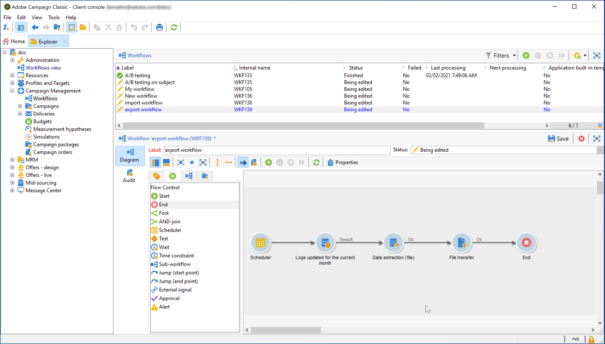

# 將資料從 Campaign 匯出至 Adobe Experience Platform {#sources}

若要將Campaign Classic資料匯出至Adobe Real-time Customer Data Platform (RTCDP)，您首先需要在Campaign Classic中建立工作流程，以將您要共用的資料匯出至S3或Azure Blob儲存位置。

設定好工作流程並將資料傳送至您的儲存位置後，您需要將S3或Azure Blob儲存位置連線為 **來源** 在Adobe Experience Platform中。

>[!NOTE]
>
>請注意，我們建議僅匯出Campaign產生的資料（例如傳送、開啟、點按等） 前往Adobe Experience Platform。 從第三方來源（例如您的CRM）擷取的資料應直接匯入Adobe Experience Platform。

## 在Campaign Classic中建立匯出工作流程

若要將資料從Campaign Classic匯出至您的S3或Azure Blob儲存位置，您需要建立工作流程以定位您要匯出的資料，並將其傳送至您的儲存位置。

若要這麼做，請新增並設定：

* 一個 **[!UICONTROL Data extraction (file)]** 活動以將目標資料擷取至CSV檔案。 有關如何設定此活動的詳細資訊，請參閱 [本節](../../workflow/using/extraction--file-.md).

  

* A **[!UICONTROL File transfer]** 將CSV檔案傳輸至儲存位置的活動。 有關如何設定此活動的詳細資訊，請參閱 [本節](../../workflow/using/file-transfer.md).

  

例如，以下工作流程會定期將記錄擷取到CSV檔案中，然後將檔案傳輸至儲存位置。

## 以來源連線您的儲存位置

將S3或Azure Blob儲存位置連線為 **來源** Adobe中的Experience Platform如下所列。 有關上述各步驟的詳細資訊，請參閱 [來源聯結器檔案](https://experienceleague.adobe.com/docs/experience-platform/sources/home.html?lang=zh-Hant).

1. 在Adobe Experience Platform **[!UICONTROL Sources]** 功能表，建立與儲存位置的連線：

   * [建立Amazon S3來源連線](https://experienceleague.adobe.com/docs/experience-platform/sources/ui-tutorials/create/cloud-storage/s3.html)
   * [Azure Blob聯結器](https://experienceleague.adobe.com/docs/experience-platform/sources/connectors/cloud-storage/blob.html)

   >[!NOTE]
   >
   >儲存位置可以是Amazon S3、使用密碼的SFTP、使用SSH金鑰的SFTP或Azure Blob連線。 將資料傳送至Adobe Campaign的偏好方法為透過Amazon S3或Azure Blob：

   

1. 為雲端儲存批次連線設定資料流。 資料流是排程的工作，會從儲存位置擷取資料並擷取至Adobe Experience Platform資料集。 此步驟可讓您從儲存位置設定資料擷取，包括資料選擇和CSV欄位與XDM結構的對應。

   詳細資訊請參閱 [此頁面](https://experienceleague.adobe.com/docs/experience-platform/sources/ui-tutorials/dataflow/cloud-storage.html).

   

1. 設定來源後，Adobe Experience Platform會從您提供的儲存位置匯入檔案。

   可以根據您的需求排程此操作。 我們建議每天執行匯出最多6次，視執行個體上已存在的負載而定。
