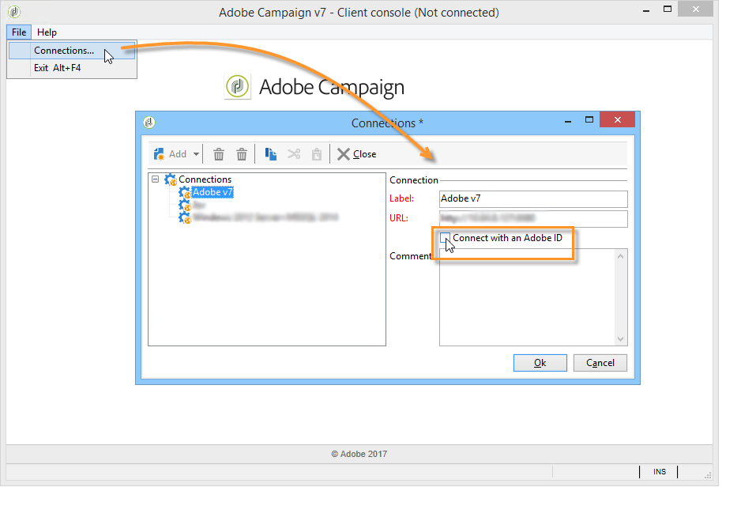

# 實作IMS{#implementing-ims}

## 啟用IMS連線 {#enabling-the-ims-connection}

1. 若要啟用透過IMS連線，請在主控台的連線視窗中檢查&#x200B;**[!UICONTROL Connect with an Adobe ID]**。

   

1. 輸入您的Adobe ID和密碼。 接著會顯示Adobe Campaign主畫面。

   

## 停用IMS連線 {#disabling-the-ims-connection}

要禁用通過Adobe ID的連接，請斷開連接，按一下&#x200B;**[!UICONTROL File > Connections]**&#x200B;並取消選中&#x200B;**[!UICONTROL Connect with an Adobe ID]**。

