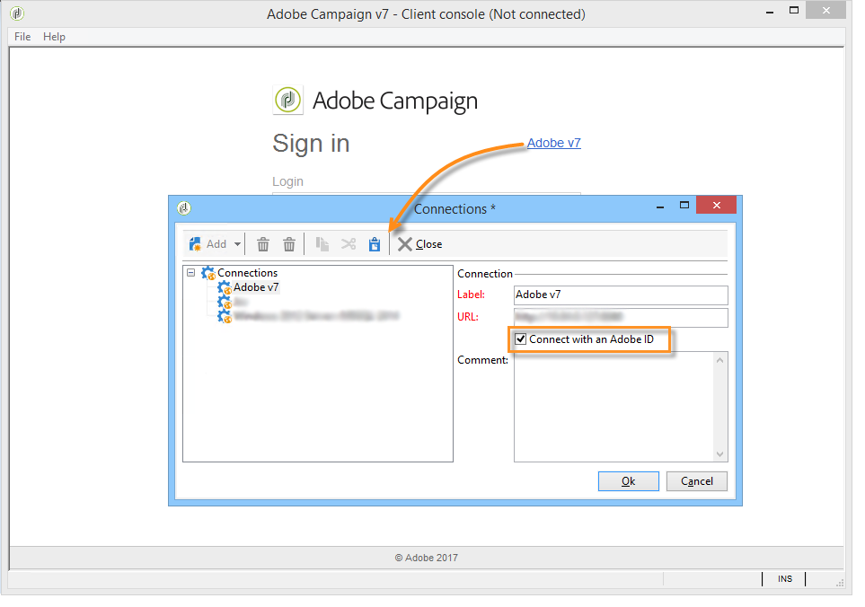

# 實作IMS{#implementing-ims}

完成[IMS設定](configuring-ims.md)後，您就可以啟用連線。

若要在Adobe Campaign中啟用IMS驗證模式，請執行下列步驟：

1. 開啟「使用者端主控台」連線畫面。
1. 選取啟用連線所需的環境。
1. 核取&#x200B;**[!UICONTROL Connect with an Adobe ID]**&#x200B;選項並儲存變更。

   

1. 連線至此環境時，請使用您的Adobe ID和密碼。
