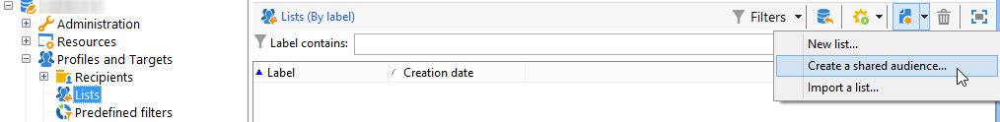

# 匯入和匯出受眾{#importing-and-exporting-audiences}

## 匯入對象 {#importing-an-audience}

您可以透過收件者清單，將受眾/區段從Audience Manager或People核心服務匯入Adobe Campaign。

1. 前往 **[!UICONTROL Profiles and Targets]** > **[!UICONTROL Lists]** 節點。
1. 在動作列中，選取 **[!UICONTROL New]** > **[!UICONTROL Create a shared audience...]**.

   

1. 在開啟的視窗中，按一下 **[!UICONTROL Select a shared audience]** 前往其他Adobe Experience Cloud解決方案中可用的共用對象/區段清單。
1. 選取對象並確認。 對象的資訊會自動完成。

   請注意，若要匯入共用對象，您應獲派 **[!UICONTROL Audience library]** 產品，並成為Audience Manager的管理員。 有關詳細資訊，請參閱 [Admin Console檔案](https://helpx.adobe.com/tw/enterprise/managing/user-guide.html).

   

1. 從 **[!UICONTROL AMC Data source]** 欄位來定義預期的資料類型。

   

1. 儲存閱聽眾。

對象會透過技術工作流程匯入。 匯入的清單包含可使用AMC資料來源調解的元素。 Adobe Campaign無法辨識的元素不會匯入。

從People核心服務或Audience Manager直接匯入區段時，匯入程式需要24到36小時進行同步。 在此期間後，您將能在Adobe Campaign中尋找和使用您的新對象。

>[!NOTE]
>
>如果您要將對象從Adobe Analytics匯入Adobe Campaign，必須先在People核心服務或Audience Manager中共用這些對象。 此程式需要12到24小時，必須與Campaign同步，將其新增至24到36小時。
>
>在該特定情況下，受眾共用時間範圍最多可為60小時。 如需People核心服務與Audience Manager中Adobe Analytics受眾共用的詳細資訊，請參閱 [Adobe Analytics檔案](https://experienceleague.adobe.com/docs/analytics/components/segmentation/segmentation-workflow/seg-publish.html).

每次同步對象資料時，都會完全取代對象資料。 只能匯入區段。 不支援包含機碼值組、特徵和規則的精細資料。

## 匯出對象 {#exporting-an-audience}

您可以使用工作流程，將受眾從Adobe Campaign匯出至Audience manager或People核心服務。 建立和使用工作流程的程式在 [此文檔](../../workflow/using/building-a-workflow.md). 匯出的受眾會儲存為「人員」核心服務中的區段：

1. 建立新的目標工作流程。
1. 使用可用的不同活動來鎖定一組收件者。
1. 定位後，拖放 **[!UICONTROL Update shared audience]** 活動，然後開啟。

   

1. 定義您要透過 **[!UICONTROL Select a shared audience]** 選項。 在開啟的視窗中，您可以選取現有對象或建立新對象。

   如果您選取現有對象，則只會將新記錄新增至對象。

   若要將收件者清單匯出至新受眾，請完成 **[!UICONTROL Segment name]** 欄位，然後按一下 **[!UICONTROL Create]** 之後，再選取新建立的對象。

   按一下視窗右上方的核取符號，然後按 **[!UICONTROL OK]** 按鈕。

1. 選取 **[!UICONTROL AMC Data source]** 指定預期的資料類型。 架構會自動決定。

   

1. 儲存閱聽眾。

然後會匯出對象。 儲存對象活動有兩個外站轉變。 主轉變包含已成功匯出的收件者。 其他轉變包含無法與訪客ID或宣告ID對應的收件者。

Adobe Campaign與People核心服務的同步需要24到36小時。 在此期間之後，您將能在People核心服務中尋找新的受眾，並在其他Adobe Experience Cloud解決方案中重複使用。 如需在「Adobe人員」核心服務中使用Adobe Campaign共用對象的詳細資訊，請參閱此 [檔案](https://experienceleague.adobe.com/docs/core-services/interface/audiences/t-audience-create.html).

>[!NOTE]
>
>若要調解，記錄必須有Adobe Experience Cloud ID（「visitor ID」或「delaced ID」）。 匯出和匯入對象時，沒有Adobe Experience Cloud ID的記錄會遭到忽略。
