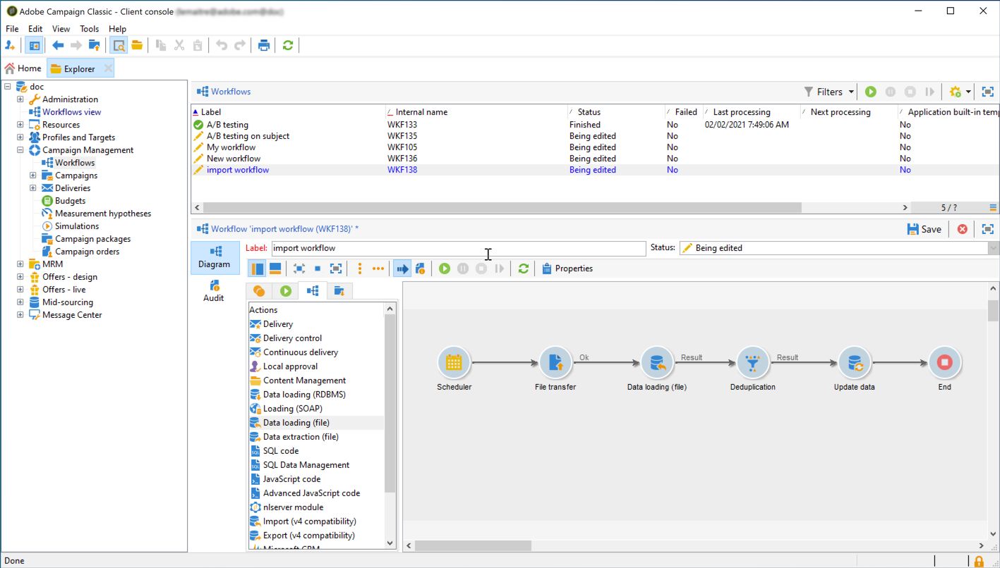

# 將Adobe Experience Platform區段擷取至Campaign {#destinations}

若要將Adobe Experience Platform對象擷取至Campaign並用於您的工作流程，您首先需要將Adobe Campaign as a Adobe Experience Platform **目的地**&#x200B;連線，並使用要匯出的區段進行設定。

設定目的地後，系統會將資料匯出至您的儲存位置，而且您將需要在Campaign Classic中建置專用的工作流程來擷取資料。

## 將Adobe Campaign連線為目的地

在Adobe Experience Platform中，選取匯出區段的儲存位置，以設定與Adobe Campaign的連線。 此步驟也可讓您選取要匯出的區段，並指定要包含的其他XDM欄位。

如需詳細資訊，請參閱[Destinations檔案](https://experienceleague.adobe.com/docs/experience-platform/destinations/catalog/email-marketing/adobe-campaign.html)。

設定目的地後，Adobe Experience Platform會在您提供的儲存位置中建立以Tab分隔的.txt或.csv檔案。 此作業會排程並每24小時執行一次。

您現在可以設定Campaign Classic工作流程，將區段擷取至Campaign。

## 在Campaign Classic中建立匯入工作流程

將Campaign Classic設定為目的地後，您需要建立專用的工作流程，以匯入Adobe Experience Platform已匯出的檔案。

若要這麼做，您必須新增及設定&#x200B;**[!UICONTROL File transfer]**&#x200B;活動。 有關如何設定此活動的詳細資訊，請參閱[Campaign v8檔案](https://experienceleague.adobe.com/docs/campaign/automation/workflows/wf-activities/event-activities/file-transfer.html){target="_blank"}。

接著，您就可以根據需求建立工作流程（使用區段資料更新資料庫、傳送跨管道傳遞至區段等）

例如，以下工作流程會每天從您的儲存位置下載檔案，然後使用區段資料更新Campaign資料庫。

