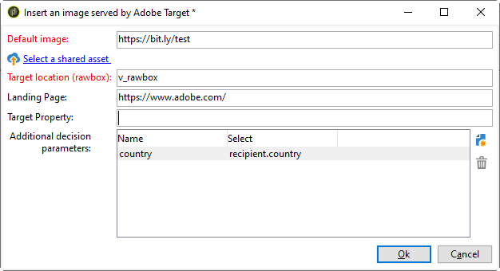
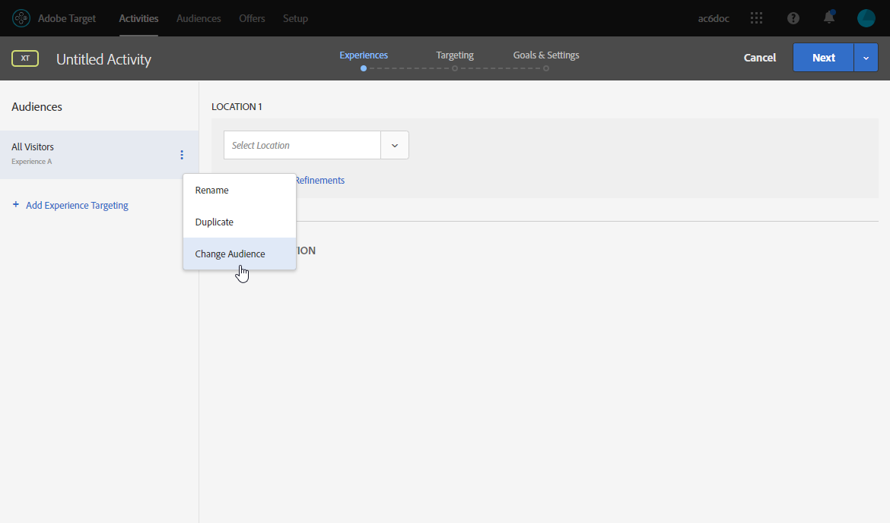

# 插入Target動態內容 {#inserting-a-dynamic-image}

在本頁面中，了解如何將Adobe Target的動態優惠方案整合至Adobe Campaign的電子郵件中。

其目的是建立具有影像區塊的傳送，該影像區塊會根據收件者的國家/地區動態變更：資料會隨每個mbox請求傳送，且取決於收件者的IP位址。

在此訊息中，影像可能會依下列使用者體驗而動態變化：

* 電子郵件在法國開啟。
* 電子郵件在美國開啟。
* 如果這些條件皆不適用，則會顯示預設影像。

若要執行此操作，請套用下列步驟：

1. [在電子郵件中插入動態優惠方案](../../integrations/using/inserting-a-dynamic-image.md#inserting-dynamic-offer)
1. [建立重新導向選件](../../integrations/using/inserting-a-dynamic-image.md#create-redirect-offers)
1. [建立對象](../../integrations/using/inserting-a-dynamic-image.md#audiences-target)
1. [建立體驗鎖定目標活動](../../integrations/using/inserting-a-dynamic-image.md#creating-targeting-activity)
1. [預覽並傳送電子郵件](../../integrations/using/inserting-a-dynamic-image.md#preview-send-email)

## 在電子郵件中插入動態優惠方案 {#inserting-dynamic-offer}

在Adobe Campaign中，定義完電子郵件的目標和內容後，您就可以從Target插入動態影像。

若要這麼做，請指定預設影像的URL、位置名稱，以及您要傳輸至Target的欄位。

在Adobe Campaign中，有兩種方式可從Target將動態影像插入電子郵件：

* 如果您使用數位內容編輯器，請選擇現有影像並選取 **[!UICONTROL Insert]** > **[!UICONTROL Dynamic image served by Adobe Target]** 的上界。

   

* 如果使用標準編輯器，請將游標置於要插入影像的位置並選取 **[!UICONTROL Include]** > **[!UICONTROL Dynamic image served by Adobe Target...]** 從「個人化」下拉式功能表。

   

### 定義影像參數 {#defining-image-parameters}

* 此 **[!UICONTROL Default image]**&#x200B;的URL:未滿足任何條件時將顯示的影像。 您也可以從資產資料庫中選取影像。
* 此 **[!UICONTROL Target location]**:輸入動態選件位置的名稱。 您必須在Target活動中選取此位置。
* 此 **[!UICONTROL Landing Page]**:如果您想要將預設影像重新導向至預設登陸頁面。 此URL僅適用於預設影像顯示在最終電子郵件中的情況，且為選用。
* 此 **[!UICONTROL Additional decision parameters]**:指定Adobe Target區段中定義之欄位與Adobe Campaign欄位之間的對應。 使用的Adobe Campaign欄位必須已在rawbox中指定。 在我們的範例中，我們新增了「國家」欄位。

如果您在Adobe Target的設定中使用企業權限，請在此欄位中新增對應的屬性。 進一步了解Target企業權限，位於 [本頁](https://experienceleague.adobe.com/docs/target/using/administer/manage-users/enterprise/properties-overview.html).

## 建立重新導向選件 {#create-redirect-offers}

在Target中，您可以建立不同版本的選件。 您可以根據每個使用者體驗來建立重新導向選件，並指定要顯示的影像。

在此情況下，我們需要兩個重新導向選件，第三個（預設的）要在Adobe Campaign中定義。

1. 若要在Target Standard中建立新的重新導向選件，請從 **[!UICONTROL Content]** 按一下 **[!UICONTROL Code offers]**.

1. 按一下 **[!UICONTROL Create]**，之後 **[!UICONTROL Redirect Offer]**。

   

1. 輸入選件名稱和影像的URL。

   

1. 對剩餘的重新導向選件，請依照相同的程式操作。 如需關於此項目的詳細資訊，請參閱此[頁面](https://experienceleague.adobe.com/docs/target/using/experiences/offers/offer-redirect.html)。

## 建立對象 {#audiences-target}

在Target中，您需要建立兩個對象，將針對要傳送的不同內容，將造訪您選件的人員分類為其中。 對於每個對象，新增規則以定義誰將能看見選件。

1. 若要在Target中建立新對象，請從 **[!UICONTROL Audiences]** 按一下 **[!UICONTROL Create Audience]**.

   

1. 新增名稱至對象。

   

1. 按一下 **[!UICONTROL Add a rule]** ，然後選取類別。 規則使用特定條件來鎖定訪客。 您可以新增條件或在其他類別中建立新規則，借此縮小規則範圍。

1. 請對其餘對象執行相同的程式。

## 建立體驗鎖定目標活動 {#creating-targeting-activity}

在Target中，我們需要建立體驗鎖定目標活動、定義不同的體驗，並將它們與對應的選件建立關聯。

### 定義對象 {#defining-the-audience}

1. 若要建立體驗鎖定目標活動，請從 **[!UICONTROL Activities]** 按一下 **[!UICONTROL Create Activity]** then **[!UICONTROL Experience Targeting]**.

   

1. 選擇 **[!UICONTROL Form]** as **[!UICONTROL Experience Composer]**.

1. 按一下 **[!UICONTROL Change audience]** 按鈕。

   

1. 選取在前述步驟中建立的對象。

   

1. 按一下以建立其他體驗 **[!UICONTROL Add Experience Targeting]**.

### 定義位置和內容 {#defining-location-content}

為每個對象新增內容：

1. 在Adobe Campaign中插入動態選件時，選取您選取的位置名稱。

   

1. 按一下下拉式按鈕並選取 **[!UICONTROL Change Redirect Offer]**.

   

1. 選取您先前建立的重新導向選件。

   

1. 請依照第二個體驗的相同步驟操作。

### 定義活動 {#defining-activity}

此 **[!UICONTROL Target]** 視窗會摘要您的活動。 如有必要，您可以新增其他體驗。

此 **[!UICONTROL Goal & Settings]** 視窗可讓您設定優先順序、目標或持續時間，以個人化您的活動。

此 **[!UICONTROL Reporting Settings]** 區段可讓您選取動作並編輯將決定何時達成目標的參數。

## 預覽並傳送電子郵件 {#preview-send-email}

在Adobe Campaign中，您現在可以預覽電子郵件，並在不同的收件者上測試其呈現。 您會注意到影像會根據所建立的不同體驗而變更。 若要進一步了解電子郵件建立，請參閱 [頁面](../../delivery/using/defining-the-email-content.md).

您現在可以傳送電子郵件，包括Target的動態優惠方案。

