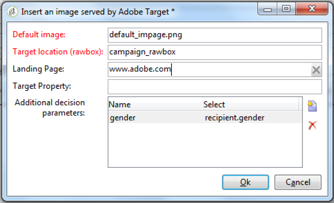

# 插入動態影像{#inserting-a-dynamic-image}

本節詳細說明在Adobe Campaign中執行的步驟，以將Adobe target的影像整合至電子郵件。

您必須事先在Adobe target中執行下列動作：

* 建立一或多個 [重新導向選件](https://marketing.adobe.com/resources/help/en_US/tnt/help/t_Creating_a_Redirect_Offer.html)，您必須在其中指定要使用的影像URL。
* 建立一或多個 [觀眾](https://marketing.adobe.com/resources/help/en_US/target/target/t_create-audience.html)，以定義您活動的目標。
* 建立 [表單式體驗撰寫器活動](https://marketing.adobe.com/resources/help/en_US/tnt/help/t_Creating_an_A_B_Test.html) ，您必須在活動中選取rawbox並指定數個體驗，視所建立的重新導向選件數量而定。 對於每個體驗，您必須選擇其中一個已建立的重新導向選件。

   若要指定這些體驗，您可以使用Adobe Campaign的資訊來建立區段。 若要在選件的選擇規則中使用Adobe Campaign的資料，您必須在Adobe Target的rawbox中指定資料。

若要在Adobe Campaign傳遞中插入Adobe Target影像：

1. 建立電子郵件傳送。
1. 在可用的個人化欄位中，選取 **[!UICONTROL Include > Dynamic image served by Adobe Target]**。

   

1. 在開啟的視窗中，選取預設會出現在電子郵件中的影像。 您可以指定影像URL或使用共 [用影像](../../integrations/using/sharing-assets-with-adobe-experience-cloud.md)。
1. 輸入在Adobe Target中指定之rawbox的名稱。
1. 如果您想要將預設影 **[!UICONTROL Landing Page]** 像重新導向至預設登陸頁面，請在欄位中輸入URL。 此URL僅適用於在最終電子郵件中顯示預設影像且為選用的情況。
1. 如果您在Adobe target的設定中使用「企業版」權限，請在此欄位中新增對應的屬性。 在此頁面中進一步瞭解Target Enterprise [權限](https://marketing.adobe.com/resources/help/en_US/target/target/properties-overview.html)。 如果您未在Target中使用「企業版」權限，此欄位是選用欄位，而非必要欄位。
1. 在 **[!UICONTROL Additional decision parameters]**&#x200B;中，指定Adobe target區段中定義的欄位與Adobe Campaign欄位之間的對應。 使用的Adobe Campaign欄位必須已在rawbox中指定。

   

   在Adobe target中定義參數時，會透過在Adobe Campaign中整合Target影像時建立的rawbox和「調整」選項 **來執行** 。

   

   此處顯示的範例說明如何定義男性和女性不同的體驗。

您也可以根據使用者的電子郵件網域和位址，定義數個案例。 當開啟電子郵件時，資料會自動從使用者的瀏覽器中復原。

在預覽您的電子郵件時，您可以在選取不同的描述檔時看到，插入的影像會依Adobe Target活動和Adobe Campaign中指定的參數而變更。

您可以測量在Adobe Target中傳送的結果。

