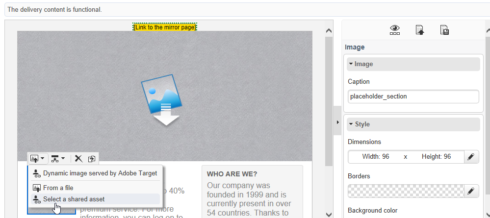

# 插入共用資產{#inserting-a-shared-asset}

從Adobe Experience Cloud共用的Assets可用於您的電子郵件和登入頁面，如下所示：

1. 建立新電子郵件或新登陸頁面。

   如果您使用Adobe Experience Manager資產庫的資產，請使用在[設定整合](../../integrations/using/configuring-access-to-assets.md#integrating-with-aem-assets)時建立的傳遞範本。

   如果您沒有此特定範本，請確定在傳遞&#x200B;**Properties**&#x200B;中，**[!UICONTROL Content editing mode]** （**[!UICONTROL Advanced]**&#x200B;索引標籤）已設定為&#x200B;**DCE**，並且已提供您要用來存取AEM Assets資源程式庫的AEM外部帳戶。

1. 在編輯視窗中，選取選項以新增影像：

   * 如果您使用[標準編輯模式](https://experienceleague.adobe.com/docs/campaign/campaign-v8/send/emails/defining-the-email-content.html?lang=zh-Hant#adding-images){target="_blank"}，請選取&#x200B;**[!UICONTROL Image]** > **[!UICONTROL Select a shared asset]**。

     

   * 如果您使用[進階編輯模式](../../web/using/about-campaign-html-editor.md) (DCE)，請移至影像區塊，然後透過內容功能表選取&#x200B;**[!UICONTROL Select a shared asset]**。

     

     >[!NOTE]
     >
     >使用DCE時，您無法從[網頁存取](../../platform/using/adobe-campaign-workspace.md#console-and-web-access)的Adobe Campaign插入共用影像。

1. 在開啟的選取範圍視窗中，選取影像，然後確認。

   可用的影像來自Adobe Experience Cloud資料庫或AEM Assets資料庫，視您的Adobe Campaign執行個體的設定方式而定。 請參閱[設定Assets存取權](../../integrations/using/configuring-access-to-assets.md)區段。

   

>[!NOTE]
>
>如果您透過Adobe Target整合，則可以使用共用影像作為預設影像。 請參見[此頁面](../../integrations/using/integrating-with-adobe-target.md)。
