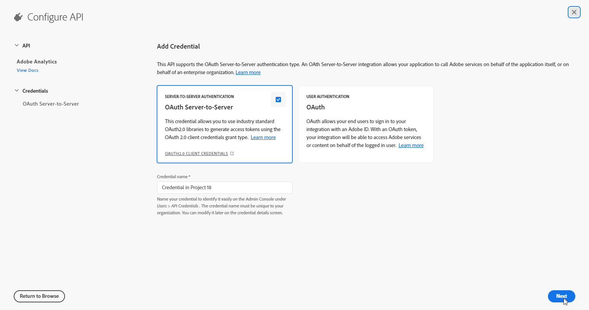
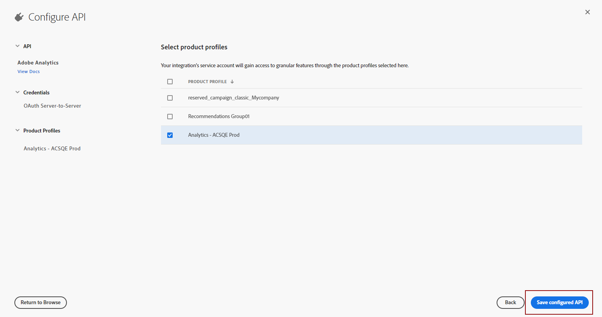

# 建立您的Adobe技術帳戶 {#create-service-account}

伺服器對伺服器驗證認證可讓應用程式的伺服器產生存取權杖，並代表應用程式本身進行API呼叫。 [了解更多](https://developer.adobe.com/developer-console/docs/guides/authentication/ServerToServerAuthentication/)

## 移轉現有的整合 {#migrate-jwt}

Adobe已棄用服務帳戶(JWT)認證。 Campaign與Adobe解決方案和應用程式的整合現在必須依賴OAuth伺服器對伺服器認證。

如果您在2024年6月之前實作了與Campaign的傳入或傳出整合，您必須將您的Campaign環境升級至v7.4.1，並將您的技術帳戶移轉至oAuth （如詳細） [於本檔案中](https://developer.adobe.com/developer-console/docs/guides/authentication/ServerToServerAuthentication/migration){target="_blank"}. 現有的服務帳戶(JWT)憑證將繼續有效，直到 **2025年1月27日**.

完成移轉後，您必須將新認證與Campaign建立關聯（如中所述） [本節](#add-credentials).

## 建立新整合的OAuth技術帳戶 {#oauth-service}

若要針對新整合建立您的OAuth技術帳戶，請遵循下列步驟：

1. 存取Adobe Developer主控台並以下列身分登入 **系統管理員** ，屬於您的組織。

   有關管理員角色的詳細資訊，請參閱此 [頁面](https://helpx.adobe.com/enterprise/using/admin-roles.html).

1. 按一下&#x200B;**[!UICONTROL Create a new project]**。

   

1. 按一下 **[!UICONTROL Add to Project]** 並選取 **[!UICONTROL API]**.

   

1. 選取您要與Campaign整合的產品，然後按一下 **[!UICONTROL Next]**.

1. 選擇 **[!UICONTROL OAuth Server-to-Server]** 作為驗證型別，然後按一下 **[!UICONTROL Next]**.

   

1. 選取 **[!UICONTROL Product profile]** 連結至您的專案。

   您可以視需要建立新檔案。 [了解更多](https://helpx.adobe.com/enterprise/using/manage-product-profiles.html)

1. 然後，按一下 **[!UICONTROL Save Configured API]**.

   

1. 在您的專案中，在認證底下選取 [!DNL OAuth Server-to-Server] 並複製下列資訊：

   * **[!UICONTROL Client ID]**
   * **[!UICONTROL Client secret]**
   * **[!UICONTROL Technical account ID]**
   * **[!UICONTROL Organization ID]**

## 在Adobe Campaign中新增OAuth專案認證 {#add-credentials}

請依照下列步驟，在Adobe Campaign中新增OAuth專案認證：

1. 透過SSH登入安裝Adobe Campaign例項的每個容器。

1. 透過執行以下命令，在Adobe Campaign中新增您的OAuth專案認證： `neolane` 使用者。 這將會插入 **[!UICONTROL Technical Account]** 執行個體組態檔中的認證。

   ```
   nlserver config -instance:<instance_name> -setimsoauth:ims-org-id/client-id/technical-account-id/client-secret
   ```
