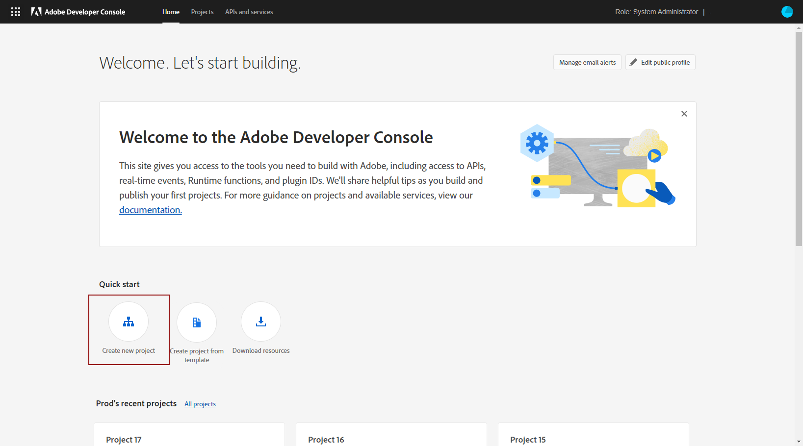

# 建立 Adobe 技術帳戶 {#create-service-account}

伺服器對伺服器驗證認證可讓應用程式的伺服器產生存取權杖，並代表應用程式本身進行API呼叫。 [了解更多](https://developer.adobe.com/developer-console/docs/guides/authentication/ServerToServerAuthentication/)

## 移轉現有的整合 {#migrate-jwt}

Adobe已棄用服務帳戶(JWT)憑證。 Campaign與Adobe解決方案和應用程式的整合現在必須依賴OAuth伺服器對伺服器認證。

如果您在2024年6月之前已實作與行銷活動的傳入或傳出整合，您必須將行銷活動環境升級至v7.4.1，並將您的技術帳戶移轉至oAuth，如本檔案](https://developer.adobe.com/developer-console/docs/guides/authentication/ServerToServerAuthentication/migration){target="_blank"}所述。 [現有服務帳戶 (JWT) 憑證將繼續有效至 **2025 年 1 月 27 日**。

完成移轉後，您必須依照[本節](#add-credentials)的說明，將新的認證與Campaign建立關聯。

## 建立新整合的OAuth技術帳戶 {#oauth-service}

To create your OAuth technical account for new integrations, follow these steps:

1. 存取Adobe Developer主控台，並以您組織的&#x200B;**系統管理員**&#x200B;身分登入。

   如需管理員角色的詳細資訊，請參閱此[頁面](https://helpx.adobe.com/enterprise/using/admin-roles.html)。

1. 按一下&#x200B;**[!UICONTROL Create a new project]**。

   

1. 按一下&#x200B;**[!UICONTROL Add to Project]**&#x200B;並選取&#x200B;**[!UICONTROL API]**。

   

1. 選取您要與Campaign整合的產品，然後按一下&#x200B;**[!UICONTROL Next]**。

1. 選擇&#x200B;**[!UICONTROL OAuth Server-to-Server]**&#x200B;作為驗證型別，然後按一下&#x200B;**[!UICONTROL Next]**。

   

1. 選取專案的&#x200B;**[!UICONTROL Product profile]**&#x200B;連結。

   您可以視需要建立新檔案。 [了解更多](https://helpx.adobe.com/enterprise/using/manage-product-profiles.html)

1. 然後，按一下&#x200B;**[!UICONTROL Save Configured API]**。

   

1. 在專案的[認證]底下，選取[!DNL OAuth Server-to-Server]並複製下列資訊：

   * **[!UICONTROL Client ID]**
   * **[!UICONTROL Client secret]**
   * **[!UICONTROL Technical account ID]**
   * **[!UICONTROL Organization ID]**

## Add OAuth project credentials in Campaign {#add-credentials}

執行上述步驟後，請在Adobe Campaign中新增您的OAuth專案認證。

>[!NOTE]
>
>作為託管或受管理的Cloud Services客戶，不需要執行此步驟： Adobe已將OAuth專案憑證新增至您的環境。
>

若為內部部署或混合客戶，請遵循下列步驟：

1. 透過SSH登入安裝Adobe Campaign例項的每個容器。

1. 以`neolane`使用者身分執行以下命令，在Adobe Campaign中新增您的OAuth專案認證。 這會在執行個體組態檔中插入&#x200B;**[!UICONTROL Technical Account]**&#x200B;認證。

   ```
   nlserver config -instance:<instance_name> -setimsoauth:ims-org-id/client-id/technical-account-id/client-secret
   ```

   >[!NOTE]
   >
   > 對於7.4.1之前的版本，請使用`setimsauth`或`setimsjwtauth`，而非`setimsoauth`。


