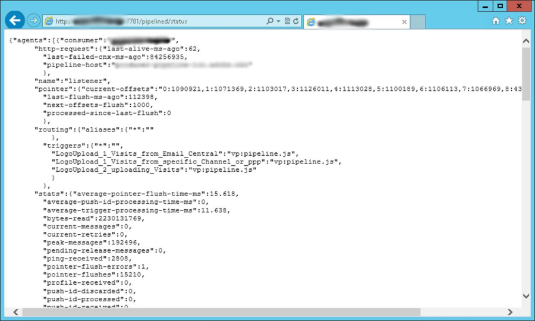

# 管線監視 {#pipeline-monitoring}

[!DNL pipelined]狀態Web服務提供有關[!DNL pipelined]進程狀態的資訊。

可使用瀏覽器手動存取，或透過監控應用程式自動存取。

REST格式，說明如下。

## 指標 {#indicators}

本節列出狀態Web服務中的指標。

強調要監測的建議指標。

* 消費者：提取觸發器的用戶端名稱。 在管線選項中配置。
* http-request
   * last-alive-ms-ago:自進行連接檢查以來的時間（毫秒）。
   * last-failed-cnx-ms-ago:自上次連接檢查失敗以來的時間（毫秒）。
   * pipeline-host:提取管道資料的來源主機的名稱。
* 指針
   * 當前偏移：指針在管道中的值，每個子線程。
   * last-flush-ms-ago:擷取批次觸發器後的時間（毫秒）。
   * 下一偏移齊平：等到下一個批完成時。
   * processed-since-lastflush:上次批處理的觸發器數。
* 路由
   * 觸發器：已檢索的觸發器清單。 在[!DNL pipelined]選項中配置。
* 統計
   * average-pointer-flush time-ms:一批觸發器的平均處理時間。
   * average-trigger-processing-time-ms:分析觸發器資料所花的平均時間。
   * 位元組讀取：自進程啟動後從隊列中讀取的位元組數。
   * current-messages:已從佇列提取且正在等待處理的待處理訊息的目前數目。 **此指標應接近零**。
   * current-retries:當前處理失敗並等待重試的消息數。
   * 峰值消息：進程自啟動以來一直在處理的掛起消息的最大數量。
   * 指針刷新：自啟動以來處理的郵件批數。
   * routing-JS-custom:自訂JS處理的訊息數。
   * trigger-discered:因處理錯誤而重試過多次後被捨棄的訊息數。
   * trigger-processed:未發生錯誤而處理的訊息數。
   * 觸發接收：從隊列接收的消息數。

這些統計資料會依處理執行緒顯示。

* average-trigger-processing-time-ms:分析觸發器資料所花的平均時間。
* is-JS-processor:值「1」。
* trigger-discered:因處理錯誤而重試過多次後被捨棄的訊息數。 **此指標應為零**。
* 觸發失敗：JS中的處理錯誤數。 **此指標應為零**。
* 觸發接收：從隊列接收的消息數。

* 設定：它們設定在設定檔案中。
   * flush-pointer-msg-count:批次中的訊息數。
   * flush-pointer-period-ms:兩個批次之間的時間（以毫秒為單位）。
   * processing-threads-JS:執行自訂JS的處理執行緒數目。
   * retry-period-ms:處理錯誤發生時兩次重試之間的時間。
   * retry-validity-duration-ms:會重試處理時間的持續時間，直到消息被丟棄為止。
   * 管道訊息報表

## 管道消息報告{#pipeline-report}

此報表顯示過去五天內每小時的訊息數量。

