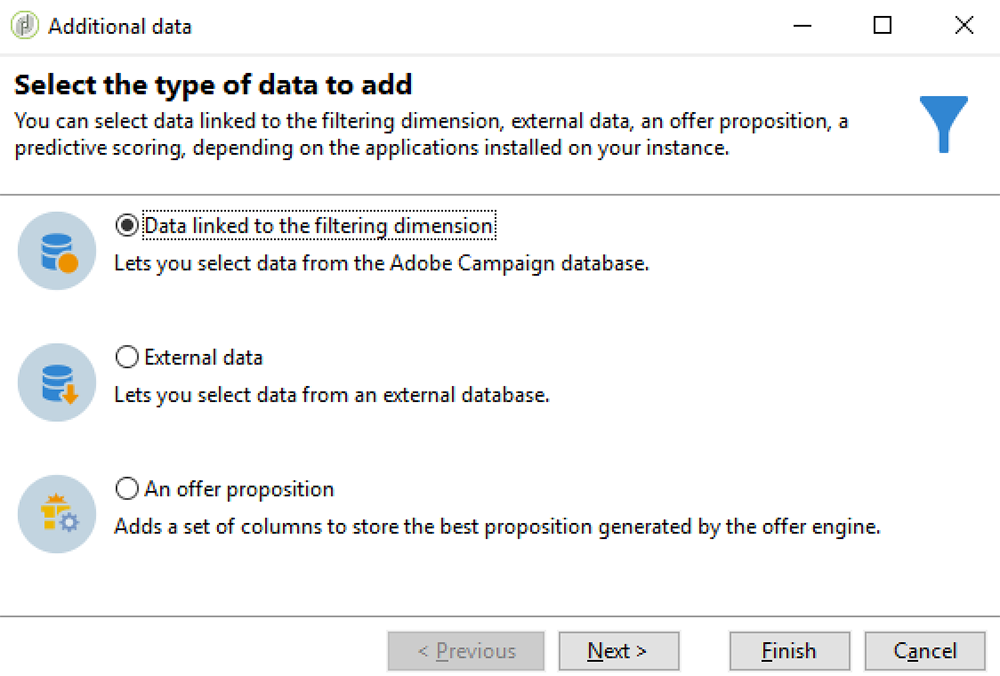
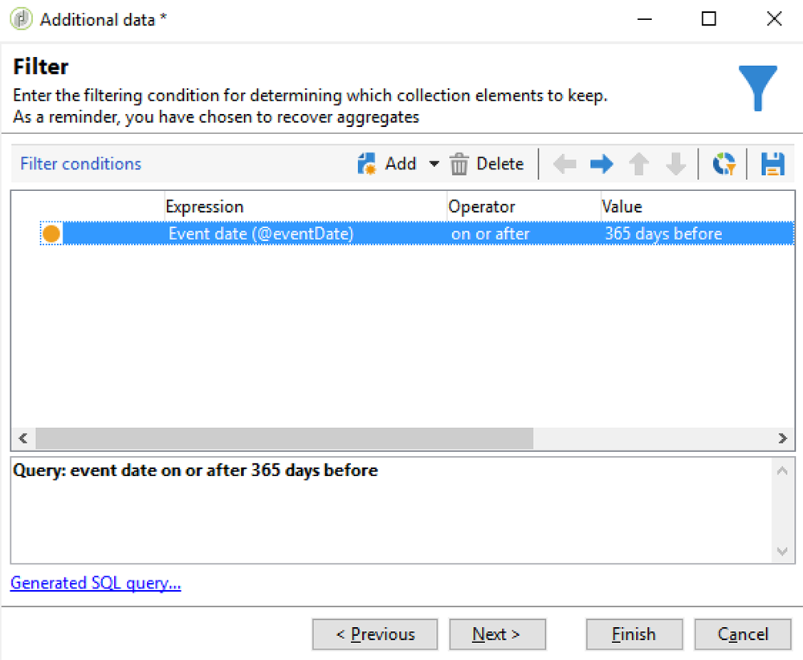

# 同步對象{#synchronizing-audiences}

您可以使用Campaign v7進階功能來建立複雜的清單，並以順暢的方式直接與Campaign Standard（包括其他資料）即時共用此清單作為對象。 然後您的Campaign Standard使用者就可以在Adobe Campaign Standard中使用對象。

只能使用Campaign v7，才能實現複雜的鎖定目標，其中涉及未在Campaign Standard中複製的其他資料。

您也可以透過Campaign Standard，直接共用透過連接器(如Microsoft Dynamics)傳送的收件者或資料清單。

此使用案例顯示如何在Campaign v7中準備傳送的目標，以及如何在透過Adobe Campaign Standard建立和傳送的傳送中重複使用此目標及其他資料。

>[!NOTE]
>
>如果您需要的所有資料皆已復寫，您也可以在Adobe Campaign Standard中使用匯總和集合來擴充資料。

## 必要條件 {#prerequisites}

若要達成此目標，您需要：

* 儲存在Campaign v7資料庫中並與Campaign Standard同步的收件者。 請參閱 [同步設定檔](../../integrations/using/synchronizing-profiles.md) 區段。
* 其他資料，例如儲存在與Campaign v7資料庫中nms:recipients相關的表格中的訂閱或交易。 這些資料可來自Campaign v7 OOB結構或自訂表格。 預設情況下，Campaign Standard中無法使用它們，因為它們未同步。
* 直接在Campaign v7和Campaign Standard中執行工作流程。
* 在Campaign Standard中建立和執行傳送的權限。

## 在Campaign v7中使用其他資料建立目標工作流程 {#create-a-targeting-workflow-with-additional-data-in-campaign-v7}

只能使用Campaign v7，才能實現複雜的鎖定目標，其中涉及未在Campaign Standard中複製的其他資料。

定義目標及其其他資料後，就可以將其儲存為可與Campaign Standard共用的清單。

>[!NOTE]
>
>這是一個例子。 您只需查詢收件者清單，並與ACS共用，無需進一步處理即可。 您也可以使用其他資料管理活動來準備最終目標。

若要取得最終對象及其其他資料：

1. 從建立新工作流程 **[!UICONTROL Profiles and Targets]** > **[!UICONTROL Jobs]** > **[!UICONTROL Targeting workflows]**.
1. 新增 **[!UICONTROL Query]** 活動，並選取您要傳送最終電子郵件的收件者。 例如，所有18至30歲的收件者都居住在法國。

   

1. 從查詢中新增其他資料。 如需詳細資訊，請參閱 [新增資料](../../workflow/using/query.md#adding-data) 區段。

   此範例顯示如何新增匯總，以計算收件者一年內收到的傳送數。

   在 **[!UICONTROL Query]**，選取 **[!UICONTROL Add data...]**.

   

1. 選取 **[!UICONTROL Data linked to the filtering dimension]** 並按一下 **[!UICONTROL Next]**。

   

1. 選擇 **[!UICONTROL Data linked to the filtering dimension]** ，然後選取 **[!UICONTROL Recipient delivery logs]** 節點，按一下 **[!UICONTROL Next]**.

   

1. 選擇 **[!UICONTROL Aggregates]** 在 **[!UICONTROL Data collected]** 欄位，按一下 **[!UICONTROL Next]**.

   

1. 新增篩選條件，僅考量在過去365天內建立的記錄，然後按一下 **[!UICONTROL Next]**.

   

1. 定義輸出欄。 在此，唯一需要的欄是計算傳送數量的欄。 要執行此操作：

   * 選擇 **[!UICONTROL Add]** 窗戶右邊。
   * 從 **[!UICONTROL Select field]** 按一下 **[!UICONTROL Advanced selection]**.
   * 選擇 **[!UICONTROL Aggregate]**，然後 **[!UICONTROL Count]**. 檢查 **[!UICONTROL Distinct]** ，然後按一下 **[!UICONTROL Next]**.
   * 在欄位清單中，選取用於 **計數** 函式。 選擇將一律填入的欄位，例如 **[!UICONTROL Primary key]** 欄位，然後按一下 **[!UICONTROL Finish]**.
   * 變更 **[!UICONTROL Alias]** 欄。 此別名可讓您輕鬆擷取最終傳送中新增的欄。 例如 **NBdeliverys**.
   * 按一下 **[!UICONTROL Finish]** 並儲存 **[!UICONTROL Query]** 活動設定。

   

1. 儲存工作流程。下一節顯示如何與ACS共用母體。

## 與Campaign Standard共用目標 {#share-the-target-with-campaign-standard}

定義目標母體後，您可以透過 **[!UICONTROL List update]** 活動。

1. 在先前建立的工作流程中，新增 **[!UICONTROL List update]** 活動，並指定您要更新或建立的清單。

   指定您要在Campaign v7中儲存清單的資料夾。 清單會受實作期間定義的資料夾對應所限制，一旦在Campaign Standard中共用，這可能會影響清單的可見性。 請參閱 [權限轉換](../../integrations/using/acs-connector-principles-and-data-cycle.md#rights-conversion) 區段。

1. 請確定 **[!UICONTROL Share with ACS]** 選項。 預設會勾選此選項。

   

1. 儲存並執行工作流程。

   目標及其其他資料會儲存在Campaign v7的清單中，並立即以清單對象的形式共用為Campaign Standard。 只有已複製的配置檔案才與ACS共用。

若 **[!UICONTROL List update]** 活動，表示與Campaign Standard的同步可能已失敗。 若要查看關於發生錯誤的詳細資訊，請前往 **[!UICONTROL Administration]** > **[!UICONTROL ACS Connector]** > **[!UICONTROL Process]** > **[!UICONTROL Diagnosis]**. 此資料夾包含由 **[!UICONTROL List update]** 活動執行。 請參閱 [疑難排解ACS連接器](../../integrations/using/troubleshooting-the-acs-connector.md) 區段。

## 擷取Campaign Standard中的資料並用於傳送 {#retrieve-the-data-in-campaign-standard-and-use-it-in-a-delivery}

在Campaign v7中執行目標工作流程後，您就可以從 **[!UICONTROL Audiences]** Campaign Standard。

透過在Campaign Standard中建立傳遞工作流程，便可使用此對象，以及其在傳遞中包含的其他資料。

1. 從 **[!UICONTROL Marketing activities]** 功能表。
1. 新增 **[!UICONTROL Read audience]** 活動，並選取您先前從Campaign v7共用的對象。

   此活動可用來擷取所選對象的資料。 您也可以套用其他 **[!UICONTROL Source Filtering]** 如有需要，請使用此活動的根據索引標籤。

1. 新增 **[!UICONTROL Email delivery]** 活動和設定為任何其他 [電子郵件傳送活動](https://experienceleague.adobe.com/docs/campaign-standard/using/managing-processes-and-data/channel-activities/email-delivery.html).
1. 開啟傳遞內容。
1. 新增個人化欄位。從快顯視窗中，找出 **[!UICONTROL Additional data (targetData)]** 節點。 此節點包含在初始定位工作流程中計算的對象其他資料。 您可以將它們作為任何其他個人化欄位使用。

   在此範例中，來自原始目標工作流程的其他資料是過去365天內傳送給每個收件者的傳送數。 此處顯示目標工作流程中指定的NBdellies別名。

   

1. 儲存傳送和工作流程。

   工作流程現在已準備好執行。 會分析傳送內容，並準備好傳送。

   

## 傳送並監控您的傳送 {#send-and-monitor-your-delivery}

傳送及其內容準備就緒後，請傳送傳送：

1. 執行傳送工作流程。 此步驟會準備要傳送的電子郵件。
1. 從傳送控制面板，手動確認可傳送傳送。
1. 監控傳送的報表和記錄：

   * **在Campaign Standard**:存取 [報告](https://experienceleague.adobe.com/docs/campaign-standard/using/reporting/about-reporting/about-dynamic-reports.html) 和 [記錄](https://experienceleague.adobe.com/docs/campaign-standard/using/testing-and-sending/monitoring-messages/monitoring-a-delivery.html) 與任何傳送相關。
   * **在Campaign v7和Campaign Standard**:傳送ID、電子郵件廣泛記錄檔和電子郵件追蹤記錄檔已同步至Campaign v7。 然後，您就可以從Campaign v7以360°的方式檢視行銷活動。

      隔離會自動同步回Campaign v7。 這可讓將無法傳送的資訊納入Campaign v7中執行的下一個目標定位。

      如需隔離管理的詳細資訊，請參閱以下Campaign Standard: [本節](https://experienceleague.adobe.com/docs/campaign-standard/using/testing-and-sending/monitoring-messages/understanding-quarantine-management.html?lang=en).
