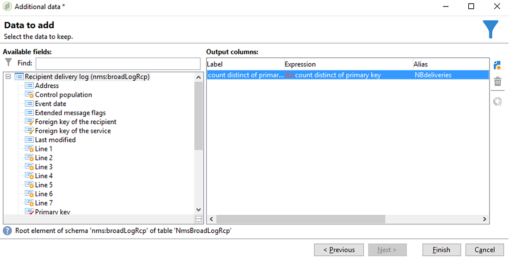

# 同步對象{#synchronizing-audiences}

您可以使用Campaign v7進階功能建立複雜的清單，並與Campaign Standard（包括其他資料）以順暢的方式直接即時地以觀眾身分分享此清單。 然後，您的Campaign standard使用者就可以在Adobe Campaign standard中使用對象。

複雜的定位涉及未在Campaign standard中複製的其他資料，只能使用Campaign v7來達成。

您也只需共用收件者清單或透過連接器（例如Microsoft Dynamics with Campaign Standard）傳送的資料。

此使用案例說明如何在Campaign v7中準備您的傳送目標，以及如何在使用Adobe Campaign Standard建立和傳送的傳送中重複使用此目標及其他資料。

>[!NOTE]
>
>如果您需要的所有資料都已複製，您也可以在Adobe Campaign standard中使用匯總和集合來豐富資料。

## 必要條件 {#prerequisites}

為達到此目的，您需要：

* 儲存在Campaign v7資料庫並與Campaign Standard同步的收件者。 請參閱同步 [配置檔案](../../integrations/using/synchronizing-profiles.md) 。
* 其他資料，例如儲存在Campaign v7資料庫中與nms:recipients相關的表格中的訂閱或交易。 這些資料可來自Campaign v7 OOB結構描述或自訂表格。 由於未同步化，因此在「促銷活動標準」中預設無法使用這些項目。
* 在Campaign v7和Campaign standard中執行工作流程的權限。
* 在Campaign standard中建立和執行傳送的權限。

## 在Campaign v7中建立包含其他資料的定位工作流程 {#create-a-targeting-workflow-with-additional-data-in-campaign-v7}

複雜的定位涉及未在Campaign standard中複製的其他資料，只能使用Campaign v7來達成。

定義目標及其其他資料後，就可將其儲存為可與「促銷活動標準」共用的清單。

>[!NOTE]
>
>這就是一個例子。 根據您的需求，您只需查詢收件者清單，並與ACS共用，毋需進一步處理。 您也可以使用其他資料管理活動來準備最終目標。

若要取得最終受眾及其他資料：

1. 從> **[!UICONTROL Profiles and Targets]** >建立新工作流程 **[!UICONTROL Jobs]****[!UICONTROL Targeting workflows]**。
1. 新增活 **[!UICONTROL Query]** 動，並選取您要傳送最終電子郵件給的收件者。 例如，所有18到30歲的收受者都住在法國。

   

1. 從查詢中新增其他資料。 如需詳細資訊，請參閱「新增 [資料](../../workflow/using/query.md#adding-data) 」一節。

   此範例說明如何新增匯總，以計算收件者在一年中收到多少傳送。

   在中， **[!UICONTROL Query]**&#x200B;選擇 **[!UICONTROL Add data...]**。

   

1. 選擇 **[!UICONTROL Data linked to the filtering dimension]** 並按一下 **[!UICONTROL Next]**。

   

1. 選擇 **[!UICONTROL Data linked to the filtering dimension]** ，然後選擇節 **[!UICONTROL Recipient delivery logs]** 點並按一下 **[!UICONTROL Next]**。

   

1. 在欄 **[!UICONTROL Aggregates]** 位中選 **[!UICONTROL Data collected]** 取並按一下 **[!UICONTROL Next]**。

   

1. 新增篩選條件，僅納入過去365天內建立的帳戶記錄，然後按一下 **[!UICONTROL Next]**。

   

1. 定義輸出列。 在這裡，唯一需要的欄是計算傳送次數的欄。 若要這麼做：

   * 在 **[!UICONTROL Add]** 窗口右側選擇。
   * 在窗口 **[!UICONTROL Select field]** 中，按一下 **[!UICONTROL Advanced selection]**。
   * 選擇 **[!UICONTROL Aggregate]**，然後 **[!UICONTROL Count]**。 勾選選選 **[!UICONTROL Distinct]** 項，然後按一下 **[!UICONTROL Next]**。
   * 在欄位清單中，選擇用於計數函式的 **欄位** 。 選擇永遠會填入的欄位，例如欄 **[!UICONTROL Primary key]** 位，然後按一下 **[!UICONTROL Finish]**。
   * 更改列中的表達 **[!UICONTROL Alias]** 式。 此別名可讓您輕鬆擷取最終傳送中新增的欄。 例如 **NBdeliveries**。
   * 按一下 **[!UICONTROL Finish]** 並保存活 **[!UICONTROL Query]** 動配置。
   

1. 儲存工作流程。 下節說明如何與ACS共用人口。

## 與Campaign standard共用目標 {#share-the-target-with-campaign-standard}

定義目標人口後，您就可以透過活動與ACS共 **[!UICONTROL List update]** 用。

1. 在先前建立的工作流程中，新 **[!UICONTROL List update]** 增活動並指定您要更新或建立的清單。

   指定您要在Campaign v7中儲存清單的檔案夾。 清單受實作期間所定義的資料夾對應所約束，一旦在Campaign standard中共用後，這些對其可見性會有影響。 請參閱「 [權限轉換](../../integrations/using/acs-connector-principles-and-data-cycle.md#rights-conversion) 」一節。

1. 請確定已勾 **[!UICONTROL Share with ACS]** 選此選項。 預設情況下會選中它。

   

1. 儲存並執行工作流程。

   定位及其其他資料會儲存在Campaign v7的清單中，並立即在Campaign Standard中以清單對象的身分共用。 只有已複製的配置檔案與ACS共用。

如果活動發生錯 **[!UICONTROL List update]** 誤，表示與Campaign standard的同步可能失敗。 若要查看有關問題的詳細資訊，請前往 **[!UICONTROL Administration]** > **[!UICONTROL ACS Connector]** > **[!UICONTROL Process]** > **[!UICONTROL Diagnosis]**。 此資料夾包含由活動執行觸發的同 **[!UICONTROL List update]** 步工作流。 請參閱「 [Troubleshooting the ACS Connector(ACS連接器疑難排解](../../integrations/using/troubleshooting-the-acs-connector.md) )」部分。

## 擷取Campaign standard中的資料，並在傳送中使用 {#retrieve-the-data-in-campaign-standard-and-use-it-in-a-delivery}

在Campaign v7中執行定位工作流程後，您就可以從Campaign Standard的選單中，以唯讀模式尋找 **[!UICONTROL Audiences]** 清單對象。

在Campaign standard中建立傳送工作流程後，就可使用此對象及其在傳送中包含的其他資料。

1. 從功能表建立新的工作 **[!UICONTROL Marketing activities]** 流程。
1. 新增活 **[!UICONTROL Read audience]** 動並選取您先前從Campaign v7共用的對象。

   此活動用於擷取所選對象的資料。 您也可以視需要使 **[!UICONTROL Source Filtering]** 用本活動的「相關」索引標籤，套用其他項目。

1. 新增活 **[!UICONTROL Email delivery]** 動，並將其設定為任何其他 [電子郵件傳送活動](https://docs.adobe.com/content/help/en/campaign-standard/using/managing-processes-and-data/channel-activities/email-delivery.html)。
1. 開啟傳送內容。
1. 新增個人化欄位。 從彈出式選單中，找到節 **[!UICONTROL Additional data (targetData)]** 點。 此節點包含初始定位工作流程中計算的觀眾其他資料。 您可將其當做任何其他個人化欄位使用。

   在此範例中，原始定位工作流程所產生的其他資料是過去365天內傳送給每個收件者的傳送數。 在定位工作流程中指定的NBdeliveries別名在此處可見。

   

1. 儲存傳送和工作流程。

   工作流程現在已可供執行。 傳送內容將進行分析並準備傳送。

   

## 傳送及監控您的傳送 {#send-and-monitor-your-delivery}

傳送及其內容準備就緒後，請傳送傳送，如本節中詳細說明 [所述](https://docs.adobe.com/content/help/en/campaign-standard/using/managing-processes-and-data/channel-activities/email-delivery.html):

1. 執行傳送工作流程。 此步驟會準備傳送電子郵件。
1. 從傳送控制面板，手動確認可傳送。
1. 監控傳送的報表和記錄：

   * **在Campaign Standard中**:存取 [與傳](https://docs.adobe.com/content/help/en/campaign-standard/using/reporting/about-reporting/about-dynamic-reports.html) 送相關的報  表和記錄檔，以取用任何傳送。
   * **在Campaign v7和Campaign Standard中**:傳送ID、電子郵件廣泛記錄檔和電子郵件追蹤記錄檔會同步至Campaign v7。 然後，您就可以從Campaign v7獲得行銷宣傳的360度檢視。

      隔離會自動同步回Campaign v7。 這可讓您將無法傳遞的資訊納入Campaign v7中執行的下一個定位。

      您可在此區段中，找到有關Campaign Standard隔離管理的 [詳細資訊](https://docs.adobe.com/content/help/en/campaign-standard/using/testing-and-sending/monitoring-messages/understanding-quarantine-management.html)。

