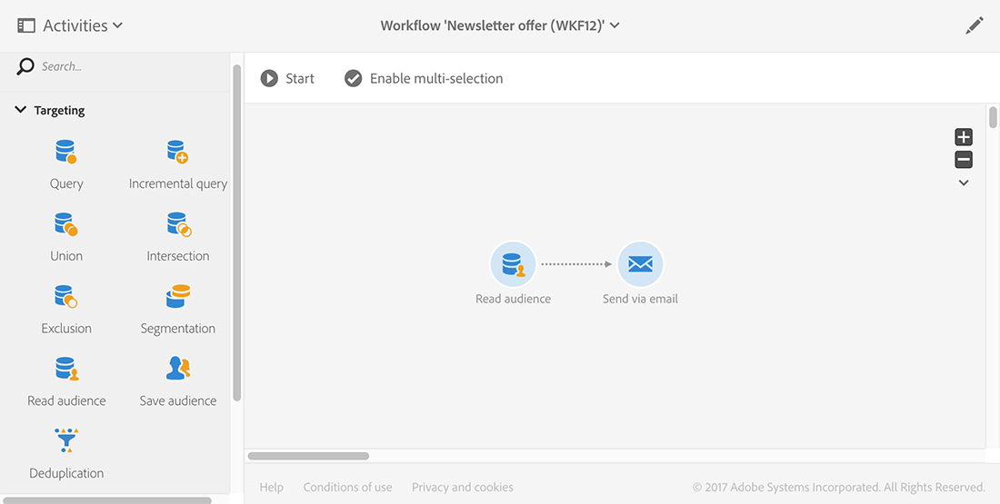

# 同步客群{#synchronizing-audiences}

您可以使用Campaign v7進階功能建立複雜的清單，並以順暢的方式與Campaign Standard（包括其他資料）直接即時以對象身分共用此清單。 您的Campaign Standard使用者就可以在Adobe Campaign Standard中取用受眾。

涉及在Campaign Standard中未複製之其他資料的複雜目標定位，只能使用Campaign v7來達成。

您也可以透過Campaign Standard共用收件者清單或透過Microsoft Dynamics等聯結器的資料。

此使用案例顯示如何在Campaign v7中準備傳送的目標，以及如何在使用Adobe Campaign Standard建立和傳送的傳送中重複使用此目標及其其他資料。

>[!NOTE]
>
>如果您需要的所有資料都已復寫，您也可以使用Adobe Campaign Standard中的彙總和集合來擴充資料。

## 先決條件 {#prerequisites}

若要完成此操作，您需要：

* 收件者儲存在Campaign v7資料庫並與Campaign Standard同步。 請參閱[同步設定檔](../../integrations/using/synchronizing-profiles.md)區段。
* 其他資料，例如儲存在Campaign v7資料庫中與nms：recipients相關的表格中的訂閱或交易。 這些資料可以來自Campaign v7 OOB結構描述或自訂表格。 由於未同步化，因此Campaign Standard預設不會提供這些專案。
* 有權執行Campaign v7和Campaign Standard的工作流程。
* 在Campaign Standard中建立及執行傳送的權利。

## 在Campaign v7中使用其他資料建立目標定位工作流程 {#create-a-targeting-workflow-with-additional-data-in-campaign-v7}

涉及在Campaign Standard中未複製之其他資料的複雜目標定位，只能使用Campaign v7來達成。

定義目標及其其他資料後，可以將其儲存為清單以供與Campaign Standard共用。

>[!NOTE]
>
>範例如下。 根據您的要求，您只需查詢收件者清單並與ACS共用即可，無需任何進一步處理。 您也可以使用其他資料管理活動來準備最終目標。

若要取得最終對象及其他：

1. 從&#x200B;**[!UICONTROL Profiles and Targets]** > **[!UICONTROL Jobs]** > **[!UICONTROL Targeting workflows]**&#x200B;建立新的工作流程。
1. 新增&#x200B;**[!UICONTROL Query]**&#x200B;活動並選取您要傳送最終電子郵件的收件者。 例如，18至30歲且居住在法國的所有收件者。

   

1. 從查詢中新增其他資料。 如需詳細資訊，請參閱[新增資料](../../workflow/using/query.md#adding-data)區段。

   此範例說明如何新增彙總，以計算收件者在一年內收到多少傳遞。

   在&#x200B;**[!UICONTROL Query]**&#x200B;中，選取&#x200B;**[!UICONTROL Add data...]**。

   

1. 選取 **[!UICONTROL Data linked to the filtering dimension]** 並按一下 **[!UICONTROL Next]**。

   

1. 選擇&#x200B;**[!UICONTROL Data linked to the filtering dimension]**，然後選取&#x200B;**[!UICONTROL Recipient delivery logs]**&#x200B;節點並按一下&#x200B;**[!UICONTROL Next]**。

   

1. 在&#x200B;**[!UICONTROL Data collected]**&#x200B;欄位中選取&#x200B;**[!UICONTROL Aggregates]**&#x200B;並按一下&#x200B;**[!UICONTROL Next]**。

   

1. 新增篩選條件以僅考慮過去365天內建立的記錄，然後按一下&#x200B;**[!UICONTROL Next]**。

   

1. 定義輸出欄。 在此，唯一需要的欄是計算傳遞數量的欄。 若要這麼做：

   * 在視窗右側選取&#x200B;**[!UICONTROL Add]**。
   * 從&#x200B;**[!UICONTROL Select field]**&#x200B;視窗，按一下&#x200B;**[!UICONTROL Advanced selection]**。
   * 選取&#x200B;**[!UICONTROL Aggregate]**，然後選取&#x200B;**[!UICONTROL Count]**。 核取&#x200B;**[!UICONTROL Distinct]**&#x200B;選項，然後按一下&#x200B;**[!UICONTROL Next]**。
   * 在欄位清單中，選取用於&#x200B;**Count**&#x200B;函式的欄位。 選擇永遠要填入的欄位，例如&#x200B;**[!UICONTROL Primary key]**&#x200B;欄位，然後按一下&#x200B;**[!UICONTROL Finish]**。
   * 變更&#x200B;**[!UICONTROL Alias]**&#x200B;欄中的運算式。 此別名可讓您在最終傳送中輕鬆擷取新增的欄。 例如&#x200B;**NBdeliveries**。
   * 按一下&#x200B;**[!UICONTROL Finish]**&#x200B;並儲存&#x200B;**[!UICONTROL Query]**&#x200B;活動設定。

   

1. 儲存工作流程。 下一節將展示如何與ACS共用母體。

## 與Campaign Standard共用目標 {#share-the-target-with-campaign-standard}

定義目標母體後，您可以透過&#x200B;**[!UICONTROL List update]**&#x200B;活動與ACS共用它。

1. 在先前建立的工作流程中，新增&#x200B;**[!UICONTROL List update]**&#x200B;活動，並指定您要更新或建立的清單。

   指定您要在Campaign v7中儲存清單的資料夾。 清單受制於實施期間定義的資料夾對應，一旦在Campaign Standard中共用，可能會影響其可見性。 請參閱[許可權轉換](../../integrations/using/acs-connector-principles-and-data-cycle.md#rights-conversion)區段。

1. 請確定已核取&#x200B;**[!UICONTROL Share with ACS]**&#x200B;選項。 預設會勾選。

   

1. 儲存並執行工作流程。

   目標及其他Campaign Standard會儲存在Campaign v7的清單中，並立即以清單對象的形式共用。 只有已複製的設定檔會與ACS共用。

如果&#x200B;**[!UICONTROL List update]**&#x200B;活動發生錯誤，表示與Campaign Standard的同步處理可能已失敗。 若要檢視發生問題的詳細資訊，請前往「**[!UICONTROL Administration]** > **[!UICONTROL ACS Connector]** > **[!UICONTROL Process]** > **[!UICONTROL Diagnosis]**」。 此資料夾包含由&#x200B;**[!UICONTROL List update]**&#x200B;活動執行觸發的同步工作流程。 請參閱[疑難排解ACS聯結器](../../integrations/using/troubleshooting-the-acs-connector.md)區段。

## 擷取Campaign Standard中的資料，並將其用於傳遞 {#retrieve-the-data-in-campaign-standard-and-use-it-in-a-delivery}

在Campaign v7中執行目標定位工作流程後，您就可以從Campaign Standard的&#x200B;**[!UICONTROL Audiences]**&#x200B;功能表以唯讀模式找到清單對象。

透過Campaign Standard建立傳送工作流程，然後就可以使用此對象及其在傳送中包含的其他資料。

1. 從&#x200B;**[!UICONTROL Marketing activities]**&#x200B;功能表建立新的工作流程。
1. 新增&#x200B;**[!UICONTROL Read audience]**&#x200B;活動並選取您先前從Campaign v7共用的對象。

   此活動用於擷取所選對象的資料。 如有需要，您也可以使用此活動的相應索引標籤，套用額外的&#x200B;**[!UICONTROL Source Filtering]**。

1. 新增&#x200B;**[!UICONTROL Email delivery]**&#x200B;活動，並將其設定為任何其他[電子郵件傳遞活動](https://experienceleague.adobe.com/docs/campaign-standard/using/managing-processes-and-data/channel-activities/email-delivery.html?lang=zh-Hant)。
1. 開啟傳遞內容。
1. 新增個人化欄位。從快顯視窗中找到&#x200B;**[!UICONTROL Additional data (targetData)]**&#x200B;節點。 此節點包含已在初始定位工作流程中計算的對象其他資料。 您可以使用它們做為任何其他個人化欄位。

   在此範例中，來自原始定位工作流程的其他資料是過去365天內傳送給每個收件者的傳送數量。 此處會顯示目標工作流程中所指定的NBdeliveries別名。

   

1. 儲存傳遞和工作流程。

   工作流程現在已準備好執行。 將會分析傳遞內容並準備傳送。

   

## 傳送並監視您的傳遞 {#send-and-monitor-your-delivery}

一旦傳送及其內容準備就緒後，請傳送傳送：

1. 執行傳遞工作流程。 此步驟會準備要傳送的電子郵件。
1. 從傳遞控制面板，手動確認可傳送傳遞。
1. 監視傳送的報告和記錄：

   * **在Campaign Standard**&#x200B;中：存取與任何傳遞相關的傳遞[報告](https://experienceleague.adobe.com/docs/campaign-standard/using/reporting/about-reporting/about-dynamic-reports.html?lang=zh-Hant)和[記錄](https://experienceleague.adobe.com/docs/campaign-standard/using/testing-and-sending/monitoring-messages/monitoring-a-delivery.html?lang=zh-Hant)。
   * Campaign v7和Campaign Standard **中的**：傳遞ID、電子郵件廣泛記錄檔和電子郵件追蹤記錄檔已同步至Campaign v7。 然後您就可以從Campaign v7取得行銷活動的360°檢視。

     隔離會自動同步回Campaign v7。 這允許將無法傳遞的資訊納入考量，以便在Campaign v7中執行的下一個目標定位。

     您可以在[本節](https://experienceleague.adobe.com/docs/campaign-standard/using/testing-and-sending/monitoring-messages/understanding-quarantine-management.html?lang=zh-Hant)中找到有關Campaign Standard隔離管理的詳細資訊。
