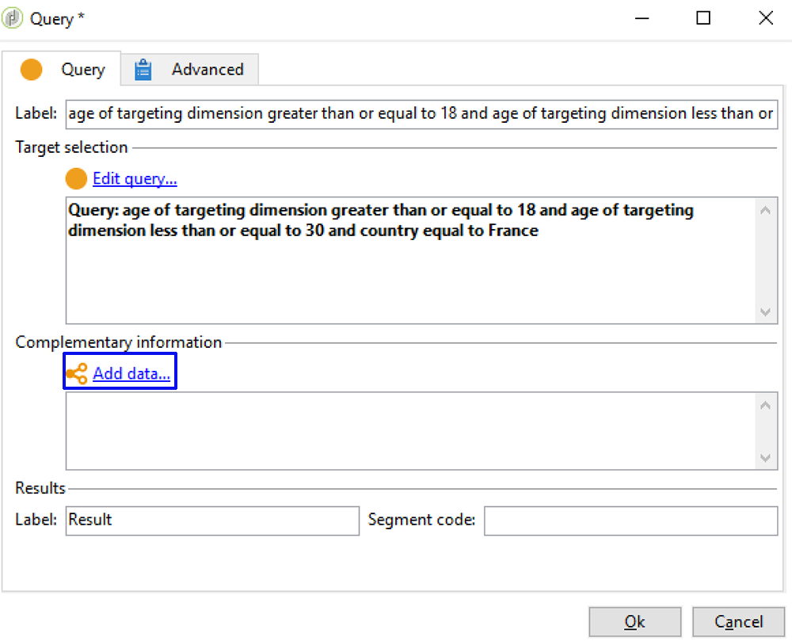

# 同步受眾{#synchronizing-audiences}

您可以使用Campaign v7進階功能來建立複雜的清單，並以順暢的方式直接與Campaign Standard（包括其他資料）即時共用此清單作為對象。 然後您的Campaign Standard使用者就可以在Adobe Campaign Standard中使用對象。

只能使用Campaign v7，才能實現複雜的鎖定目標，其中涉及未在Campaign Standard中複製的其他資料。

您也可以直接共用透過連接器（如Microsoft Dynamics）傳送的收件者或資料清單與Campaign Standard。

此使用案例顯示如何在Campaign v7中準備傳送的目標，以及如何在透過Adobe Campaign Standard建立和傳送的傳送中重複使用此目標及其他資料。

>[!NOTE]
>
>如果您需要的所有資料皆已復寫，您也可以在Adobe Campaign Standard中使用匯總和集合來擴充資料。

## 先決條件 {#prerequisites}

若要達成此目標，您需要：

* 儲存在Campaign v7資料庫中並與Campaign Standard同步的收件者。 請參閱[同步設定檔](../../integrations/using/synchronizing-profiles.md)區段。
* 其他資料，例如儲存在與Campaign v7資料庫中nms:recipients相關的表格中的訂閱或交易。 這些資料可來自Campaign v7 OOB結構或自訂表格。 預設情況下，Campaign Standard中無法使用它們，因為它們未同步。
* 直接在Campaign v7和Campaign Standard中執行工作流程。
* 在Campaign Standard中建立和執行傳送的權限。

## 在Campaign v7中使用其他資料建立目標工作流程 {#create-a-targeting-workflow-with-additional-data-in-campaign-v7}

只能使用Campaign v7，才能實現複雜的鎖定目標，其中涉及未在Campaign Standard中複製的其他資料。

定義目標及其其他資料後，就可以將其儲存為可與Campaign Standard共用的清單。

>[!NOTE]
>
>這是一個例子。 您只需查詢收件者清單，並與ACS共用，無需進一步處理即可。 您也可以使用其他資料管理活動來準備最終目標。

若要取得最終對象及其其他資料：

1. 從&#x200B;**[!UICONTROL Profiles and Targets]** > **[!UICONTROL Jobs]** > **[!UICONTROL Targeting workflows]**&#x200B;建立新工作流。
1. 新增&#x200B;**[!UICONTROL Query]**&#x200B;活動，並選取您要傳送最終電子郵件給的收件者。 例如，所有18至30歲的收件者都居住在法國。

   

1. 從查詢中新增其他資料。 如需詳細資訊，請參閱[新增資料](../../workflow/using/query.md#adding-data)區段。

   此範例顯示如何新增匯總，以計算收件者一年內收到的傳送數。

   在&#x200B;**[!UICONTROL Query]**&#x200B;中，選擇&#x200B;**[!UICONTROL Add data...]**。

   

1. 選取 **[!UICONTROL Data linked to the filtering dimension]** 並按一下 **[!UICONTROL Next]**。

   

1. 選擇&#x200B;**[!UICONTROL Data linked to the filtering dimension]**，然後選擇&#x200B;**[!UICONTROL Recipient delivery logs]**&#x200B;節點，然後按一下&#x200B;**[!UICONTROL Next]**。

   

1. 在&#x200B;**[!UICONTROL Data collected]**&#x200B;欄位中選擇&#x200B;**[!UICONTROL Aggregates]** ，然後按一下&#x200B;**[!UICONTROL Next]**。

   

1. 新增篩選條件，僅考量在過去365天內建立的記錄，然後按一下&#x200B;**[!UICONTROL Next]**。

   

1. 定義輸出欄。 在此，唯一需要的欄是計算傳送數量的欄。 要執行此操作：

   * 選擇窗口右側的&#x200B;**[!UICONTROL Add]**。
   * 在&#x200B;**[!UICONTROL Select field]**&#x200B;窗口中，按一下&#x200B;**[!UICONTROL Advanced selection]**。
   * 依次選擇&#x200B;**[!UICONTROL Aggregate]**&#x200B;和&#x200B;**[!UICONTROL Count]**。 檢查&#x200B;**[!UICONTROL Distinct]**&#x200B;選項，然後按一下&#x200B;**[!UICONTROL Next]**。
   * 在欄位清單中，選取用於&#x200B;**Count**&#x200B;函式的欄位。 選擇將始終填充的欄位，例如&#x200B;**[!UICONTROL Primary key]**&#x200B;欄位，然後按一下&#x200B;**[!UICONTROL Finish]**。
   * 更改&#x200B;**[!UICONTROL Alias]**&#x200B;列中的表達式。 此別名可讓您輕鬆擷取最終傳送中新增的欄。 例如&#x200B;**NBdellies**。
   * 按一下&#x200B;**[!UICONTROL Finish]**&#x200B;並儲存&#x200B;**[!UICONTROL Query]**&#x200B;活動設定。

   

1. 儲存工作流程。下一節顯示如何與ACS共用母體。

## 與Campaign Standard共用目標 {#share-the-target-with-campaign-standard}

定義目標母體後，您可以透過&#x200B;**[!UICONTROL List update]**&#x200B;活動與ACS共用。

1. 在先前建立的工作流程中，新增&#x200B;**[!UICONTROL List update]**&#x200B;活動並指定您要更新或建立的清單。

   指定您要在Campaign v7中儲存清單的資料夾。 清單會受實作期間定義的資料夾對應所限制，一旦共用至Campaign Standard，清單的可見性就會受到影響。 請參閱[權限轉換](../../integrations/using/acs-connector-principles-and-data-cycle.md#rights-conversion)區段。

1. 確定已勾選&#x200B;**[!UICONTROL Share with ACS]**&#x200B;選項。 預設會勾選此選項。

   

1. 儲存並執行工作流程。

   目標及其其他資料會儲存在Campaign v7的清單中，並立即以清單對象的形式共用為Campaign Standard。 只有已複製的配置檔案才與ACS共用。

如果&#x200B;**[!UICONTROL List update]**&#x200B;活動發生錯誤，表示與Campaign Standard的同步可能已失敗。 若要查看關於發生錯誤的詳細資訊，請前往&#x200B;**[!UICONTROL Administration]** > **[!UICONTROL ACS Connector]** > **[!UICONTROL Process]** > **[!UICONTROL Diagnosis]**。 此資料夾包含&#x200B;**[!UICONTROL List update]**&#x200B;活動執行所觸發的同步工作流程。 請參閱[ACS Connector](../../integrations/using/troubleshooting-the-acs-connector.md)疑難排解部分。

## 擷取Campaign Standard中的資料並用於傳送 {#retrieve-the-data-in-campaign-standard-and-use-it-in-a-delivery}

在Campaign v7中執行目標工作流程後，您就可以從促銷活動的&#x200B;**[!UICONTROL Audiences]**&#x200B;功能表中以唯讀模式找到清單對象。

透過在Campaign Standard中建立傳遞工作流程，便可使用此對象，以及其在傳遞中包含的其他資料。

1. 從&#x200B;**[!UICONTROL Marketing activities]**&#x200B;功能表建立新的工作流程。
1. 新增&#x200B;**[!UICONTROL Read audience]**&#x200B;活動，並選取您先前從Campaign v7共用的對象。

   此活動可用來擷取所選對象的資料。 您也可以視需要使用此活動的相應索引標籤，套用額外的&#x200B;**[!UICONTROL Source Filtering]**。

1. 新增&#x200B;**[!UICONTROL Email delivery]**&#x200B;活動，並將其設定為任何其他[電子郵件傳送活動](https://experienceleague.adobe.com/docs/campaign-standard/using/managing-processes-and-data/channel-activities/email-delivery.html)。
1. 開啟傳遞內容。
1. 新增個人化欄位。從快顯視窗中，找到&#x200B;**[!UICONTROL Additional data (targetData)]**&#x200B;節點。 此節點包含在初始定位工作流程中計算的對象其他資料。 您可以將它們作為任何其他個人化欄位使用。

   在此範例中，來自原始目標工作流程的其他資料是過去365天內傳送給每個收件者的傳送數。 此處顯示目標工作流程中指定的NBdellies別名。

   

1. 儲存傳送和工作流程。

   工作流程現在已準備好執行。 會分析傳送內容，並準備好傳送。

   

## 傳送並監控您的傳送 {#send-and-monitor-your-delivery}

傳送及其內容準備就緒後，請傳送傳送：

1. 執行傳送工作流程。 此步驟會準備要傳送的電子郵件。
1. 從傳送控制面板，手動確認可傳送傳送。
1. 監控傳送的報表和記錄：

   * **Campaign Standard**:以任  何傳  送方式存取與傳送相關的報表和記錄。
   * **在Campaign v7和Campaign Standard中**:傳送ID、電子郵件廣泛記錄檔和電子郵件追蹤記錄檔已同步至Campaign v7。然後，您就可以從Campaign v7以360°的方式檢視行銷活動。

      隔離會自動同步回Campaign v7。 這可讓將無法傳送的資訊納入Campaign v7中執行的下一個目標定位。

      您可以在[此部分](https://experienceleague.adobe.com/docs/campaign-standard/using/testing-and-sending/monitoring-messages/understanding-quarantine-management.html?lang=en)的Campaign Standard中找到有關隔離管理的詳細資訊。
