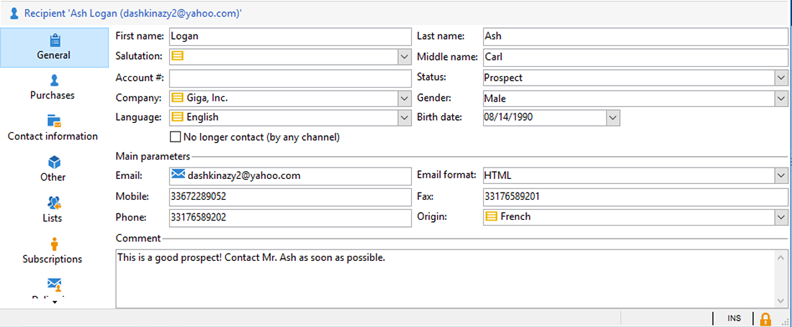
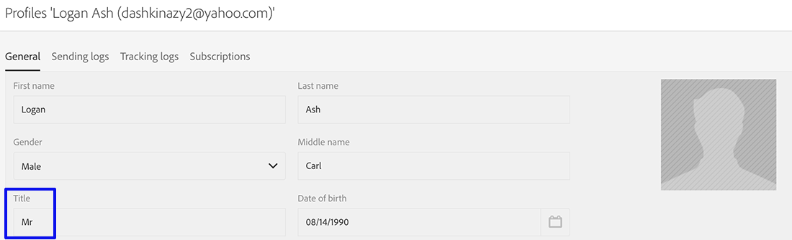
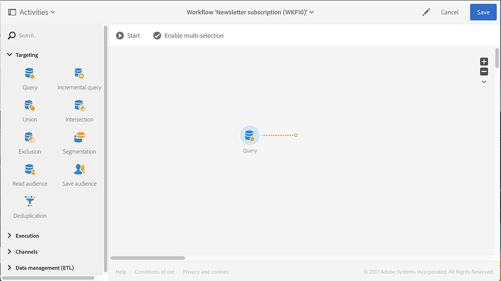
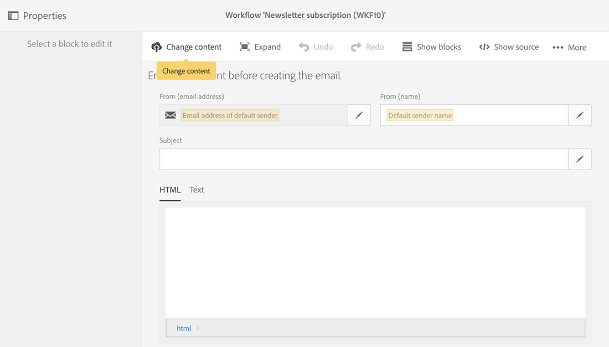
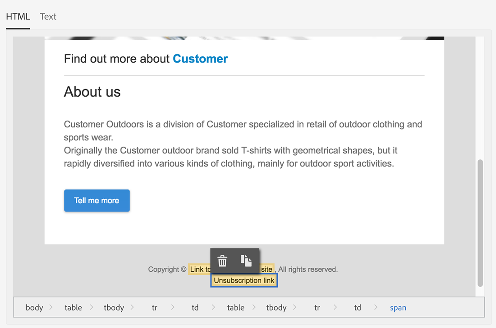

# 同步設定檔{#synchronizing-profiles}

ACS Connector會將資料從Campaign v7複製到Campaign Standard。 從Campaign v7收到的資料可用於Campaign Standard建立傳遞。 您可以透過執行下面列出的操作，檢視設定檔的同步方式。

* **新增收件者**：在Campaign v7中建立新的收件者，並確認已將對應的設定檔復寫至Campaign Standard。 請參閱[建立新收件者](#creating-a-new-recipient)。
* **更新收件者**：在Campaign v7中編輯新的收件者，並在Campaign Standard中檢視對應的設定檔，以確認已復寫更新。 請參閱[編輯收件者](#editing-a-recipient)。
* **在Campaign Standard中建立工作流程**：在Campaign Standard中建立工作流程，其中包含具有從Campaign v7復寫之對象或設定檔的查詢。 請參閱[建立工作流程](#creating-a-workflow)。
* **在Campaign Standard中建立傳遞**：依照工作流程完成以傳送傳遞。 請參閱[建立傳遞](#creating-a-delivery)。
* **驗證取消訂閱連結**：使用Campaign v7網頁應用程式，確定收件者取消訂閱服務的選擇已傳送至Campaign v7資料庫。 停止接收服務的選項會複製到Campaign Standard。 請參閱[變更取消訂閱連結](#changing-the-unsubscription-link)。

## 先決條件 {#prerequisites}

以下章節說明ACS Connector如何協助您在Campaign v7中新增和編輯收件者，然後在Campaign Standard傳送中使用這些收件者。 ACS Connector需要下列專案：

* Campaign v7中的收件者已復寫至Campaign Standard。
* 在Campaign v7和Campaign Standard中執行工作流程的使用者許可權。
* 在Campaign Standard中建立和執行傳遞的使用者許可權。

## 變更取消訂閱連結 {#changing-the-unsubscription-link}

當收件者按一下Campaign Standard傳送的電子郵件中的取消訂閱連結時，Campaign Standard中的對應設定檔會更新。 為確保復寫設定檔包含使用者取消訂閱服務的選擇，資訊必須傳送至Campaign v7而非Campaign Standard。 為了執行變更，取消訂閱服務會連結至Campaign v7網頁應用程式，而非Campaign Standard。

>[!NOTE]
>
>請在執行以下步驟之前，要求您的顧問設定取消訂閱服務的網頁應用程式。

## 建立新收件者 {#creating-a-new-recipient}

1. 在Campaign v7中建立新的收件者，以復寫至Campaign Standard。 儘可能輸入詳細資訊，包括收件者的姓氏、名字、電子郵件地址及郵寄地址。 但是，請勿選擇&#x200B;**[!UICONTROL Salutation]**，因為它將會新增到下一節[編輯收件者](#editing-a-recipient)。 如需進一步資訊，請參閱[新增收件者](../../platform/using/adding-profiles.md)。

   

1. 確認新收件者已新增至Campaign Standard。 檢閱設定檔時，請確定您在Campaign v7中輸入的資料也可在Campaign Standard中使用。 若要瞭解在Campaign Standard中尋找設定檔的位置，請參閱[導覽基本知識](https://experienceleague.adobe.com/docs/campaign-standard/using/getting-started/discovering-the-interface/interface-description.html?lang=zh-Hant)。

   

   根據預設，ACS Connector的定期復寫是每15分鐘一次。 如需進一步資訊，請參閱[資料復寫](../../integrations/using/acs-connector-principles-and-data-cycle.md#data-replication)。

## 編輯收件者 {#editing-a-recipient}

以下變更單一資料點的步驟提供簡單範例，說明使用資料複製時，Campaign v7如何成為Campaign Standard的主要資料庫。 修改或刪除Campaign v7中的複製資料對Campaign Standard中的對應資料具有相同的效果。

1. 從[建立新收件者](#creating-a-new-recipient)及編輯收件者的名稱，選擇新建立的收件者。 例如，選擇收件者的&#x200B;**[!UICONTROL Salutation]** （例如，Mr或Mrs）。 如需進一步資訊，請參閱[編輯設定檔](../../platform/using/editing-a-profile.md)。

   

1. 確認收件者的名稱已在Campaign Standard中更新。 若要瞭解在Campaign Standard中尋找設定檔的位置，請參閱[導覽基本知識](https://experienceleague.adobe.com/docs/campaign-standard/using/getting-started/discovering-the-interface/interface-description.html?lang=zh-Hant)。

   

   根據預設，ACS Connector的定期復寫是每15分鐘一次。 如需進一步資訊，請參閱[資料復寫](../../integrations/using/acs-connector-principles-and-data-cycle.md#data-replication)。

## 建立工作流程 {#creating-a-workflow}

數位行銷人員可從Campaign v7復寫的設定檔和服務中，運用Campaign Standard的豐富資料。 下列指示示範如何將查詢新增至Campaign Standard工作流程，然後用於復寫資料庫。

如需Campaign Standard工作流程的詳細資訊和完整指示，請參閱[工作流程](../../workflow/using/about-workflows.md)。

1. 前往Campaign Standard並按一下&#x200B;**[!UICONTROL Marketing Activities]**。
1. 按一下右上角的&#x200B;**[!UICONTROL Create]**。
1. 按一下&#x200B;**[!UICONTROL Workflow]**。
1. 按一下&#x200B;**[!UICONTROL New workflow]**&#x200B;和&#x200B;**[!UICONTROL Next]**。
1. 在&#x200B;**[!UICONTROL Label]**&#x200B;欄位中輸入工作流程名稱，並視需要輸入其他資訊。 按一下&#x200B;**[!UICONTROL Next]**。
1. 從左側的&#x200B;**[!UICONTROL Targeting]**&#x200B;拖曳&#x200B;**[!UICONTROL Query]**&#x200B;目標至工作區。

   

1. 連按兩下&#x200B;**[!UICONTROL Query]**&#x200B;活動，然後選擇可與復寫資料庫搭配使用的引數。 例如，您可以：

   * 將&#x200B;**[!UICONTROL Profiles]**&#x200B;拖曳至工作區。 使用欄位下拉式功能表選擇&#x200B;**[!UICONTROL Is external resource]**&#x200B;以尋找從Campaign v7復寫的設定檔。
   * 拖曳其他查詢引數，以進一步鎖定複製的設定檔。

## 建立傳遞 {#creating-a-delivery}

>[!NOTE]
>
>建立傳遞的指示會繼續[建立工作流程](#creating-a-workflow)的工作流程。

數位行銷人員可運用Campaign v7網頁應用程式，確保將收件者取消訂閱服務的選擇傳送至Campaign v7資料庫。 收件者按一下取消訂閱連結後，停止接收服務的選項會從Campaign v7復寫至Campaign Standard。 如需其他詳細資料，請參閱[變更取消訂閱連結](#changing-the-unsubscription-link)。

請依照下列步驟，使用Campaign v7中建立的取消訂閱服務，將電子郵件傳遞新增至現有工作流程。 如需有關Campaign Standard工作流程的詳細資訊和完整指示，請參閱此[檔案](../../workflow/using/about-workflows.md)。

>[!NOTE]
>
>請在執行以下步驟之前，要求您的顧問設定取消訂閱服務的網頁應用程式。

1. 按一下左側的&#x200B;**[!UICONTROL Channels]**。
1. 將&#x200B;**[!UICONTROL Email delivery]**&#x200B;拖曳至工作區中的現有工作流程。

   

1. 連按兩下&#x200B;**[!UICONTROL Email delivery]**&#x200B;活動並選擇&#x200B;**[!UICONTROL Single send email]**&#x200B;或&#x200B;**[!UICONTROL Recurring email]**。 選取您的選項並按一下&#x200B;**[!UICONTROL Next]**。
1. 按一下&#x200B;**[!UICONTROL Send via email]**&#x200B;並按一下&#x200B;**[!UICONTROL Next]**。

   

1. 在&#x200B;**[!UICONTROL Label]**&#x200B;欄位中輸入傳遞的名稱，並視需要輸入其他資訊。 按一下&#x200B;**[!UICONTROL Next]**。

   

1. 在&#x200B;**[!UICONTROL Subject]**&#x200B;欄位中，輸入要出現在收件者電子郵件收件匣中的主旨。
1. 按一下&#x200B;**[!UICONTROL Change content]**&#x200B;以新增HTML範本。

   

1. 選擇包含取消訂閱服務連結的內容。 按一下&#x200B;**[!UICONTROL Confirm]**。

   

1. 目前的取消訂閱連結必須由使用您的顧問所建立之Web應用程式的新連結取代。 在電子郵件內容底部找到取消訂閱連結，然後按一下該連結。 按一下垃圾桶圖示以刪除連結。

   

1. 按一下相同內容區域並輸入&#x200B;**取消訂閱連結**。

   

1. 用游標反白文字，然後按一下鏈圖示。
1. 按一下&#x200B;**[!UICONTROL Link to a landing page]**。

   

1. 按一下資料夾圖示以選擇登陸頁面。

   

1. 選擇顧問建立的網頁應用程式，然後按一下&#x200B;**[!UICONTROL Confirm]**。

   

1. 按一下&#x200B;**[!UICONTROL Create]**。
1. 按一下傳遞名稱以返回工作流程。

   

1. 按一下&#x200B;**[!UICONTROL Start]**&#x200B;以傳送傳遞。 電子郵件傳遞圖示會閃爍，表示正在準備進行傳遞。

   

1. 連按兩下&#x200B;**[!UICONTROL Email delivery]**&#x200B;頻道，然後選擇&#x200B;**[!UICONTROL Confirm]**&#x200B;以傳送電子郵件。 按一下&#x200B;**[!UICONTROL OK]**&#x200B;以傳送訊息。

   

## 驗證取消訂閱服務 {#verifying-the-unsubscription-service}

在移至下列步驟之前，請依照[建立工作流程](#creating-a-workflow)和[建立傳遞](#creating-a-delivery)中的指示進行。

1. 收件者按一下電子郵件傳遞中的取消訂閱連結。

   

1. 收件者會確認取消訂閱。

   

1. Campaign v7中的收件者資料已更新，以反映使用者已取消訂閱。 確認已針對收件者核取方塊&#x200B;**[!UICONTROL No longer contact (by any channel)]**。 若要瞭解如何在Campaign v7中檢視收件者，請參閱[編輯設定檔](../../platform/using/editing-a-profile.md)。

   

1. 前往Campaign Standard並開啟收件者的設定檔詳細資料。 確認&#x200B;**[!UICONTROL No longer contact (by any channel)]**&#x200B;旁出現核取方塊。 若要瞭解在Campaign Standard中尋找設定檔的位置，請參閱[導覽基本知識](https://experienceleague.adobe.com/docs/campaign-standard/using/getting-started/discovering-the-interface/interface-description.html?lang=zh-Hant)。

   
