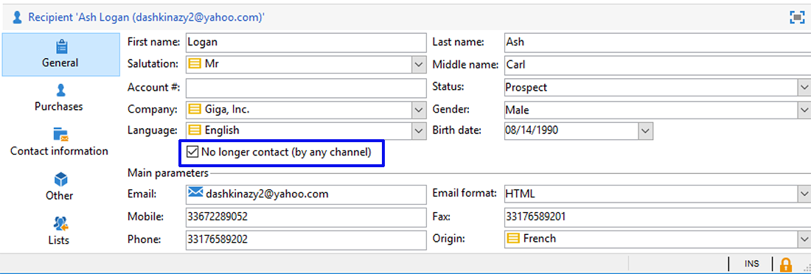

# 同步設定檔{#synchronizing-profiles}

ACS連接器將資料從Campaign v7複製到Campaign Standard。 從Campaign v7收到的資料可用於Campaign Standard以建立傳送。 您可以執行下列操作，了解設定檔的同步方式。

* **新增收件者**:在Campaign v7中建立新收件者，並確認已將對應的設定檔複製至Campaign Standard。請參閱[建立新收件者](#creating-a-new-recipient)。
* **更新收件者**:在Campaign v7中編輯新收件者，並在Campaign Standard中檢視對應的設定檔，以確認已複製更新。請參閱[編輯收件者](#editing-a-recipient)。
* **在Campaign Standard中建立工作流程**:在Campaign Standard中建立工作流程，包括從Campaign v7複製的對象或設定檔的查詢。請參閱[建立工作流](#creating-a-workflow)。
* **在Campaign Standard中建立傳送**:請依照工作流程完成，以傳送傳遞。請參閱[建立傳送](#creating-a-delivery)。
* **驗證取消訂閱連結**:使用Campaign v7 Web應用程式，以確定收件者選擇取消訂閱服務的選項會傳送至Campaign v7資料庫。停止接收服務的選項被複製到Campaign Standard。 請參閱[變更取消訂閱連結](#changing-the-unsubscription-link)。

## 先決條件 {#prerequisites}

以下幾節說明ACS連接器如何協助您在Campaign v7中新增和編輯收件者，然後在Campaign Standard傳送中使用收件者。 ACS Connector需要下列項：

* Campaign v7中的收件者已復寫至Campaign Standard。
* 在Campaign v7和Campaign Standard中執行工作流程的使用者權限。
* 在Campaign Standard中建立和執行傳送的使用者權限。

## 變更取消訂閱連結 {#changing-the-unsubscription-link}

當收件者按一下Campaign Standard所傳送電子郵件中的取消訂閱連結時，會更新Campaign Standard中的對應設定檔。 為了確定已復寫的設定檔包含使用者選擇取消訂閱服務，必須將資訊傳送至Campaign v7，而非Campaign Standard。 若要執行變更，取消訂閱服務會連結至Campaign v7 Web應用程式，而非Campaign Standard。

>[!NOTE]
>
>請您的顧問先為取消訂閱服務設定Web應用程式，然後再執行下列步驟。

## 建立新收件者 {#creating-a-new-recipient}

1. 在Campaign v7中建立新收件者，以便復寫至Campaign Standard。 輸入盡可能多的資訊，包括收件者的姓氏、名字、電子郵件地址和郵遞區號。 但是，請勿選擇&#x200B;**[!UICONTROL Salutation]**，因為它將添加到[編輯收件者](#editing-a-recipient)的下一節。 如需詳細資訊，請參閱[新增收件者](../../platform/using/adding-profiles.md)。

   

1. 確認新收件者已新增至Campaign Standard。 檢閱設定檔時，請確定您在Campaign v7中輸入的資料也可在Campaign Standard中使用。 若要了解在Campaign Standard中尋找設定檔的位置，請參閱[導覽基本知識](https://experienceleague.adobe.com/docs/campaign-standard/using/getting-started/discovering-the-interface/interface-description.html?lang=zh-Hant)。

   

   預設情況下，ACS Connector的定期複製為每15分鐘一次。 有關詳細資訊，請參閱[資料複製](../../integrations/using/acs-connector-principles-and-data-cycle.md#data-replication)。

## 編輯收件者 {#editing-a-recipient}

以下變更單一資料點的步驟提供了一個簡單範例，說明當使用資料復寫時，Campaign v7如何成為Campaign Standard的主要資料庫。 修改或刪除Campaign v7中的已復寫資料，對Campaign Standard中的對應資料會有相同的影響。

1. 從[建立新收件者](#creating-a-new-recipient)中選擇新建的收件者，並編輯收件者的姓名。 例如，為收件者（例如Mr或Mrs）選擇&#x200B;**[!UICONTROL Salutation]**。 如需詳細資訊，請參閱[編輯設定檔](../../platform/using/editing-a-profile.md)。

   

1. 確認收件者的名稱已以Campaign Standard更新。 若要了解在Campaign Standard中尋找設定檔的位置，請參閱[導覽基本知識](https://experienceleague.adobe.com/docs/campaign-standard/using/getting-started/discovering-the-interface/interface-description.html)。

   

   預設情況下，ACS Connector的定期複製為每15分鐘一次。 有關詳細資訊，請參閱[資料複製](../../integrations/using/acs-connector-principles-and-data-cycle.md#data-replication)。

## 建立工作流程 {#creating-a-workflow}

數位行銷人員可使用從Campaign v7複製的設定檔和服務，在Campaign Standard中運用豐富的資料。 以下說明演示如何將查詢添加到Campaign Standard工作流，然後與複製的資料庫一起使用。

有關Campaign Standard工作流的詳細資訊和完整說明，請參閱[Workflows](../../workflow/using/about-workflows.md)。

1. 前往Campaign Standard，然後按一下&#x200B;**[!UICONTROL Marketing Activities]**。
1. 按一下右上角的&#x200B;**[!UICONTROL Create]**。
1. 按一下&#x200B;**[!UICONTROL Workflow]**。
1. 按一下&#x200B;**[!UICONTROL New workflow]**&#x200B;和&#x200B;**[!UICONTROL Next]**。
1. 在&#x200B;**[!UICONTROL Label]**&#x200B;欄位中輸入工作流的名稱，並視需要輸入其他資訊。 按一下&#x200B;**[!UICONTROL Next]**。
1. 從左側的&#x200B;**[!UICONTROL Targeting]**，將&#x200B;**[!UICONTROL Query]**&#x200B;目標拖曳至工作區。

   

1. 按兩下&#x200B;**[!UICONTROL Query]**&#x200B;活動，然後選擇可與複製的資料庫一起使用的參數。 例如，您可以：

   * 將&#x200B;**[!UICONTROL Profiles]**&#x200B;拖曳至工作區。 使用欄位下拉式選單來選擇&#x200B;**[!UICONTROL Is external resource]**&#x200B;以尋找從Campaign v7復寫的設定檔。
   * 拖曳其他查詢參數，以進一步鎖定已復寫的設定檔。

## 建立傳遞 {#creating-a-delivery}

>[!NOTE]
>
>建立傳送的指示會繼續以[建立工作流程](#creating-a-workflow)開始的工作流程。

數位行銷人員可運用Campaign v7 Web應用程式，以確定收件者選擇取消訂閱服務的選項會傳送至Campaign v7資料庫。 收件者按一下取消訂閱連結後，停止接收服務的選項會從Campaign v7複製到Campaign Standard。 有關其他詳細資訊，請參閱[更改取消訂閱連結](#changing-the-unsubscription-link)。

請依照下列步驟，使用在Campaign v7中建立的取消訂閱服務，將電子郵件傳送新增至現有的工作流程。 有關Campaign Standard工作流的詳細資訊和完整說明，請參見此[document](../../workflow/using/about-workflows.md)。

>[!NOTE]
>
>請您的顧問先為取消訂閱服務設定Web應用程式，然後再執行下列步驟。

1. 按一下左側的&#x200B;**[!UICONTROL Channels]**。
1. 將&#x200B;**[!UICONTROL Email delivery]**&#x200B;拖曳至工作區中的現有工作流程。

   

1. 按兩下&#x200B;**[!UICONTROL Email delivery]**&#x200B;活動，然後選擇&#x200B;**[!UICONTROL Single send email]**&#x200B;或&#x200B;**[!UICONTROL Recurring email]**。 選擇選項，然後按一下&#x200B;**[!UICONTROL Next]**。
1. 按一下&#x200B;**[!UICONTROL Send via email]**，然後按一下&#x200B;**[!UICONTROL Next]**。

   

1. 在&#x200B;**[!UICONTROL Label]**&#x200B;欄位中輸入傳送的名稱，並視需要輸入其他資訊。 按一下&#x200B;**[!UICONTROL Next]**。

   

1. 在&#x200B;**[!UICONTROL Subject]**&#x200B;欄位中，輸入要出現在收件者電子郵件收件匣中的主旨。
1. 按一下&#x200B;**[!UICONTROL Change content]**&#x200B;以新增HTML範本。

   

1. 選擇包含要取消訂閱服務的連結的內容。 按一下&#x200B;**[!UICONTROL Confirm]**。

   

1. 目前的取消訂閱連結必須替換為使用顧問建立之Web應用程式的新連結。 在電子郵件內容底部找到取消訂閱連結，然後按一下。 按一下垃圾桶圖示以刪除連結。

   

1. 按一下相同內容區域內的，然後鍵入&#x200B;**取消訂閱連結**。

   

1. 用游標突出顯示文本，然後按一下鏈表徵圖。
1. 按一下&#x200B;**[!UICONTROL Link to a landing page]**。

   

1. 按一下資料夾圖示以選擇登錄頁面。

   

1. 選擇顧問建立的Web應用程式，然後按一下&#x200B;**[!UICONTROL Confirm]**。

   

1. 按一下&#x200B;**[!UICONTROL Create]**。
1. 按一下傳送名稱以返回工作流程。

   

1. 按一下&#x200B;**[!UICONTROL Start]**&#x200B;以傳送傳遞。 電子郵件傳送圖示會閃爍，指出其已準備好傳送。

   

1. 連按兩下&#x200B;**[!UICONTROL Email delivery]**&#x200B;通道，然後選擇&#x200B;**[!UICONTROL Confirm]**&#x200B;以傳送電子郵件。 按一下&#x200B;**[!UICONTROL OK]**&#x200B;以傳送訊息。

   

## 驗證取消訂閱服務 {#verifying-the-unsubscription-service}

請依照[建立工作流程](#creating-a-workflow)和[建立傳送](#creating-a-delivery)中的指示，再前往下列步驟。

1. 收件者按一下電子郵件傳送中的取消訂閱連結。

   

1. 收件者會確認取消訂閱。

   

1. Campaign v7中的收件者資料會更新，以反映使用者已取消訂閱。 確認已為收件者勾選方塊&#x200B;**[!UICONTROL No longer contact (by any channel)]**。 若要了解如何在Campaign v7中檢視收件者，請參閱編輯設定檔[。](../../platform/using/editing-a-profile.md)

   

1. 前往「Campaign Standard」 ，並開啟收件者的設定檔詳細資訊。 確認&#x200B;**[!UICONTROL No longer contact (by any channel)]**&#x200B;旁邊出現核取方塊。 若要了解在Campaign Standard中尋找設定檔的位置，請參閱[導覽基本知識](https://experienceleague.adobe.com/docs/campaign-standard/using/getting-started/discovering-the-interface/interface-description.html)。

   
