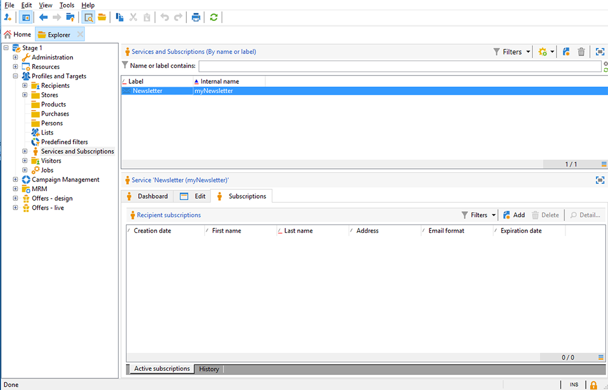
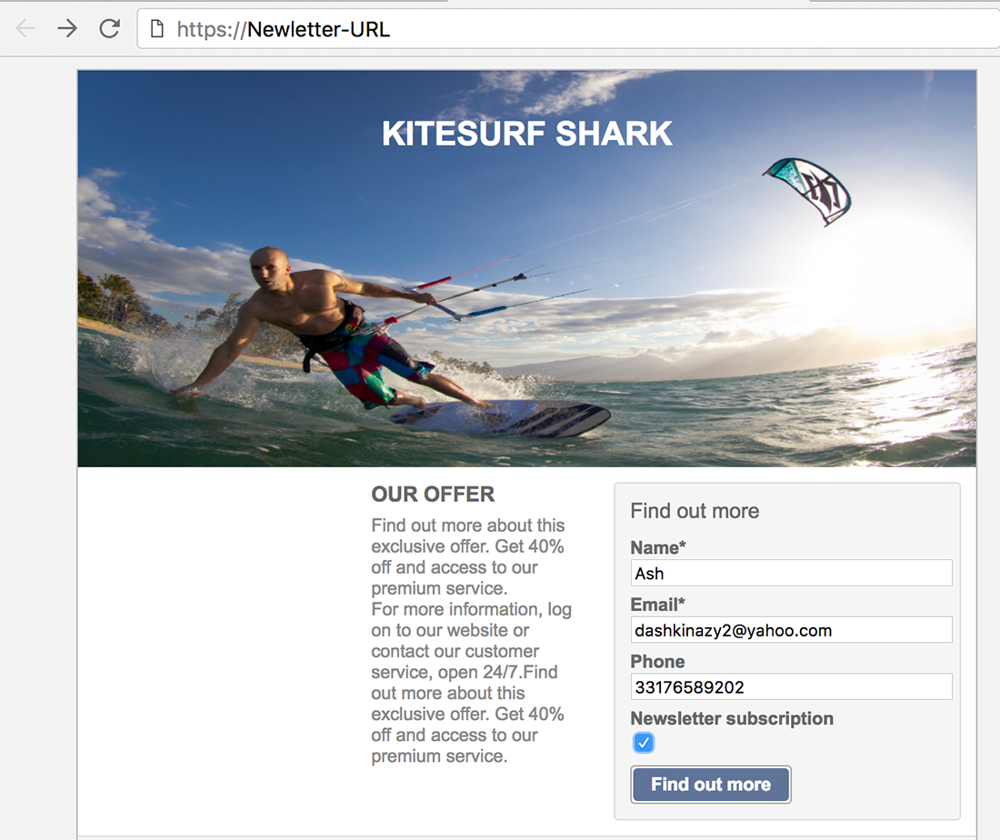
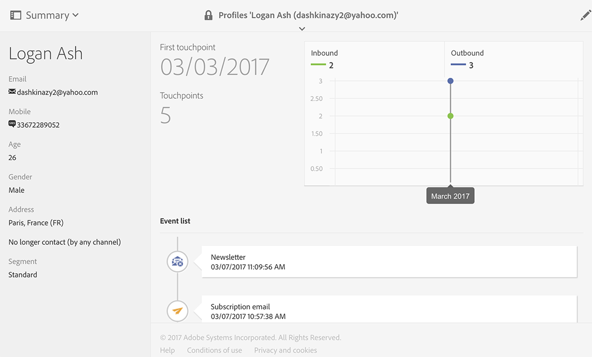

# 同步 Web 應用程式{#synchronizing-web-applications}

在此使用案例中，我們將使用Campaign Standard傳送通訊，其中包括Campaign v7 Web應用程式的連結。 當收件者點按電子郵件中的連結時，Web應用程式會顯示一個表單，其中包含預先載入收件者資料的數個欄位，以及電子報的訂閱連結。 收件者可以更新其資料並訂閱服務。 此設定檔將在Campaign v7中更新，且資訊將以Campaign Standard複製。

如果Campaign v7中有許多服務和Web應用程式，則您可能選擇不在Campaign Standard中重新建立這些服務和應用程式。 ACS Connector可讓您使用所有現有的Campaign v7 Web應用程式和服務，並將它們連結至Campaign Standard發送的傳遞。

## 先決條件 {#prerequisites}

若要達成此目標，您需要：

* 儲存在Campaign v7資料庫中並與Campaign Standard同步的收件者。 請參閱[同步設定檔](../../integrations/using/synchronizing-profiles.md)區段。
* 在Campaign v7中建立並發佈的服務和Web應用程式。
* web應用程式必須包含使用&#x200B;**[!UICONTROL Adobe Campaign encryption]**&#x200B;標識方法的&#x200B;**[!UICONTROL Pre-loading]**&#x200B;活動。

## 建立Web應用程式和服務 {#creating-the-web-application-and-service}

在Campaign v7中，您可以建立Web應用程式，讓收件者訂閱服務。 Web應用程式和服務是在Campaign v7中設計和儲存的，您可以通過Campaign Standard通信來更新此服務。 若要進一步了解Campaign v7中的Web應用程式，請參閱[此區段](../../web/using/adding-fields-to-a-web-form.md#subscription-checkboxes)。

在Campaign v7中，已建立下列物件：

* 電子報服務
* 包含&#x200B;**[!UICONTROL Pre-loading]**、**[!UICONTROL Page]**&#x200B;和&#x200B;**[!UICONTROL Storage]**&#x200B;活動的Web應用程式。

1. 轉到&#x200B;**[!UICONTROL Resources > Online > Web applications]**&#x200B;並選擇現有Web應用程式。

   

1. 編輯&#x200B;**[!UICONTROL Preloading]**&#x200B;活動。 選中&#x200B;**[!UICONTROL Auto-load data referenced in the form]**&#x200B;框並選擇&#x200B;**[!UICONTROL Adobe Campaign encryption]**&#x200B;標識方法。 這可讓Web應用程式以儲存在Adobe Campaign資料庫中的資料預先載入表單欄位。 請參閱[本檔案](../../web/using/publishing-a-web-form.md#pre-loading-the-form-data)。

   

1. 編輯&#x200B;**[!UICONTROL Page]**。 已包含三個欄位（姓名、電子郵件和電話），以及一個核取方塊，邀請收件者訂閱電子報（**[!UICONTROL Newsletter]**&#x200B;服務）。

   

1. 前往&#x200B;**[!UICONTROL Profiles and Target > Services and subscriptions]**&#x200B;並開啟&#x200B;**[!UICONTROL Newsletter]**&#x200B;服務。 這是將從Campaign Standard通訊更新的服務。 您可以看到，尚未有收件者訂閱此服務。

   

1. 前往&#x200B;**[!UICONTROL Profiles and Targets > Recipient]**&#x200B;並選取收件者。 您可以看到此設定檔尚未訂閱服務。

   

## 複製資料 {#replicating-the-data}

為了在Campaign v7和Campaign Standard之間複製所需的資料，可使用數個復寫工作流程範本。 **[!UICONTROL Profiles replication]**&#x200B;工作流程會自動將所有Campaign v7收件者複製到Campaign Standard。 請參閱[技術和復寫工作流程](../../integrations/using/acs-connector-principles-and-data-cycle.md#technical-and-replication-workflows)。 **[!UICONTROL Landing pages replication]**&#x200B;工作流允許複製我們要在Campaign Standard中使用的Web應用程式。

若要檢查資料是否已正確複製，請遵循以下Campaign Standard步驟：

1. 在主螢幕上，按一下&#x200B;**[!UICONTROL Customer profiles]**。

   

1. 搜尋您的Campaign v7收件者，並檢查此收件者是否出現在Campaign Standard中。

   

1. 從頂端列按一下&#x200B;**[!UICONTROL Marketing activities]**，然後搜尋Campaign v7 Web應用程式。 它會顯示為Campaign Standard中的登陸頁面。

   

1. 按一下左上角的&#x200B;**[!UICONTROL Adobe Campaign]**&#x200B;標誌，然後選取&#x200B;**Profiles &amp; audiences > Services**&#x200B;並檢查電子報服務是否也在。

   

## 設計和傳送電子郵件 {#designing-and-sending-the-email}

在本部分，我們將了解如何在Campaign Standard電子郵件中加入從Campaign v7 Web應用程式複製的登錄頁面連結。

建立、設計和傳送電子郵件的步驟與傳統電子郵件的步驟相同。 請參閱[Adobe Campaign Standard](https://experienceleague.adobe.com/docs/campaign-standard.html?lang=zh-Hant)檔案。

1. 建立新電子郵件，並選擇一或多個已複製的設定檔作為對象。
1. 編輯內容並插入&#x200B;**[!UICONTROL Link to a landing page]**。

   

1. 選取從Campaign v7 Web應用程式複製的登錄頁面。

   

1. 準備電子郵件、傳送校樣並傳送最終電子郵件。
1. 其中一個收件者會開啟電子郵件，然後按一下電子報訂閱的連結。

   

1. 此收件者新增電話號碼並勾選電子報訂閱方塊。

   

## 擷取更新的資訊 {#retrieving-the-updated-information}

當收件者透過Web應用程式更新其資料時，Adobe Campaign v7會同步擷取更新的資訊。 然後，它會從Campaign v7複製到Campaign Standard。

1. 在Campaign v7中，前往&#x200B;**[!UICONTROL Profiles and Target > Services and subscriptions]**&#x200B;並開啟&#x200B;**[!UICONTROL Newsletter]**&#x200B;服務。 您可以看到收件者現在出現在訂閱者清單中。

   

1. 前往&#x200B;**[!UICONTROL Profiles and Targets > Recipient]**&#x200B;並選取收件者。 您可以看到電話號碼已儲存。

   

1. 在&#x200B;**[!UICONTROL Subscriptions]**&#x200B;索引標籤中，我們也可以看到此收件者已訂閱電子報服務。

   

1. 等待幾分鐘，以執行設定檔復寫工作流程。
1. 在Campaign Standard中，存取您的收件者設定檔，以檢查更新的資料是否已從Campaign v7正確復寫。

   

1. 編輯設定檔。 您可以看到電話號碼已更新。

   

1. 按一下&#x200B;**[!UICONTROL Subscriptions]**&#x200B;標籤。 快訊服務現在會顯示。

   
