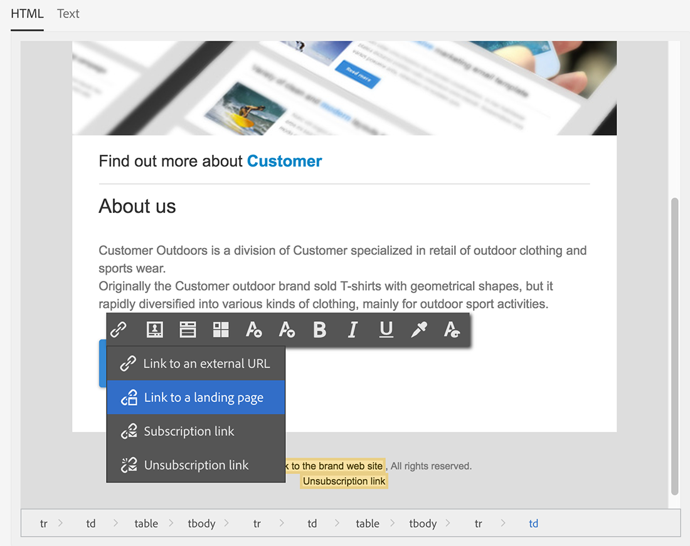

# 同步化網站應用程式{#synchronizing-web-applications}

在此使用案例中，我們將使用Campaign Standard傳送包含指向Campaign v7網頁應用程式連結的通訊。 當收件者按一下電子郵件中的連結時，網頁應用程式會顯示一個表單，其中包含數個預先載入收件者資料的欄位，以及一個電子報訂閱連結。 收件者可以更新其資料並訂閱服務。 他的設定檔將會在Campaign v7中更新，而資訊將會在Campaign Standard中複製。

如果您在Campaign v7中有許多服務和Web應用程式，您可能會選擇不要以Campaign Standard重新建立它們。 ACS Connector可讓您使用所有現有的Campaign v7網頁應用程式和服務，並將其連結至Campaign Standard傳送的傳遞。

## 先決條件 {#prerequisites}

若要完成此操作，您需要：

* 收件者儲存在Campaign v7資料庫並與Campaign Standard同步。 請參閱 [同步設定檔](../../integrations/using/synchronizing-profiles.md) 區段。
* 在Campaign v7中建立和發佈的服務和網頁應用程式。
* 網頁應用程式必須包含 **[!UICONTROL Pre-loading]** 活動使用 **[!UICONTROL Adobe Campaign encryption]** 識別方法。

## 建立Web應用程式和服務 {#creating-the-web-application-and-service}

在Campaign v7中，您可以建立網站應用程式，讓收件者訂閱服務。 網頁應用程式和服務是在Campaign v7中設計和儲存的，您可以透過Campaign Standard通訊更新此服務。 若要進一步瞭解Campaign v7的網頁應用程式，請參閱 [本節](../../web/using/adding-fields-to-a-web-form.md#subscription-checkboxes).

在Campaign v7中，已建立下列物件：

* 電子報服務
* 包含下列專案的網頁應用程式： **[!UICONTROL Pre-loading]**， a **[!UICONTROL Page]** 和 **[!UICONTROL Storage]** 活動。

1. 前往 **[!UICONTROL Resources > Online > Web applications]** 並選取現有的網頁應用程式。

   

1. 編輯 **[!UICONTROL Preloading]** 活動。 此 **[!UICONTROL Auto-load data referenced in the form]** 核取方塊，且 **[!UICONTROL Adobe Campaign encryption]** 已選取識別方法。 這可讓網頁應用程式以Adobe Campaign資料庫中儲存的資料預先載入表單欄位。 另請參閱 [本檔案](../../web/using/publishing-a-web-form.md#pre-loading-the-form-data).

   

1. 編輯 **[!UICONTROL Page]**. 新增了三個欄位（姓名、電子郵件和電話），以及一個核取方塊，可邀請收件者訂閱電子報(**[!UICONTROL Newsletter]** 服務)。

   

1. 前往 **[!UICONTROL Profiles and Target > Services and subscriptions]** 並開啟 **[!UICONTROL Newsletter]** 服務。 這是將從Campaign Standard通訊更新的服務。 您可以看到還沒有收件者訂閱此服務。

   

1. 前往 **[!UICONTROL Profiles and Targets > Recipient]** 並選取收件者。 您可以看到此設定檔尚未訂閱服務。

   

## 複製資料 {#replicating-the-data}

為了在Campaign v7和Campaign Standard之間複製所需的資料，有數個複製工作流程範本可供使用。 此 **[!UICONTROL Profiles replication]** 工作流程會自動將所有Campaign v7收件者複製到Campaign Standard。 另請參閱 [技術和復寫工作流程](../../integrations/using/acs-connector-principles-and-data-cycle.md#technical-and-replication-workflows). 此 **[!UICONTROL Landing pages replication]** 工作流程可複製我們想要在Campaign Standard中使用的網頁應用程式。

若要檢查資料是否已正確複製，請按照Campaign Standard中的以下步驟操作：

1. 在主畫面中按一下 **[!UICONTROL Customer profiles]**.

   

1. 搜尋您的Campaign v7收件者，並檢查此收件者是否出現在Campaign Standard中。

   

1. 從頂端列按一下 **[!UICONTROL Marketing activities]**，並搜尋Campaign v7網頁應用程式。 這會顯示為Campaign Standard中的登陸頁面。

   

1. 按一下 **[!UICONTROL Adobe Campaign]** 標誌，在左上角，然後選取 **設定檔與受眾>服務** 並檢查是否有電子報服務。

   

## 設計和傳送電子郵件 {#designing-and-sending-the-email}

在本部分中，我們將瞭解如何在Campaign Standard電子郵件中包含從Campaign v7網頁應用程式復寫之登入頁面的連結。

建立、設計和傳送電子郵件的步驟與傳統電子郵件的步驟相同。 請參閱 [Adobe Campaign Standard](https://experienceleague.adobe.com/docs/campaign-standard/using/campaign-standard-home.html?lang=zh-Hant) 檔案。

1. 建立新電子郵件，並選擇一或多個復寫設定檔作為對象。
1. 編輯內容並插入 **[!UICONTROL Link to a landing page]**.

   

1. 選取從Campaign v7網頁應用程式複製的登入頁面。

   

1. 準備電子郵件、傳送校樣並傳送最終電子郵件。
1. 其中一個收件者會開啟電子郵件，然後按一下電子報訂閱的連結。

   

1. 此收件者新增電話號碼並檢查電子報訂閱方塊。

   

## 正在擷取更新的資訊 {#retrieving-the-updated-information}

當收件者透過網頁應用程式從更新其資料時，Adobe Campaign v7會同步擷取更新的資訊。 然後從Campaign v7複製到Campaign Standard。

1. 在Campaign v7中，前往 **[!UICONTROL Profiles and Target > Services and subscriptions]** 並開啟 **[!UICONTROL Newsletter]** 服務。 您可以看到收件者現在出現在訂閱者清單中。

   

1. 前往 **[!UICONTROL Profiles and Targets > Recipient]** 並選取收件者。 您可以看到電話號碼現在已儲存。

   

1. 在 **[!UICONTROL Subscriptions]** 索引標籤中，我們也會看到此收件者已訂閱Newsletter服務。

   

1. 請稍候幾分鐘，讓設定檔復寫工作流程執行。
1. 在Campaign Standard中，存取您的收件者設定檔，以檢查更新的資料是否已從Campaign v7正確復寫。

   

1. 編輯設定檔。 您可以看到電話號碼已更新。

   

1. 按一下 **[!UICONTROL Subscriptions]** 標籤。 Newsletter服務現在會出現。

   
