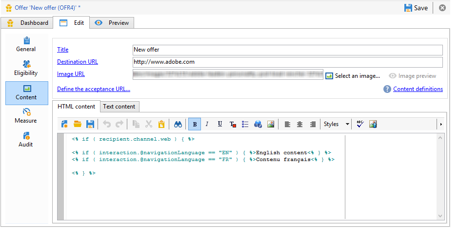

# 其他資料{#additional-data}

在呼叫互動引擎期間，您可以傳輸內容相關的其他資訊。 該資料可以來自儲存在工作流（出站通道）的工作表中的目標資料，或來自網站在呼叫（入站通道）期間發送的呼叫資料。 您可以在資格規則、選件個人化中使用此額外資料，也可以將它儲存在提案表格中。

對於傳入渠道，恢復資訊（例如，咨詢選件的人員的瀏覽器語言或呼叫中心代理的名稱）可能很有用。 然後，您可以在資格規則中使用此呼叫資料，僅向以法文或英文檢視網頁的使用者呈現選件。

在定位工作流程（出站渠道）中，您可以在呼叫引擎期間使用定位資料。 例如，您可以透過FDA，利用收件者連結交易或外部資料庫的資料來豐富目標。

## 其他資料設定 {#additional-data-configuration}

必須擴展鏈 **接到環境的nms:interaction** schema並聲明在調用交互引擎期間將使用的附加欄位的清單。 建立資格規則或個人化選件時，這些欄位將可從「互動」節點存取(請參 **閱使用其他資料**[](#using-additional-data))。

對於入站渠道，必須將呼叫資料欄位添加到「交互 **」節點** 。

```
<element label="Interactions" labelSingular="Interaction" name="interaction">
  <attribute label="Navigation language" name="navigationLanguage" type="string"/>
</element>
```

>[!NOTE]
>
>傳入渠道上支援Xml集合，但其他結構的連結則不支援。

對於出站渠道，必須將包含其 **他欄位的targetData** 元素添加到 **Interaction** 節點。

```
<element label="Interactions" labelSingular="Interaction" name="interaction">
  <element name="targetData">
    <attribute label="Date of last transaction" name="lastTransactionDate" type="datetime"/>
  </element>
</element>
```

>[!NOTE]
>
>對外渠道不支援系列。 不過，您可以建立其他結構描述的連結。

如果要將此資料儲存在命題表中，還必須擴展 **nms:compositionRcp** schema並聲明這些欄位。

```
<element label="Recipient offer propositions" labelSingular="Recipient offer proposition" name="propositionRcp">
  <attribute label="Last transaction date" name="lastTransactionDate" type="datetime"/>
  <attribute label="Navigation language" name="navigationLanguage" type="string"/>
</element>
```

## 其他資料實作 {#additional-data-implementation}

### 輸入頻道（網頁） {#input-channel--web-page-}

若要在呼叫引擎時傳輸其他資料，您必須將 **interactionGlobalCtx** 變數新增至網頁的JavaScript程式碼。 將包含 **呼叫資料** 的「互動」節點插入此變數。 必須遵循與 **nms:interaction架構中相同的xml結** 構。 請參閱：其 [他資料設定](#additional-data-configuration)。

```
interactionGlobalCtx = "<interaction navigationLanguage='"+myLanguage+"'/>";
```

### 輸出通道 {#output-channel}

必須建立一個定位工作流，該工作流將載入工作表中的其他資料，方法是遵守與 **nms:interaction架構中相同的xml結構和內部名稱** 。 請參閱：其 [他資料設定](#additional-data-configuration)。

## 使用其他資料 {#using-additional-data}

### 資格規則 {#eligibility-rules}

您可以在資格規則中使用選件、類別和權重的其他資料。

例如，您可以選擇讓選件只顯示給以英文檢視頁面的使用者。


>[!NOTE]
>
>您必須限制定義資料之渠道的規則。 在我們的範例中，我們會限制傳入Web頻道（欄位）上&#x200B;**[!UICONTROL Taken into account if]** 的規則。

### 個人化 {#personalization}

您也可以在個人化選件時使用此額外資料。 例如，您可以新增導覽語言的條件



>[!NOTE]
>
>您必須限制資料所定義之通道的個人化。 在我們的範例中，我們會限制傳入Web頻道的規則。

如果您使用其他資料來個人化選件，則預設情況下，此資料不會顯示在預覽中，因為該資料不在資料庫中。 在環境的頁籤 **[!UICONTROL Example of call data]** 中，必須添加值示例才能在預覽中使用。 請遵循與 **nms:interaction架構擴充中相同的xml** 結構。 有關詳細資訊，請參閱「其 [他資料配置」](#additional-data-configuration)。


預覽時，按一 **[!UICONTROL Content personalization options for the preview]** 下並選取欄位中的 **[!UICONTROL Call data]** 值。


### 儲存空間 {#storage}

在呼叫引擎期間，您可以將其他資料儲存在命題表格中，以豐富資料庫。 這些資料可用於報告、ROI計算或後續程式。

>[!NOTE]
>
>您必須已擴展 **nms:compositionRcp** schema並聲明將包含要儲存的資料的欄位。 如需詳細資訊：其 [他資料設定](#additional-data-configuration)。

在選件空間中，移至標籤， **[!UICONTROL Storage]** 然後按一下按 **[!UICONTROL Add]** 鈕。

在列中， **[!UICONTROL Storage path]** 選擇命題表中的儲存欄位。 在列中 **[!UICONTROL Expression]** ，選擇節點中的其他字 **[!UICONTROL Interaction]** 段。

您可以在提案產生或被接受時（當訪客點按選件時）擷取呼叫資料。


