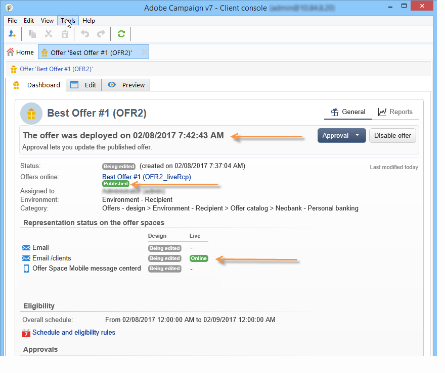

# 核准和啟用優惠方案{#approving-and-activating-an-offer}

選件內容完成後，您需要核准它以複製到即時環境中並傳送。 核准與優惠方案內容及其資格有關。

優惠方案控制面板上的橫幅會告訴您優惠方案是否需要通過核准週期。

## 核准優惠內容 {#approving-offer-content}

核准優惠方案內容表示選取您要在即時環境中提供的表現。

優惠內容的每個空間各有一個表示法。 由於每個優惠方案空間都有其自己的結構和演算功能，因此優惠方案表示可能會有所不同。

您可以選擇在某些可用空間上核准優惠方案內容，而在其他空間上拒絕優惠方案內容。

>[!IMPORTANT]
>
>一旦優惠方案的內容和資格獲得核准，發佈工作流程（優惠方案通知）就會自動執行，優惠方案就會上線並在所有已啟用的空間中使用。

若要核准優惠方案內容，請套用下列步驟：

1. 按一下 **[!UICONTROL Approval]** 按鈕並選取 **[!UICONTROL Approve content]** 在快顯視窗中。

   

1. 使用下拉式清單，選取您要持續編輯的表示或要發佈至即時環境的表示，然後按一下 **[!UICONTROL Content approval]**.

   

   一旦核准優惠方案內容，就會更新優惠方案控制面板表格上的資訊。

   

   >[!NOTE]
   >
   >此 **[!UICONTROL Content approved]** 提及並不意味著所有優惠方案宣告皆已啟用且已核准。 這表示內容核准流程已完成，無論所有優惠方案是否已啟用/核准。

## 核准優惠資格 {#approving-offer-eligibility}

核准優惠方案資格表示接受或拒絕優惠方案權重，且適用性規則也在優惠方案中設定，或繼承自父類別中建立的規則。

>[!IMPORTANT]
>
>一旦優惠方案的內容和資格獲得核准，發佈工作流程（優惠方案通知）就會自動執行，優惠方案就會上線並在所有已啟用的空間中使用。

* 按一下「 」即可檢視規則的完整清單 **[!UICONTROL Schedule and eligibility rules]**.

  

* 若要變更適用性規則，請按一下 **[!UICONTROL Reject]**，然後按一下 **[!UICONTROL Eligibility approval]**.

  

  優惠方案控制面板上的各種狀態都會更新。

  

* 若要接受優惠資格，請按一下 **[!UICONTROL Approve eligibility]**.

  

  核准資格，視需要新增評論，然後按一下 **[!UICONTROL Eligibility approval]**.

  

  優惠方案控制面板上的各種狀態都會更新。

  

## 核准追蹤 {#approval-tracking}

核准追蹤可在優惠方案控制面板上使用。 按一下 **[!UICONTROL Hide/display logs]** 以存取它。

>[!NOTE]
>
>追蹤也可在以下位置使用： **[!UICONTROL Audit]** 選件的索引標籤，其中包含稽核者意見的詳細資訊。

## 重新開始核准 {#restart-the-approval}

啟動核准後，即可重新啟動。 要執行此操作，請遵循下列指示：

1. 按一下 **[!UICONTROL Content approved]** 在優惠方案控制面板上。
1. 在 **[!UICONTROL Edit]** 在出現的視窗中，選取要重新啟動的核准，然後按一下 **[!UICONTROL Re-initialize approval to submit it again]**.
1. 按一下以確認 **[!UICONTROL Ok]**.

## 發佈優惠方案 {#publishing-the-offer}

一旦優惠方案的內容和資格都獲得核准，優惠方案就會由工作流程發佈，該工作流程會針對每個核准週期結束的優惠方案自動執行。 此 **[!UICONTROL Offer notification]** 工作流程也會每小時執行一次，以便將（如有必要）優惠方案目錄中包含的空間和類別從設計環境同步至即時環境。

設計環境中可用選件的控制面板包含有關發佈的資訊，包括即時環境中相符選件的名稱。

若要顯示即時環境中可用的優惠方案，請按一下優惠方案標籤：即時優惠方案有一個包含其所有相關資訊的控制面板。

## 停用優惠方案 {#disabling-an-offer}

一旦核准優惠方案，您就可以加以停用。

若要這麼做，請移至儀表板，尋找線上優惠方案或等待上線的優惠方案，然後按一下 **[!UICONTROL Disable offer]**.

您也可以直接停用類別，方法是前往 **[!UICONTROL Eligibility]** 標籤並核取 **[!UICONTROL Enabled]** 方塊。

>[!NOTE]
>
>在設計環境中刪除優惠方案時，它會在連結的線上環境中自動停用。 主張保留期過後，停用的優惠方案會從線上環境中刪除。

