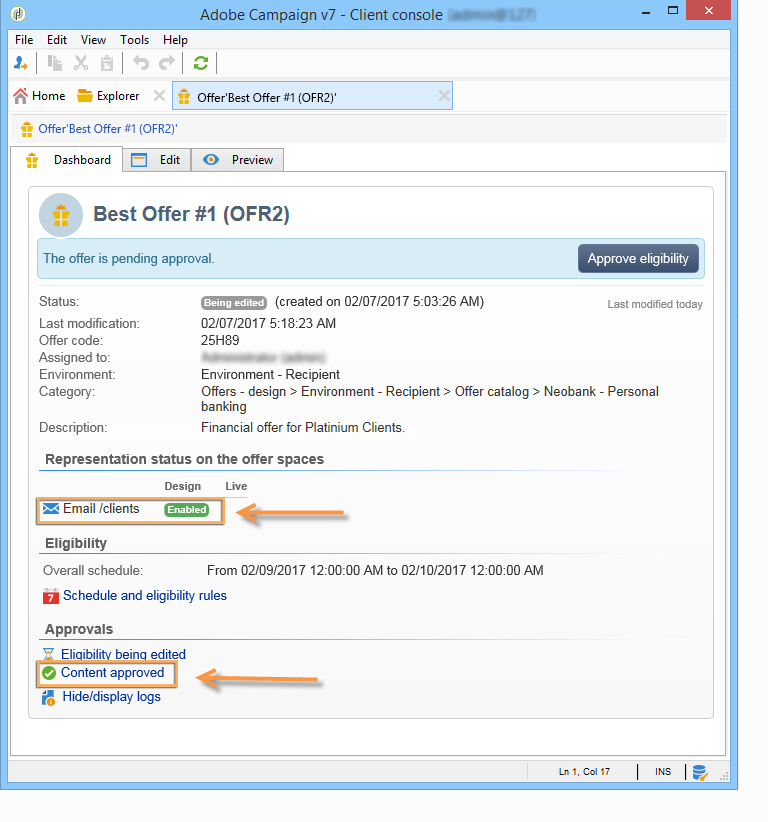

# 核准和啟用優惠方案{#approving-and-activating-an-offer}

優惠方案內容完成後，您必須核准該優惠方案，才能複製至即時環境並傳送。 核准與優惠方案內容及其資格有關。

優惠方案控制面板上的橫幅會告訴您是否需要完成核准週期。

## 核准優惠方案內容 {#approving-offer-content}

核准優惠方案內容表示要選取要在即時環境中使用的表示法。

選件的內容每個空間有一個表示法。 由於每個選件空間都有其自己的結構和自己的呈現功能，因此選件表示方式可能會有所不同。

您可以選擇在某些可用空間上核准優惠方案內容，並在其他空間上拒絕優惠方案內容。

>[!IMPORTANT]
>
>核准優惠方案的內容和資格後，發佈工作流程（優惠方案通知）會自動執行，且優惠方案會上線，並可在所有啟用的空間中使用。

若要核准優惠方案內容，請套用下列步驟：

1. 按一下&#x200B;**[!UICONTROL Approval]**&#x200B;按鈕，然後在快顯視窗中選取&#x200B;**[!UICONTROL Approve content]**。

   

1. 使用下拉式清單，選取您要持續編輯的表示法或要發佈至即時環境的表示法，然後按一下&#x200B;**[!UICONTROL Content approval]**。

   

   核准優惠方案內容後，優惠方案控制面板表格上的資訊就會更新。

   

   >[!NOTE]
   >
   >**[!UICONTROL Content approved]**&#x200B;提及並不表示所有優惠方案表示皆已啟用且已核准。 它表示內容核准程式已完成，無論所有選件是否已啟用/核准。

## 核准優惠方案資格 {#approving-offer-eligibility}

核准優惠方案資格是指接受或拒絕優惠方案權重，以及優惠方案中也設定或繼承自父類別中建立之規則的適用性規則。

>[!IMPORTANT]
>
>核准優惠方案的內容和資格後，發佈工作流程（優惠方案通知）會自動執行，且優惠方案會上線，並可在所有啟用的空間中使用。

* 按一下&#x200B;**[!UICONTROL Schedule and eligibility rules]**&#x200B;即可檢視規則完整清單。

   

* 要更改適用性規則，請按一下&#x200B;**[!UICONTROL Reject]**，然後按一下&#x200B;**[!UICONTROL Eligibility approval]**。

   

   優惠方案控制面板會更新各種狀態。

   

* 若要接受優惠方案資格，請按一下&#x200B;**[!UICONTROL Approve eligibility]**。

   

   核准資格，視需要新增註解，然後按一下&#x200B;**[!UICONTROL Eligibility approval]**。

   

   優惠方案控制面板會更新各種狀態。

   

## 核准追蹤 {#approval-tracking}

優惠方案控制面板上提供核准追蹤功能。 按一下&#x200B;**[!UICONTROL Hide/display logs]**&#x200B;以訪問它。

>[!NOTE]
>
>優惠方案的&#x200B;**[!UICONTROL Audit]**&#x200B;標籤中也提供追蹤功能，內含審核者意見的詳細資訊。

## 重新啟動核准 {#restart-the-approval}

核准一經啟動，即可重新啟動。 要執行此操作，請遵循下列指示：

1. 按一下優惠方案控制面板上的&#x200B;**[!UICONTROL Content approved]**。
1. 在顯示的&#x200B;**[!UICONTROL Edit]**&#x200B;窗口中，選擇要重新啟動的批准，然後按一下&#x200B;**[!UICONTROL Re-initialize approval to submit it again]**。
1. 按一下&#x200B;**[!UICONTROL Ok]**&#x200B;進行確認。

## 發佈優惠方案 {#publishing-the-offer}

一旦優惠方案的內容和資格皆獲核准後，優惠方案就會由工作流程發佈，該工作流程會針對每個已完成核准週期的優惠方案自動執行。 **[!UICONTROL Offer notification]**&#x200B;工作流程也每小時執行一次，以便從設計環境同步選件目錄中包含的空格和類別（如有必要）至即時環境。

設計環境中可用選件的控制面板包含有關發佈的資訊，包括即時環境中的相符選件名稱。

若要顯示即時環境中可用的選件，請按一下選件標籤：即時選件有一個控制面板，其中包含其所有相關資訊。

## 停用選件 {#disabling-an-offer}

優惠方案一經核准，即可加以停用。

若要這麼做，請前往控制面板上的線上選件或等待上線的選件，然後按一下&#x200B;**[!UICONTROL Disable offer]**。

您也可以前往&#x200B;**[!UICONTROL Eligibility]**&#x200B;標籤並勾選&#x200B;**[!UICONTROL Enabled]**&#x200B;方塊，直接停用類別。

>[!NOTE]
>
>當選件在設計環境中刪除時，就會在連結的線上環境中自動停用選件。 在主張保留期後，停用的優惠方案會從線上環境中刪除。

