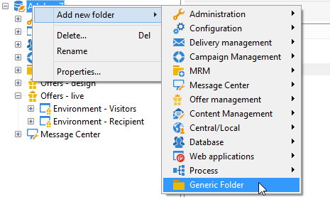
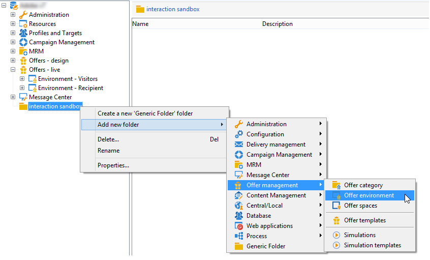

# 建立測試環境{#creating-a-test-environment}

若要建立測試環境（沙箱模式），請套用下列步驟：

>[!IMPORTANT]
>
>僅將此環境建立方法用於測試環境。 在所有其他情況下，請使用目標對應精靈。 有關詳細資訊，請參閱 [建立優惠方案環境](../../interaction/using/live-design-environments.md#creating-an-offer-environment).

1. 啟動Adobe Campaign Explorer並前往執行個體根目錄。
1. 按一下滑鼠右鍵並新增 **[!UICONTROL Generic folder]** 使用下拉式功能表。

   

1. 接著，前往您剛才建立的資料夾並新增 **[!UICONTROL Offer environment]** 使用右鍵功能表。

   

1. 套用相同的程式來建立環境子資料夾和元素。
1. 測試完成後，如果您希望在生產環境中使用環境，請在設計環境中複製選件和空間。 (按一下滑鼠右鍵> **[!UICONTROL Actions]** > **[!UICONTROL Deploy]** )。

   
