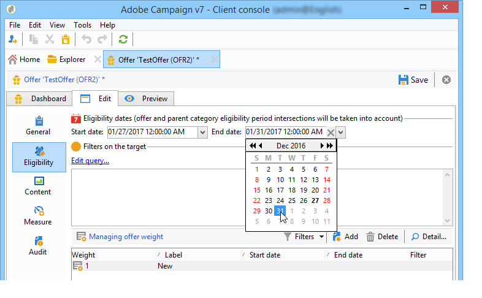
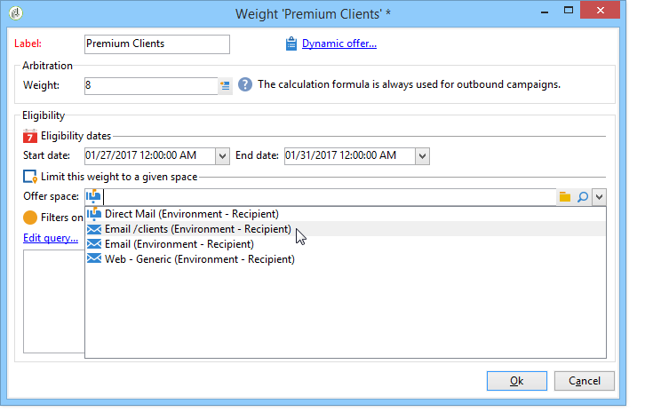
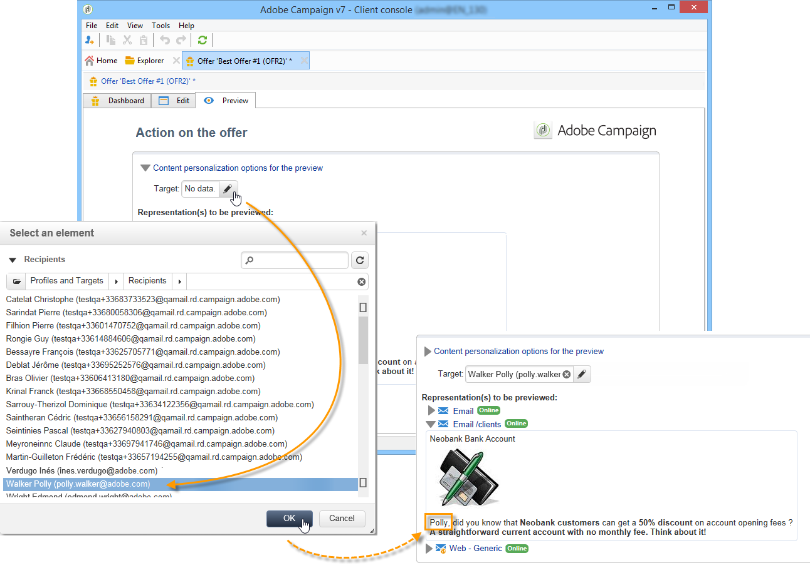

# 建立優惠方案{#creating-an-offer}


## 建立優惠方案 {#creating-the-offer}

若要建立優惠方案，請套用下列步驟：

1. 前往 **[!UICONTROL Campaigns]** 標籤並按一下 **[!UICONTROL Offers]** 連結。

   

1. 按一下 **[!UICONTROL Create]** 按鈕。

   

1. 變更標籤，並選取優惠方案應所屬的類別。

   

1. 按一下 **[!UICONTROL Save]** 以建立優惠方案。

   

   此選件可在平台中使用，且可設定其內容。

   

## 設定優惠資格 {#configuring-offer-eligibility}

在 **[!UICONTROL Eligibility]** 索引標籤中，定義優惠的有效期間和可顯示、要套用至目標的篩選器和優惠權重。

### 定義優惠方案的適用期間 {#defining-the-eligibility-period-of-an-offer}

若要定義優惠方案的適用期間，請使用下拉式清單，並在行事曆中選取開始和結束日期。



在這些日期之外，互動引擎將不會選取優惠方案。 如果您也設定了優惠方案類別的適用日期，則會套用最嚴格的期間。

### 目標上的篩選器 {#filters-on-the-target}

您可以將篩選器套用至優惠方案目標。

若要這麼做，請按一下 **[!UICONTROL Edit query]** 連結並選取您要套用的篩選器。 (請參閱 [本節](../../platform/using/steps-to-create-a-query.md#step-4---filter-data))。


如果已經建立預先定義的篩選器，您可以從使用者篩選器清單中選取它們。 有關詳細資訊，請參閱 [建立預先定義的篩選器](../../interaction/using/creating-predefined-filters.md).


### 優惠方案權重 {#offer-weight}

若要讓引擎在目標符合資格的多個優惠方案之間做出決定，您必須為優惠方案指派一或多個權重。 如有必要，您也可以將篩選器套用至目標，或限制權重將套用至的優惠方案空間。 權重較高的優惠方案會比權重較低的優惠方案更受青睞。

您可以為相同優惠方案設定多個權重，例如區分支援週期、特定目標或甚至優惠方案空間。

例如，選件對於18至25歲的連絡人，其權重可以是A，對於超過該範圍的連絡人，其權重可以是B。 如果優惠方案在整個夏天都符合資格，它在7月也可以有A的權重，在8月可以有B的權重。

>[!NOTE]
>
>指派的權重可以根據優惠方案所屬類別的引數暫時修改。 有關詳細資訊，請參閱 [建立優惠方案類別](../../interaction/using/creating-offer-categories.md).

若要在選件中建立權重，請套用下列步驟：

1. 按一下&#x200B;**[!UICONTROL Add]**。

   

1. 變更標籤並指派權數。 預設為1。

   

   >[!IMPORTANT]
   >
   >如果未輸入權重(0)，則不會將目標視為符合優惠方案資格。

1. 如果您想要將加權套用至指定期間，請定義適用日期。

   

1. 如有必要，請將權重限制在特定優惠方案空間。

   

1. 將篩選器套用至目標。

   

1. 按一下 **[!UICONTROL OK]** 以節省重量。

   

   >[!NOTE]
   >
   >如果目標符合所選優惠方案的多個權重，則引擎會保留最佳（最高）權重。 呼叫優惠方案引擎時，每個連絡人最多會選取一個優惠方案。

### 優惠方案適用性規則的摘要 {#a-summary-of-offer-eligibility-rules}

完成設定後，優惠儀表板就會顯示適用性規則的摘要。

若要檢視，請按一下 **[!UICONTROL Schedule and eligibility rules]** 連結。


## 建立優惠方案內容 {#creating-the-offer-content}

1. 按一下 **[!UICONTROL Edit]** 標籤，然後按一下 **[!UICONTROL Content]** 標籤。

   

1. 完成選件內容的各個欄位。

   * **[!UICONTROL Title]** ：指定您想要顯示在選件中的標題。 警告：這並非指優惠方案的標籤，其定義位於 **[!UICONTROL General]** 標籤。
   * **[!UICONTROL Destination URL]** ：指定您選件的URL。 若要正確處理，開頭必須是&quot;http://&quot;或&quot;https://&quot;。
   * **[!UICONTROL Image URL]** ：指定選件影像的URL或存取路徑。
   * **[!UICONTROL HTML content]** / **[!UICONTROL Text content]** ：在想要的索引標籤中輸入優惠方案內文。 若要產生追蹤，請 **[!UICONTROL HTML content]** 必須由可以括在中的HTML元素組成 `<div>` 輸入元素。 例如，的結果 `<table>` HTML頁面中的元素如下所示：

   ```
      <div> 
       <table>
        <tr>
         <th>Month</th>
         <th>Savings</th>   
        </tr>   
        <tr>    
         <td>January</td>
         <td>$100</td>   
        </tr> 
       </table> 
      </div>
   ```

   定義接受URL會顯示在中 [在接受主張時設定狀態](../../interaction/using/creating-offer-spaces.md#configuring-the-status-when-the-proposition-is-accepted) 區段。

   

   若要尋找優惠方案空間設定期間定義的必填欄位，請按一下 **[!UICONTROL Content definitions]** 顯示清單的連結。 有關詳細資訊，請參閱 [建立優惠方案空間](../../interaction/using/creating-offer-spaces.md).

   

   在此範例中，選件必須包含標題、影像、HTML內容和目的地URL。

## 預覽優惠方案 {#previewing-the-offer}

一旦您的優惠方案內容設定完成，您就可以預覽其對收件者顯示的優惠方案。 操作步驟：

1. 按一下 **[!UICONTROL Preview]** 標籤。

   

1. 選取您要檢視之優惠方案的代表方式。

   

1. 如果您已將優惠方案內容個人化，請選取優惠方案目標以檢視個人化。

   

## 在優惠方案上建立假設 {#creating-a-hypothesis-on-an-offer}

您可以在優惠方案主張上建立假設。 這可讓您判斷優惠方案對相關產品執行購買的影響。

>[!NOTE]
>
>這些假設假設會透過回應管理員執行。 請檢查您的授權合約。

對優惠方案主張執行的假設可在下列連結中參照： **[!UICONTROL Measure]** 標籤。

建立假設的詳細資訊，請參閱 [此頁面](../../response/using/about-response-manager.md).


