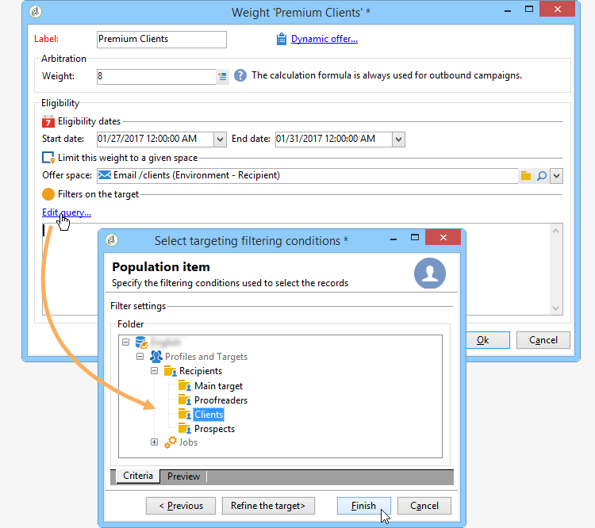
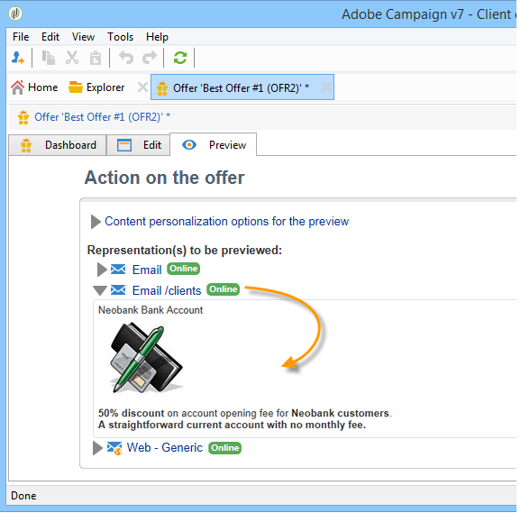

# 建立優惠方案{#creating-an-offer}

## 建立選件{#creating-the-offer}

若要建立選件，請套用下列步驟：

1. 前往&#x200B;**[!UICONTROL Campaigns]**&#x200B;標籤，然後按一下&#x200B;**[!UICONTROL Offers]**&#x200B;連結。

   

1. 按一下 **[!UICONTROL Create]** 按鈕。

   

1. 變更標籤並選取選件應屬於的類別。

   

1. 按一下&#x200B;**[!UICONTROL Save]**&#x200B;以建立選件。

   

   此選件可在平台中使用，其內容可加以設定。

   

## 設定優惠資格{#configuring-offer-eligibility}

在&#x200B;**[!UICONTROL Eligibility]**&#x200B;標籤中，定義選件的有效期間，以及可顯示的期間、套用至目標的篩選條件和選件權重。

### 定義選件的資格期間{#defining-the-eligibility-period-of-an-offer}

若要定義選件的資格期間，請使用下拉式清單，並在日曆中選取開始和結束日期。


在這些日期以外，互動引擎不會選取選件。 如果您也設定了選件類別的資格日期，則會套用最嚴格的期間。

### 目標{#filters-on-the-target}上的篩選器

您可以套用篩選器至選件目標。

若要這麼做，請按一下&#x200B;**[!UICONTROL Edit query]**&#x200B;連結，然後選取您要套用的篩選。 （請參閱[本節](../../platform/using/steps-to-create-a-query.md#step-4---filter-data)）。


如果已建立預先定義的篩選，您可以從使用者篩選清單中選取這些篩選。 有關詳細資訊，請參閱[建立預定義過濾器](../../interaction/using/creating-predefined-filters.md)。


### 選件重量{#offer-weight}

若要讓引擎在目標符合資格的數個選件之間做出決定，您必須為選件指派一或多個權重。 您也可以視需要將篩選套用至目標，或限制權重要套用的選件空間。 比較重量較輕的選件，更適合使用較重量的選件。

您可以為相同選件設定多個權重，例如，以區分支援期間、特定目標或甚至選件空間。

例如，對於年齡在18到25歲之間的接觸，選件可以具有A的重量，對於超過該範圍的接觸，選件可以具有B的重量。 如果選件在整個夏天都符合資格，則其7月份的重量可能為A,8月份的重量可能為B。

>[!NOTE]
>
>可根據選件所屬類別的參數暫時修改指派的權重。 如需詳細資訊，請參閱[建立選件類別](../../interaction/using/creating-offer-categories.md)。

若要在選件中建立權重，請套用下列步驟：

1. 按一下 **[!UICONTROL Add]**。

   

1. 變更標籤並指派權重。 預設為1。

   

   >[!IMPORTANT]
   >
   >如果未輸入加權(0)，則目標將不會被視為符合選件資格。

1. 如果您希望權重適用於指定期間，請定義資格日期。

   

1. 如有必要，請將權重限制在特定選件空間。

   

1. 套用篩選至目標。

   

1. 按一下&#x200B;**[!UICONTROL OK]**&#x200B;以保存重量。

   

   >[!NOTE]
   >
   >如果目標符合所選選件的多重權重，引擎會保留最佳（最高）權重。 在呼叫選件引擎時，每個連絡人最多會選取一次選件。

### 優惠資格規則摘要{#a-summary-of-offer-eligibility-rules}

設定完成後，資格規則的摘要將可在選件控制面板上取得。

若要檢視，請按一下&#x200B;**[!UICONTROL Schedule and eligibility rules]**&#x200B;連結。


## 建立選件內容{#creating-the-offer-content}

1. 按一下&#x200B;**[!UICONTROL Edit]**&#x200B;頁籤，然後按一下&#x200B;**[!UICONTROL Content]**&#x200B;頁籤。

   

1. 完成選件內容的各欄位。

   * **[!UICONTROL Title]** :指定您想要在選件中顯示的標題。警告：這不是指選件的標籤，該標籤在&#x200B;**[!UICONTROL General]**&#x200B;標籤中定義。
   * **[!UICONTROL Destination URL]** :指定您選件的URL。若要正確處理，必須以&quot;http://&quot;或&quot;https://&quot;開頭。
   * **[!UICONTROL Image URL]** :指定選件影像的URL或存取路徑。
   * **[!UICONTROL HTML content]** /  **[!UICONTROL Text content]** :在您要的標籤中輸入選件的正文。若要產生追蹤，**[!UICONTROL HTML content]**&#x200B;必須由HTML元素組成，這些元素可封閉在`<div>`類型元素中。 例如，HTML頁面中`<table>`元素的結果如下：

   ```
      <div> 
       <table>
        <tr>
         <th>Month</th>
         <th>Savings</th>   
        </tr>   
        <tr>    
         <td>January</td>
         <td>$100</td>   
        </tr> 
       </table> 
      </div>
   ```

   [「設定接受提案時的狀態」一節中會顯示定義接受URL。](../../interaction/using/creating-offer-spaces.md#configuring-the-status-when-the-proposition-is-accepted)

   

   若要尋找在選件空間設定期間所定義的必填欄位，請按一下&#x200B;**[!UICONTROL Content definitions]**&#x200B;連結以顯示清單。 有關詳細資訊，請參閱[建立選件空間](../../interaction/using/creating-offer-spaces.md)。

   

   在此範例中，選件必須包含標題、影像、HTML內容和目標URL。

## 預覽選件{#previewing-the-offer}

一旦您的選件內容設定好，您就可以預覽該選件，因為它會顯示給其收件者。 操作步驟：

1. 按一下&#x200B;**[!UICONTROL Preview]**&#x200B;頁籤。

   

1. 選取您要檢視之選件的表示法。

   

1. 如果您已個人化選件內容，請選取選件目標以檢視個人化。

   

## 建立選件{#creating-a-hypothesis-on-an-offer}的假設

您可以建立選件命題的假設。 這可讓您判斷選件對相關產品所執行之購買的影響。

>[!NOTE]
>
>這些假設是透過「回應管理員」執行。 請檢查您的授權合約。

對選件提案進行的假設在其&#x200B;**[!UICONTROL Measure]**&#x200B;標籤中引用。

建立假設詳見[本頁](../../campaign/using/about-response-manager.md)。


