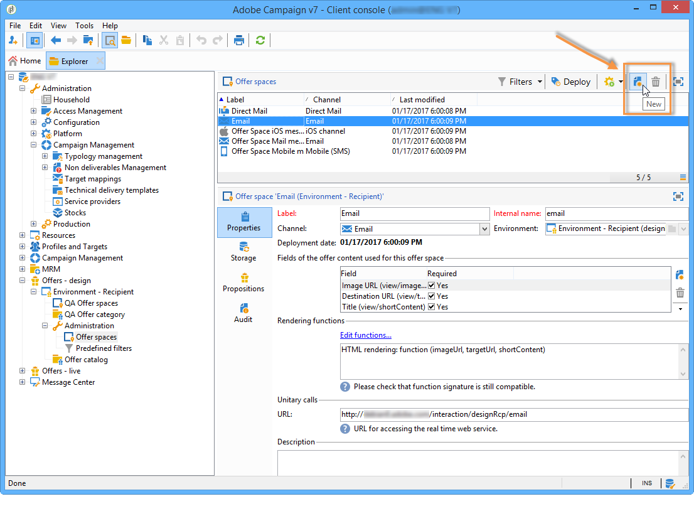
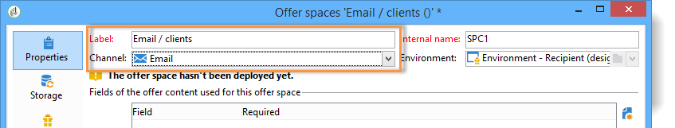

# 建立優惠方案空間{#creating-offer-spaces}

選件空間建立只能由具有選件空間子資料夾訪問權限的&#x200B;**技術管理員**&#x200B;執行。 選件空間只能在設計環境中建立，並在選件核准期間自動複製至即時環境。

目錄選件的內容會設定在選件空間中。 依預設，內容可包含下列欄位：**[!UICONTROL Title]**、**[!UICONTROL Destination URL]**、**[!UICONTROL Image URL]**、**[!UICONTROL HTML content]**&#x200B;和&#x200B;**[!UICONTROL Text content]**。 欄位順序是在選件空間中設定。

進階參數可讓您指定連絡人識別金鑰（例如，該金鑰可由各種元素、名稱和電子郵件欄位組成）。 如需詳細資訊，請參閱[展示已識別的選件](../../interaction/using/integration-via-javascript--client-side-.md#presenting-an-identified-offer)一節。

HTML或XML轉換是透過轉換函式建立。 呈現函式中定義的欄位順序必須與內容中設定的順序相同。


若要建立新的選件空間，請套用下列程式：

1. 前往選件空格清單，然後按一下&#x200B;**[!UICONTROL New]**。

   

1. 選取您要使用的渠道，並變更選件空間的標籤。

   

1. 如果以下情況之一適用於您，請選中&#x200B;**[!UICONTROL Enable unitary mode]**&#x200B;框：

   * 您正在使用與消息中心的交互
   * 您使用的是互動的酉模式（入站互動）

1. 轉至&#x200B;**[!UICONTROL Content field]**&#x200B;窗口，然後按一下&#x200B;**[!UICONTROL Add]**。

   

1. 轉至&#x200B;**[!UICONTROL Content]**&#x200B;節點，然後按以下順序選擇欄位：**[!UICONTROL Title]**、**[!UICONTROL Image URL]**、**[!UICONTROL HTML content]**、**[!UICONTROL Destination URL]**。

   

1. 選中&#x200B;**[!UICONTROL Required]**&#x200B;框，使每個欄位都為必填欄位。

   >[!NOTE]
   >
   >此設定會用於預覽，並在發佈時，如果相關選件中遺失其中一個必要元素，則會使選件空間無效。 不過，如果選件已在選件空間上存在，則不會考慮這些條件。

   

1. 按一下&#x200B;**[!UICONTROL Edit functions]**&#x200B;建立渲染函式。

   這些函式用於在選件空間上產生選件表示法。 有幾種可能的格式：出站互動的HTML或文字，入站互動的XML。

   

1. 轉到&#x200B;**[!UICONTROL HTML rendering]**&#x200B;頁籤並選擇&#x200B;**[!UICONTROL Overload the HTML rendering function]**。
1. 插入您的演算功能。

   

如有必要，您可讓傳入互動的XML轉換功能過載。 您也可以讓出站互動的HTML和文字轉換功能過載。 有關詳細資訊，請參閱[關於入站通道](../../interaction/using/about-inbound-channels.md)。

## 選件提案狀態{#offer-proposition-statuses}

根據與目標群體的互動，選件提案可以有各種狀態。 互動隨附一組值，可在整個選件生命週期中套用至選件提案。 不過，您必須設定平台，以便在建立並接受選件提案時，狀態會變更。

>[!NOTE]
>
>選件提案的狀態不會立即更新。 它由每小時觸發的追蹤工作流程執行。

### 狀態清單{#status-list}

互動隨附下列值，可用於限定選件提案的狀態：

* **[!UICONTROL Accepted]**.
* **[!UICONTROL Scheduled]**.
* **[!UICONTROL Generated]**.
* **[!UICONTROL Interested]**.
* **[!UICONTROL Presented]**.
* **[!UICONTROL Rejected]**.

預設不會套用這些值：必須進行配置。

>[!NOTE]
>
>如果選件連結至具有「已傳送」狀態的傳送，則選件提案的狀態會自動變更為「已呈現」。

### 在建立命題{#configuring-the-status-when-the-proposition-is-created}時配置狀態

當互動引擎建立選件提案時，其狀態會變更，不論是傳入或傳出互動。 這兩個值之間的選擇取決於在&#x200B;**[!UICONTROL Design]**&#x200B;環境中配置選件空間的方式

您可以針對每個空間設定建立提案時要套用的狀態，視您要在選件報表中顯示的資訊而定。

若要這麼做，請使用下列程式：

1. 轉到所需空間的&#x200B;**[!UICONTROL Storage]**&#x200B;頁籤。
1. 選擇建立提案時要應用於提案的狀態。

   

### 設定接受提案時的狀態{#configuring-the-status-when-the-proposition-is-accepted}

接受選件提案後，您就可以使用預設值之一來設定提案的新狀態。 當收件者按一下選件中的連結，而此連結會呼叫互動引擎時，更新即有效。

若要這麼做，請使用下列程式：

1. 轉到所需空間的&#x200B;**[!UICONTROL Storage]**&#x200B;頁籤。
1. 選擇接受提案時要套用至提案的狀態。

   

**入站互動**

**[!UICONTROL Storage]**&#x200B;標籤僅允許您定義&#x200B;**建議的**&#x200B;和&#x200B;**接受的**&#x200B;選件主張的狀態。 對於傳入互動，應直接在呼叫選件引擎的URL中指定選件主張的狀態，而非透過介面。 如此，您就可以指定在其他情況下套用哪些狀態，例如如果選件提案遭拒。

```
<BASE_URL>?a=UpdateStatus&p=<PRIMARY_KEY_OF_THE_PROPOSITION>&st=<NEW_STATUS_OF_THE_PROPOSITION>&r=<REDIRECT_URL>
```

例如，符合&#x200B;**Neobank**&#x200B;網站上顯示之&#x200B;**家庭保險**&#x200B;優惠的提案（識別碼&#x200B;**40004**）包含下列URL:

```
<BASE_URL>?a=UpdateStatus&p=<40004>&st=<3>&r=<"http://www.neobank.com/insurance/subscribe.html">
```

當訪客點按選件並因此點按URL時，**[!UICONTROL Accepted]**&#x200B;狀態（值&#x200B;**3**）就會套用至該提案，並將訪客重新導向至&#x200B;**Neobank**&#x200B;網站的新頁面以取消保險合約。

>[!NOTE]
>
>如果您想要在URL中指定其他狀態（例如，如果選件提案遭拒），請使用與所需狀態對應的值。 範例：**[!UICONTROL Rejected]** = &quot;5&quot;, **[!UICONTROL Presented]** = &quot;1&quot;等。
>
>可在&#x200B;**[!UICONTROL Offer propositions (nms)]**&#x200B;資料架構中擷取狀態及其值。 有關詳細資訊，請參見[此頁面](../../configuration/using/data-schemas.md)。

**對外互動**

如果是對外互動，當傳送包含連結時，您可以自動將&#x200B;**[!UICONTROL Interested]**&#x200B;狀態套用至選件提案。 只需將&#x200B;**_urlType=&quot;11&quot;**&#x200B;值新增至連結：

```
<a _urlType="11" href="<DEST_URL>">Link inserted into the delivery</a>
```

## 每個空間的選件預覽{#offer-preview-per-space}

在此標籤中，您可以透過選擇的方法來檢視收件者符合資格的選件。 在下列範例中，收件者可透過郵件取得三份提案。


如果收件者不符合任何選件的資格，這會顯示在預覽中。


當內容被限制為空格時，預覽可忽略上下文。 此時，交互模式已擴展到使用入站通道添加空間中引用的欄位（有關詳細資訊，請參閱[擴展示例](../../interaction/using/extension-example.md)）。
