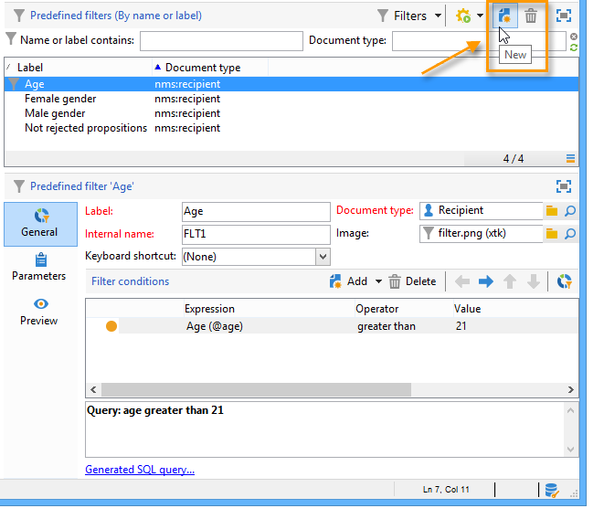
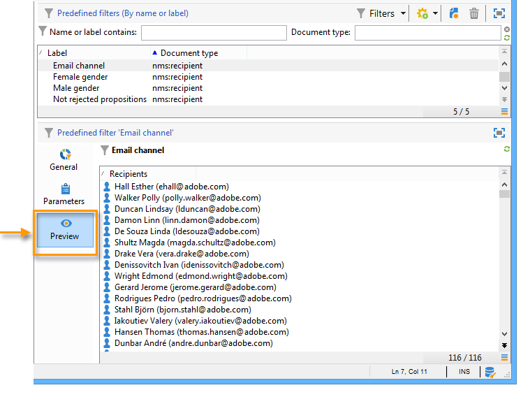

# 建立預先定義的篩選器{#creating-predefined-filters}

預先定義的篩選器可讓您建立目標群體的適用性規則，這些規則可在建立優惠方案期間輕鬆重複使用。 它們是每個環境專屬的行為，並將優惠方案引數列入考量。

若要建立篩選，請套用下列程式：

1. 移至&#x200B;**[!UICONTROL Administration]**&#x200B;資料夾並選取&#x200B;**[!UICONTROL Pre-defined offer filters]**。

   

1. 按一下 **[!UICONTROL New]**。

   

1. 變更標籤，以便稍後識別篩選器。

   

1. 選取篩選條件將關注的欄位。

   

1. 視需要選取運運算元和值，然後儲存查詢。

   

1. 按一下&#x200B;**[!UICONTROL Preview]**&#x200B;以檢視篩選結果。

   
