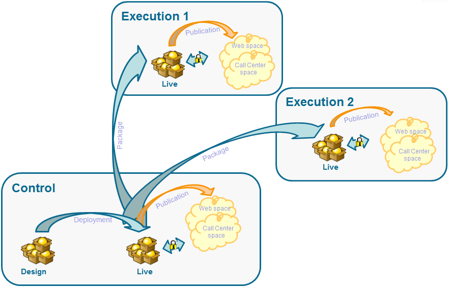

# 分佈式體系結構{#distributed-architectures}

## 原則 {#principle}

若要支援可擴充性並在傳入通道上提供全年無休的服務，您可以使用與分散式架構的互動功能。 此類體系結構已與消息中心一起使用，由以下幾個實例組成：

* 一或多個專用於對外渠道並包含行銷和環境設計基礎的控制實例
* 專用於入站通道的一個或多個執行實例



>[!NOTE]
>
>控制實例專用於入站通道，並包含目錄的聯機版本。 每個執行例項都獨立且專屬於一個連絡人區段（例如，每個國家／地區一個執行例項）。 選件引擎呼叫必須直接在執行中執行（每個執行例項有一個特定URL）。 由於執行個體間的同步並非自動，因此來自相同聯絡人的互動必須透過相同的執行個體傳送。

## 命題同步 {#proposition-synchronization}

選件同步是透過封包進行。 在執行例項上，所有目錄物件都以外部帳戶名稱為前置詞。 這表示同一執行例項可支援數個控制例項（例如開發與生產例項）。

>[!CAUTION]
>
>我們建議您使用簡短而明確的內部名稱。

選件會自動部署，然後發佈至執行和控制例項。

在設計環境中刪除的選件會在所有線上執行個體上停用。 在清除期間（在每個實例的部署助理中指定）和滑動期間（在傳入命題的分類規則中指定）之後，將在所有實例上自動刪除過時的主張和選件。


為每個環境和外部帳戶建立一個用於提案同步的工作流。 可針對每個環境和外部帳戶調整同步頻率。

## 限制 {#limitations}

* 如果您使用從匿名環境到已識別環境的回退功能，這兩個環境必須位於同一執行例項上。
* 多個執行實例之間的同步不會即時執行。 必須將相同連絡人的互動傳送至相同的例項。 控制實例必須專用於出站通道（無即時）。
* 行銷資料庫不會自動同步。 權重和資格規則中使用的行銷資料必須複製至執行例項。 此程式不是標準程式，您必須在整合期間進行開發。
* 命題同步只由FDA連接執行。
* 如果您在同一實例上使用交互和消息中心，則在這兩種情況下都將通過FDA協定進行同步。

## 軟體包配置 {#packages-configuration}

任何直接連結至 **Interaction** （選件、主張、收件者等）的架構擴充功能必須部署在執行例項上。

Interaction軟體包必須安裝在所有實例上（控制和執行）。 另外提供兩個套件：一個軟體包要安裝在控制實例上，另一個軟體包要安裝在每個執行實例上。

>[!NOTE]
>
>安裝軟體包時， **nms:** composition表的長類型欄位(如命題ID **)將變為** int64 **** type欄位。 此類資料在本節中有詳 [細說明](../../configuration/using/schema-structure.md#mapping-the-types-of-adobe-campaign-dbms-data)。

必須在每個實例上配置資料保留期間(通過部 **[!UICONTROL Data purge]** 署嚮導中的窗口)。 在執行例項中，此期間必須對應於要計算的類型學規則（滑動期間）和資格規則所需的歷史深度。

在控制例項上：

1. 按執行實例建立外部帳戶：

   

   * 完成標籤並新增簡短且明確的內部名稱。
   * 選擇 **[!UICONTROL Execution instance]**。
   * 勾選 **[!UICONTROL Enabled]** 選項。
   * 完成執行實例的連接參數。
   * 每個執行例項都必須連結至ID。 此ID是在您按一下按鈕時指 **[!UICONTROL Initialize connection]** 派的。
   * 檢查使用的應用程式類型： **[!UICONTROL Message Center]**、 **[!UICONTROL Interaction]**&#x200B;或兩者皆有。
   * 輸入使用的FDA帳戶。 必須在執行實例上建立運算子，並且必須對有關實例的資料庫具有以下讀寫權限：

      ```
      grant SELECT ON nmspropositionrcp, nmsoffer, nmsofferspace, xtkoption, xtkfolder TO user;
      grant DELETE, INSERT, UPDATE ON nmspropositionrcp TO user;
      ```
   >[!NOTE]
   >
   >必須在執行實例上授權控制實例的IP地址。

1. 配置環境：

   

   * 添加執行實例清單。
   * 對於每個同步期間，指定同步期間和篩選條件（例如，按國家／地區）。

      >[!NOTE]
      >
      >如果您遇到錯誤，可以參考同步工作流程和選件通知。 這些功能可在應用程式的技術工作流程中找到。

如果基於最佳化原因，只有部分行銷資料庫在執行例項上複製，您可以指定連結至環境的受限架構，讓使用者僅能使用執行例項上可用的資料。 您可以使用執行例項無法使用的資料來建立選件。 若要這麼做，您必須在對外渠道（欄位）上限制此規則，以停用其他渠道&#x200B;**[!UICONTROL Taken into account if]** 的規則。


## 維護選項 {#maintenance-options}

以下是控制實例上可用的維護選項清單：

>[!CAUTION]
>
>這些選項只能用於特定的維護案例。

* **`NmsInteraction_LastOfferEnvSynch_<offerEnvId>_<executionInstanceId>`**:環境在指定實例上同步的最後日期。
* **`NmsInteraction_LastPropositionSynch_<propositionSchema>_<executionInstanceIdSource>_<executionInstanceIdTarget>`**:指定架構中的陳述從一個實例同步到另一個實例的最後日期。
* **`NmsInteraction_MapWorkflowId`**:一個選項，包含生成的所有同步工作流的清單。

執行例項上可使用下列選項：

**NmsExecutionInstanceId**:選項。

## 軟體包安裝 {#packages-installation}

如果您的例項先前沒有Interaction套件，則不需要移轉。 預設情況下，在安裝軟體包後，命題表將以64位元顯示。

>[!CAUTION]
>
>根據實例中現有主張的數量，此操作可能需要一段時間。

* 如果您的實例很少或沒有陳述，則不需要手動修改陳述表。 在安裝軟體包時，將進行修改。
* 如果實例中有許多主張，則最好在安裝並運行控制包之前更改主張表的結構。 我們建議在低活動期間執行查詢。

>[!NOTE]
>
>如果您已在命題表中執行了特定配置，請相應地調整查詢。

### PostgreSQL {#postgresql}

有兩種方法。 第一個（使用工作表）的速度稍微快一些。

**工作表**

```
CREATE TABLE NmsPropositionRcp_tmp AS SELECT * FROM nmspropositionrcp WHERE 0=1;
ALTER TABLE nmspropositionrcp_tmp
  ALTER COLUMN ipropositionid TYPE bigint,
  ALTER COLUMN iinteractionid TYPE bigint;
INSERT INTO nmspropositionrcp_tmp SELECT * FROM nmspropositionrcp;
DROP TABLE nmspropositionrcp;
CREATE INDEX proposition_id ON NmsPropositionRcp (ipropositionid);
CREATE INDEX nmspropositionrcp_deliveryid ON NmsPropositionRcp (ideliveryid);
CREATE INDEX nmspropositionrcp_lastmodified ON NmsPropositionRcp (tslastmodified);
CREATE INDEX nmspropositionrcp_offerid ON NmsPropositionRcp (iofferid);
CREATE INDEX nmspropositionrcp_offerspaceid ON NmsPropositionRcp (iofferspaceid);
CREATE INDEX nmspropositionrcp_recipientidid ON NmsPropositionRcp (irecipientid);
ALTER TABLE nmspropositionrcp_tmp RENAME TO nmspropositionrcp;
```

**更改表**

```
ALTER TABLE nmspropositionrcp
  ALTER COLUMN ipropositionid TYPE bigint,
  ALTER COLUMN iinteractionid TYPE bigint;
```

### Oracle {#oracle}

編輯數字類 **型的大小** ，不會導致值或重新寫入索引。 因此，這是立竿見影的。

要執行的查詢如下：

```
ALTER TABLE nmspropositionrcp MODIFY (
ipropositionid NUMBER(19, 0),
iinteractionid NUMBER(19, 0)
);
```

### MSSQL {#mssql}

要執行的查詢如下：

```
SELECT * INTO NmsPropositionRcp_tmp FROM NmsPropositionRcp WHERE 1 = 0;
GO
ALTER TABLE NmsPropositionRcp_tmp ALTER COLUMN ipropositionid BIGINT;
GO
ALTER TABLE NmsPropositionRcp_tmp ALTER COLUMN iinteractionid BIGINT;
GO
INSERT INTO NmsPropositionRcp_tmp SELECT * FROM NmsPropositionRcp;
GO
DROP TABLE NmsPropositionRcp;
GO
sp_rename 'NmsPropositionRcp_tmp', NmsPropositionRcp
GO
ALTER TABLE NmsPropositionRcp ADD DEFAULT ((0)) FOR dWeight
GO
ALTER TABLE NmsPropositionRcp ADD DEFAULT ((0)) FOR iDeliveryId
GO
ALTER TABLE NmsPropositionRcp ADD DEFAULT ((0)) FOR iEngineType
GO
ALTER TABLE NmsPropositionRcp ADD DEFAULT ((0)) FOR iInteractionId
GO
ALTER TABLE NmsPropositionRcp ADD DEFAULT ((0)) FOR iOfferId
GO
ALTER TABLE NmsPropositionRcp ADD DEFAULT ((0)) FOR iOfferSpaceId
GO
ALTER TABLE NmsPropositionRcp ADD DEFAULT ((0)) FOR iPropositionId
GO
ALTER TABLE NmsPropositionRcp ADD DEFAULT ((0)) FOR iRank
GO
ALTER TABLE NmsPropositionRcp ADD DEFAULT ((0)) FOR iRecipientId
GO
ALTER TABLE NmsPropositionRcp ADD DEFAULT ((0)) FOR iStatus
GO
CREATE NONCLUSTERED INDEX NmsPropositionRcp_deliveryId ON NmsPropositionRcp (iDeliveryId)
GO
CREATE NONCLUSTERED INDEX NmsPropositionRcp_eventDate ON NmsPropositionRcp (tsEvent)
GO
CREATE UNIQUE NONCLUSTERED INDEX NmsPropositionRcp_id ON NmsPropositionRcp (iPropositionId)
GO
CREATE NONCLUSTERED INDEX NmsPropositionRcp_lastModified ON NmsPropositionRcp (tsLastModified)
GO
CREATE NONCLUSTERED INDEX NmsPropositionRcp_offerId ON NmsPropositionRcp (iOfferId)
GO
CREATE NONCLUSTERED INDEX NmsPropositionRcp_offerSpaceI ON NmsPropositionRcp (iOfferSpaceId)
GO
CREATE NONCLUSTERED INDEX NmsPropositionRcp_recipientId ON NmsPropositionRcp (iRecipientId)
GO
```

