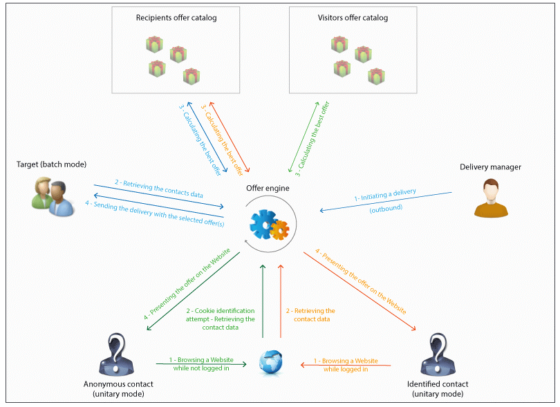

# 基本原則{#fundamental-principles}

## 部署環境 {#deploying-environments}

管理選件時，每個定位維度使用兩種環境：

* 選件管理員負責建立和分類選件、編輯選件，以及啟動核准程式以供使用的設計環境。 此環境也會定義每個類別的規則、可顯示選件的選件空間，以及用來定義選件資格的預先定義篩選。

   您也可以線上上環境中手動發佈類別。

   核准選件的程式會在「核准並啟 [用選件」區段中詳細說明](../../interaction/using/approving-and-activating-an-offer.md) 。

* 您可在即時環境中找到來自設計環境的已核准選件，以及設計環境中設定的各種選件空間、篩選器、類別和規則。 在呼叫選件引擎期間，引擎一律會使用來自即時環境的選件。

選件只會部署在核准程式期間選取的選件空間上。 因此，選件可以是即時的，但在選件空間中也無法使用。

## 交互類型和接觸方法 {#interaction-types-and-contact-methods}

互動有兩種可能類型：傳入互動（由聯絡人啟動）和傳出互動（由選件製作者啟動）。

這兩種互動類型可以在單一模式（選件是針對單一連絡人計算）或批次模式（選件是針對一組連絡人計算）中執行。 一般來說，入站互動是以酉模式進行，出站互動是以批次模式進行。 但是，對於交易型消息，例如，對於以統一模式（請參閱本節）進行出站交互的消息，可能 [有某些例外](../../message-center/using/about-transactional-messaging.md)。

只要能夠或必須顯示選件（根據所執行的配置），選件引擎就會扮演中介角色：它會結合所收到的有關聯繫人的資料，以及應用程式中指定的可套用的不同規則，自動計算可用聯繫人的最佳選件。

