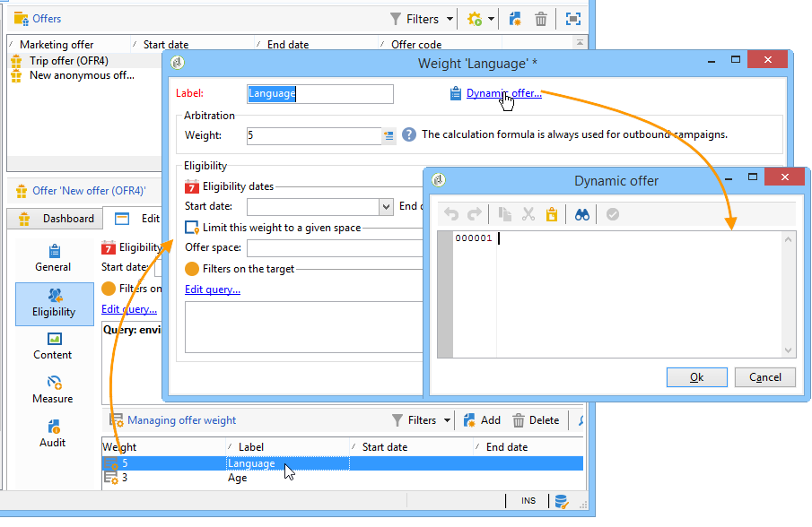

# 修改標準引擎行為{#hooks}


互動中的勾點可讓您修改&#x200B;**標準引擎行為**。

已在Adobe Campaign的選件空間中設定&#x200B;**[!UICONTROL Target loading]**&#x200B;和&#x200B;**[!UICONTROL Proposition post-processing]**&#x200B;鉤點：


在Adobe Campaign中，**[!UICONTROL Dynamic offer]**&#x200B;勾點已設定優惠方案權重：



## 目標載入中 {#target-loading}

此掛接可讓您使用來自外部系統的其他資料擴充連絡人的設定檔（由現成查詢載入）。

收集的資料必須插入呼叫資料節點（互動節點）。 整合器必須預先擴充呼叫資料結構，才能定義所收集資料的結構。 使用者存取此資料的方式，與存取標準通話資料的方式相同（在適用性規則和個人化層級）。

**輸入引數：**

* xmlInteraction （xml型別）：互動節點
* TargetId （資料表型別）：目標識別碼
* sUuid230 （字串型別）： uuid230永久cookie的值
* sNlid （字串型別）： nlid工作階段Cookie的值

**傳回引數：**

* 擴充互動節點（此鉤點的第一個引數）

>[!NOTE]
>
>**xmlInteraction**&#x200B;引數同時包含呼叫資料以及現成查詢載入的連絡人設定檔。

**範例：**

```
// Call an external system to get additional data for the target
  var additionalData  = getUrl("https://EXTERNAL_SYSTEM?target=" + encodeURIComponent(aTargetId.join("|")));
  // Enrich the context with this data
  interaction.@additionalData = additionalData;
```

## 主張後續處理 {#proposition-post-processing-}

此勾點可讓您檢查指定互動中合格主張的一致性和相容性。 它也可讓您定義新的評分或機率計算功能。

使用一致性規則的範例：

* 限制相同呼叫、連結至相同產品或相同類別中的主張數量。
* 僅限在相同互動中與產品相關的簡報優惠方案。

後續處理會在型別規則應用程式和合格主張排序之後，在優先順序步驟之前執行。

**輸入引數：**

* 主張：合格主張的表格。 以下是此表格中元素結構的範例

  ```
  { offer_id:1234,
    weight:2}
  ```

* dicOffer （xml型別）：合格優惠方案所有屬性的字典（優惠方案代碼、類別id、類別全名、開始日期、結束日期、標籤、內部名稱、優惠方案id、其他優惠方案欄位）。 例如

  ```
  { "1242": <offer category-id="61242" categoryFullName="/FULL/PATH/TO/CATEGORY/" code="CODE" endDate="" id="62473" label="LABEL" name="OFR38_OE4" product-id="43" startDate=""/>,
    "1243": ...}
  ```

* xmlTarget （xml型別）：設定檔資料節點
* xmlInteraction （xml型別）：呼叫資料節點
* iPropNumber （整數型別）：預期選件數目

**傳回引數：**

* 修改的主張清單（鉤點的第一個引數）
* 已修改的互動節點

**範例：**

```
var aReturnedProps = [];

if( aProposition.length > 0 )
{
  var iReturnedProps = 0;
  for( var iPropIdx = 0; iPropIdx < aProposition.length && iReturnedProps < iPropNumber; iPropIdx ++ )
  {
    // Check a consistency rule for instance
    if( true )
    {
      aReturnedProps.push(aProposition[iPropIdx]);
      iReturnedProps++;
    }
  }
}

return aReturnedProps;
```

## 動態優惠方案 {#dynamic-offer}

此掛接可讓您呼叫外部引擎，以選取連結至優惠方案的產品清單。 它是在適用性規則之後、型別規則應用程式之前在優惠方案中設定。

整合員應預先使用產品上的其他資訊來擴充主張&#x200B;**PropositionRcp**&#x200B;結構描述。 若要指定此資料將儲存的位置，可在空間的&#x200B;**[!UICONTROL Storage]**&#x200B;索引標籤中使用&#x200B;**[!UICONTROL Proposition being processed]**&#x200B;連結


**輸入引數：**

* xmlOffer （xml型別）：優惠方案（優惠方案代碼、類別id、類別全名、開始日期、結束日期、標籤、內部名稱、優惠方案id、其他優惠方案欄位）
* dWeight：內容權數（雙型別）
* xmlTarget （xml型別）：設定檔資料節點
* xmlInteraction （xml型別）：呼叫資料節點

**傳回引數：**

將傳回要產生的建議表格。 此表格中的每一個元素都包含下列資訊：

* 優惠識別碼
* 其他產品資料（例如產品代碼）
* 權重

>[!NOTE]
>
>系統會檢查輸入和傳回引數的選件ID是否相同。

**範例：**

```
var product = getUrl("https://EXTERNAL_SYSTEM?offerCode=" + encodeURIComponent(xmlOffer.@code));
if( product )
  return [{offer_id: parseInt(String(xmlOffer.@id)), weight: dWeight, productId: product}];
```
