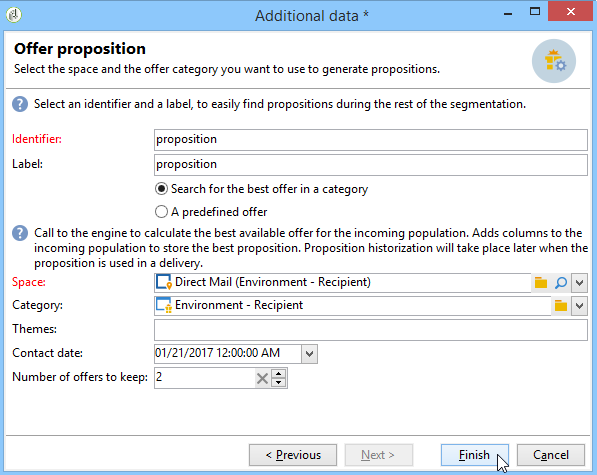

# 透過工作流程整合優惠方案{#integrating-an-offer-via-a-workflow}

在傳送活動本身之外，數個工作流程活動可讓您定義顯示選件的方式：

* 傳遞大綱
* 擴充
* 優惠引擎
* 依儲存格列出的優惠

## 傳遞大綱 {#delivery-outline}

行銷活動工作流程中可用的傳遞大綱活動可讓您呈現在傳遞大綱中參考，且來自目前進行中之行銷活動的選件。

1. 在工作流程中，新增傳送大綱活動之前，請先新增傳送活動。
1. 在傳送大綱活動中，指定要使用的大綱。

   如需指定傳送大綱的詳細資訊，請參閱[Campaign - MRM](../../campaign/using/marketing-campaign-deliveries.md#associating-and-structuring-resources-linked-via-a-delivery-outline)指南。

1. 根據您的傳送完成可用欄位。
1. 可能有兩種情況：

   * 如果您想要呼叫優惠方案引擎，請核取&#x200B;**[!UICONTROL Restrict the number of propositions selected]**&#x200B;方塊。 指定要在傳遞中呈現的優惠方案空間和主張數量。

      優惠方案引擎會考量優惠方案的權重和適用性規則。

   * 如果您未核取方塊，傳遞大綱中的所有選件都會呈現，而不需要呼叫選件引擎。
   >[!NOTE]
   >
   >預覽會考量傳送中指定的選件數量。 執行工作流程時，會考慮傳送大綱中指定的編號。

   

## 擴充 {#enrichment}

擴充活動可讓您新增選件或連結至傳遞收件者的選件。

>[!NOTE]
>
>如需擴充活動的詳細資訊，請參閱[工作流程手冊](../../workflow/using/enrichment.md)中的專用檔案。

例如，您可以在傳送前讓收件者查詢的資料更豐富。

有兩種方法可指定優惠方案。

* 指定優惠方案或優惠方案引擎呼叫。
* 參考選件的連結。

### 指定優惠方案或對優惠方案引擎的呼叫 {#specifying-an-offer-or-a-call-to-the-offer-engine}

設定查詢後（請參閱[工作流程手冊](../../workflow/using/query.md)）:

1. 新增及開啟擴充活動。
1. 在 **[!UICONTROL Enrichment]** 索引標籤中，選取 **[!UICONTROL Add data]**。
1. 在要添加的資料類型中選擇&#x200B;**[!UICONTROL An offer proposition]**。

   

1. 指定要新增的主張的識別碼及標籤。
1. 指定選件選取項目。 這有兩個可能的選項：

   * **[!UICONTROL Search for the best offer in a category]** :勾選此選項並指定優惠方案引擎呼叫參數（優惠方案空間、類別或主題、聯絡日期、要保留的優惠方案數量）。引擎會自動計算要根據這些參數新增的選件。 建議您同時填寫&#x200B;**[!UICONTROL Category]**&#x200B;或&#x200B;**[!UICONTROL Theme]**&#x200B;欄位，而非同時填寫兩者。

      

   * **[!UICONTROL A predefined offer]** :勾選此選項並指定優惠方案空間、特定優惠方案和聯絡日期，以直接設定您要新增的優惠方案，而不需呼叫優惠方案引擎。

      

1. 然後設定與您選擇的通道相對應的傳送活動。 如需詳細資訊，請參閱[將優惠方案主張插入傳送](../../interaction/using/integrating-an-offer-via-the-wizard.md#inserting-an-offer-proposition-into-a-delivery)區段。

   >[!NOTE]
   >
   >可用於預覽的建議數取決於擴充活動中執行的配置，而不是直接在傳送中執行的任何可能配置。

### 參考選件的連結 {#referencing-a-link-to-an-offer}

您也可以參考擴充活動中選件的連結。

若要這麼做，請使用下列程式：

1. 在活動的&#x200B;**[!UICONTROL Enrichment]**&#x200B;索引標籤中選取&#x200B;**[!UICONTROL Add data]**。
1. 在選擇要添加的資料類型的窗口中，選擇&#x200B;**[!UICONTROL A link]**。
1. 選取您要建立的連結類型及其目標。 在此情況下，目標為選件結構。

   

1. 指定擴充活動（此處為收件者表格）中入站表格資料與選件表格之間的連結。 例如，您可以將優惠方案代碼連結至收件者。

   

1. 然後設定與您選擇的通道相對應的傳送活動。 如需詳細資訊，請參閱[將優惠方案主張插入傳送](../../interaction/using/integrating-an-offer-via-the-wizard.md#inserting-an-offer-proposition-into-a-delivery)區段。

   >[!NOTE]
   >
   >預覽的可用建議數取決於傳送中執行的配置。

### 儲存優惠方案排名和權重 {#storing-offer-rankings-and-weights}

依預設，當使用&#x200B;**excrient**&#x200B;活動來傳送選件時，其排名和權重不會儲存在主張表格中。

>[!NOTE]
>
>記住：預設情況下，**[!UICONTROL Offer engine]**&#x200B;活動會儲存此資訊。

不過，您可以依下列方式儲存此資訊：

1. 在查詢後和傳送活動前放置的擴充活動中，建立對選件引擎的呼叫。 請參閱[指定選件或呼叫選件引擎](../../interaction/using/integrating-an-offer-via-a-workflow.md#specifying-an-offer-or-a-call-to-the-offer-engine)區段。
1. 在活動的主窗口中，選擇&#x200B;**[!UICONTROL Edit additional data...]**。

   

1. 為排名新增&#x200B;**[!UICONTROL @rank]**&#x200B;欄，為選件加權新增&#x200B;**[!UICONTROL @weight]**&#x200B;欄。

   

1. 確認新增項目並儲存工作流程。

傳遞會自動儲存選件的排名和權重。 此資訊會顯示在傳送的&#x200B;**[!UICONTROL Offers]**&#x200B;標籤中。

## 優惠引擎 {#offer-engine}

**[!UICONTROL Offer engine]**&#x200B;活動也可讓您指定傳送前對選件引擎的呼叫。

此活動的運作原則與引擎呼叫的擴充活動相同，方法是在傳送前使用引擎計算的選件擴充入站母體資料。

設定查詢後（請參閱[工作流程手冊](../../workflow/using/query.md)）:

1. 新增並開啟&#x200B;**[!UICONTROL Offer engine]**&#x200B;活動。
1. 填寫各種可用欄位，以指定對優惠方案引擎參數（優惠方案空間、類別或主題、聯絡日期、要保留的優惠方案數量）的呼叫。 引擎會自動計算要根據這些參數新增的選件。

   >[!NOTE]
   >
   >警告：如果您使用此活動，則只會儲存傳送中使用的優惠方案主張。

   

1. 然後設定與您選擇的通道相對應的傳送活動。 如需詳細資訊，請參閱[將優惠方案主張插入傳送](../../interaction/using/integrating-an-offer-via-the-wizard.md#inserting-an-offer-proposition-into-a-delivery)區段。

## 依儲存格列出的優惠 {#offers-by-cell}

**[!UICONTROL Offers by cell]**&#x200B;活動可讓您將入站母體（例如從查詢）分佈至數個區段，並指定要針對每個區段顯示的選件。

若要這麼做，請使用下列程式：

1. 指定目標母體後，新增&#x200B;**[!UICONTROL Offers by cell]**&#x200B;活動，然後開啟。
1. 在&#x200B;**[!UICONTROL General]**&#x200B;標籤中，選取您要呈現選件的選件空間。
1. 在&#x200B;**[!UICONTROL Cells]**&#x200B;標籤中，使用&#x200B;**[!UICONTROL Add]**&#x200B;按鈕指定不同的子集：

   * 使用可用的篩選和限制規則指定子集母體。
   * 然後選取您要呈現給子集的選件。 可用的優惠方案是在上一步選取的優惠方案環境中符合資格的優惠方案。

      

1. 然後設定與您選擇的通道相對應的傳送活動。 如需詳細資訊，請參閱[將優惠方案主張插入傳送](../../interaction/using/integrating-an-offer-via-the-wizard.md#inserting-an-offer-proposition-into-a-delivery)區段。
