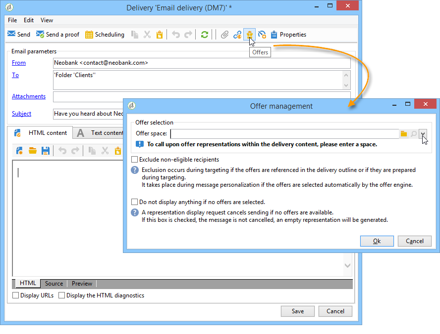

# 透過精靈整合優惠方案{#integrating-an-offer-via-the-wizard}

建立傳遞時，有兩種可能的方法可整合選件：

* 在傳送內文中呼叫優惠方案引擎。
* 透過促銷活動的傳送大綱參考優惠方案。 此方法通常用於紙張促銷活動。

## 呼叫優惠方案引擎並傳送 {#delivering-with-a-call-to-the-offer-engine}

若要在行銷活動期間呈現優惠方案，只需根據所選管道建立傳統的傳送動作即可。 定義傳送內容時，會按一下工具列中可用的&#x200B;**[!UICONTROL Offers]**&#x200B;圖示來呼叫選件引擎。

了解更多有關直接郵件傳送[的資訊，請參閱本節](../../delivery/using/about-direct-mail-channel.md)。 在本小節](../../campaign/using/setting-up-marketing-campaigns.md)中深入了解行銷活動[。

### 將選件插入傳送的主要步驟 {#main-steps-for-inserting-an-offer-into-a-delivery}

若要將優惠方案主張插入傳遞，請套用下列步驟：

1. 在傳送視窗中，按一下選件圖示。

   

1. 選取符合優惠方案環境的空間。

   

1. 若要調整引擎選擇的選件，請選取要呈現選件所屬的類別，或選取一/多個主題。 我們建議一次只使用其中一個欄位，以避免超出限制。

   

   

1. 指定您要插入至傳遞內文的選件數。

   

1. 視需要選取&#x200B;**[!UICONTROL Exclude non-eligible recipients]**&#x200B;選項。 如需詳細資訊，請參閱[呼叫優惠方案引擎](#parameters-for-calling-offer-engine)的參數。

   

1. 如有必要，請選取&#x200B;**[!UICONTROL Do not display anything if no offers are selected]**&#x200B;選項。 如需詳細資訊，請參閱[呼叫優惠方案引擎](#parameters-for-calling-offer-engine)的參數。

   

1. 使用合併欄位將屬性插入傳遞內容。 可用的命題數取決於引擎呼叫的配置方式，其順序取決於選件的優先順序。

   

1. 完成內容，照常傳送您的內容。

   

### 呼叫優惠方案引擎的參數 {#parameters-for-calling-offer-engine}

* **[!UICONTROL Space]** :選件環境的空間，必須選取該空間才能啟用選件引擎。
* **[!UICONTROL Category]** :選件排序的特定資料夾。如果未指定類別，除非選取主題，否則選件引擎會考量環境中包含的所有選件。
* **[!UICONTROL Themes]** :類別中定義上游的關鍵字。這些功能可作為篩選器，讓您透過在一組類別中選取來調整要顯示的選件數量。
* **[!UICONTROL Number of propositions]** :引擎傳回可插入傳遞內文的選件數。如果未將選件插入訊息中，選件仍會產生，但不會顯示。
* **[!UICONTROL Exclude non-eligible recipients]** :此選項可讓您啟用或停用排除沒有足夠合格優惠方案的收件者。合格命題的數量可能低於請求的命題數量。 如果選中此框，則沒有足夠建議的收件者將被排除在傳遞之外。 如果您未選擇此選項，則這些收件者將不會被排除，但他們將沒有請求的數量的建議。
* **[!UICONTROL Do not display anything if no offer is selected]** :此選項可讓您選擇在其中一個命題不存在時如何處理訊息。核取此方塊時，不會顯示遺漏主張的表示，且此主張的訊息中不會顯示任何內容。 如果未核取方塊，則訊息本身會在傳送期間取消，而收件者將不會再收到任何訊息。

### 在傳送中插入優惠方案主張 {#inserting-an-offer-proposition-into-a-delivery}

要呈現的選件表示會透過合併欄位插入傳遞內文。 優惠方案數量在優惠方案引擎呼叫的參數中定義。

您可以使用優惠方案的欄位來個人化傳送，若是電子郵件，則可使用演算功能。

## 使用傳遞大綱傳送 {#delivering-with-delivery-outlines}

您也可以使用傳遞大綱在傳遞中呈現選件。

如需傳送大綱的詳細資訊，請參閱[Campaign - MRM](../../campaign/using/marketing-campaign-deliveries.md#associating-and-structuring-resources-linked-via-a-delivery-outline)指南。

1. 建立新促銷活動或存取現有促銷活動。
1. 透過促銷活動的&#x200B;**[!UICONTROL Edit]** > **[!UICONTROL Documents]**&#x200B;標籤存取傳送大綱。
1. 新增大綱，然後以滑鼠右鍵按一下大綱並選取&#x200B;**[!UICONTROL New]** > **[!UICONTROL Offer]**，然後儲存促銷活動，將任意數量的選件插入該大綱。

   

1. 建立您有權存取的傳送外框（例如直接郵件傳送）的傳送。
1. 編輯傳送時，按一下&#x200B;**[!UICONTROL Select a delivery outline]**。

   >[!NOTE]
   >
   >視傳送類型而定，此選項可在&#x200B;**[!UICONTROL Properties]** > **[!UICONTROL Advanced]**&#x200B;功能表中找到（例如，電子郵件傳送）。

   

1. 然後，您可以使用&#x200B;**[!UICONTROL Offers]**&#x200B;按鈕，設定要在傳送中顯示的選件空間及數量。

   

1. 使用個人化欄位將主張新增至傳遞內文（如需詳細資訊，請參閱[將優惠方案主張插入傳遞](#inserting-an-offer-proposition-into-a-delivery)區段），或如果是直接郵件傳送，則編輯解壓縮檔案格式。

   將從傳遞大綱中引用的選件中選擇命題。

   >[!NOTE]
   >
   >只有在傳遞中直接產生優惠方案時，關於優惠方案排名和權重的資訊才會儲存在主張表格中。
