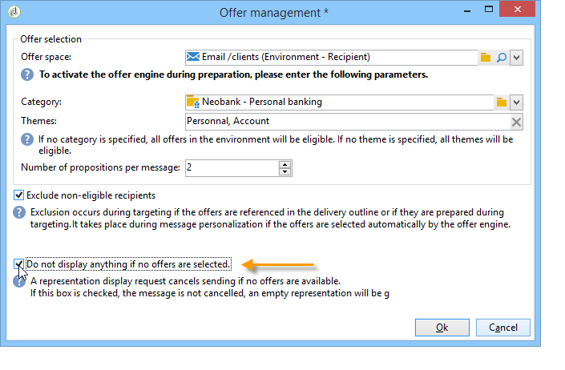

# 透過精靈整合選件{#integrating-an-offer-via-the-wizard}

建立傳送時，有兩種可能的整合選件方法：

* 在傳送內文呼叫選件引擎。
* 透過促銷活動的傳送大綱來參照選件。 此方法通常用於紙本促銷活動。

## 呼叫選件引擎進行傳送 {#delivering-with-a-call-to-the-offer-engine}

若要在行銷促銷活動期間呈現選件，只需根據所選的渠道建立傳統的傳送動作。 當定義傳送內容時，會按一下工具列中的可用圖示，來 **[!UICONTROL Offers]** 呼叫選件引擎。

如需有關傳送和行銷促銷活動的詳細資訊，請參 [閱「傳送](../../delivery/using/about-direct-mail-channel.md) 」 [和「促銷活動」](../../campaign/using/setting-up-marketing-campaigns.md)。

### 將選件插入傳送的主要步驟 {#main-steps-for-inserting-an-offer-into-a-delivery}

若要將選件建議插入傳送，請套用下列步驟：

1. 在傳送視窗中，按一下「選件」圖示。

   

1. 選取符合您選件環境的空間。

   

1. 若要調整引擎選擇的選件，請選取要呈現的選件所屬類別，或選取一／多個主題。 我們建議一次只使用其中一個欄位，以避免超出限制。

   

   

1. 指定您要插入傳送內文的選件數目。

   

1. 視需要 **[!UICONTROL Exclude non-eligible recipients]** 選取選項。 如需詳細資訊，請參閱 [呼叫選件引擎的參數](#parameters-for-calling-offer-engine)。

   

1. 如有必要，請選取 **[!UICONTROL Do not display anything if no offers are selected]** 選項。 如需詳細資訊，請參閱 [呼叫選件引擎的參數](#parameters-for-calling-offer-engine)。

   

1. 使用合併欄位將屬性插入傳送內容。 可用的主張數取決於引擎調用的配置方式，其順序取決於選件的優先順序。

   

1. 完成內容並照常傳送。

   

### 呼叫選件引擎的參數 {#parameters-for-calling-offer-engine}

* **[!UICONTROL Space]** :必須選取以啟用選件引擎的選件環境空間。
* **[!UICONTROL Category]** :選件排序的特定資料夾。 如果未指定類別，除非選取主題，否則選件引擎會考量環境中包含的所有選件。
* **[!UICONTROL Themes]** :關鍵字。 這些選件可當成篩選，讓您透過在一組類別中選取選件來調整要呈現的選件數量。
* **[!UICONTROL Number of propositions]** :引擎傳回的可插入傳送主體的選件數。 如果未將選件插入訊息中，選件仍會產生，但不會顯示。
* **[!UICONTROL Exclude non-eligible recipients]** :此選項可讓您啟用或停用排除不符合資格選件的收件者。 合格命題的數目可能低於所請求的命題數目。 如果勾選此方塊，則沒有足夠建議的收件者將會從傳送中排除。 如果您未選取此選項，這些收件者將不會被排除，但是他們將沒有要求數目的建議。
* **[!UICONTROL Do not display anything if no offer is selected]** :此選項可讓您選擇在其中一個陳述式不存在時如何處理訊息。 選中此框後，不顯示缺少命題的表示，並且不會在此命題的消息中顯示任何內容。 如果未勾選此方塊，則訊息本身會在傳送期間取消，而收件者將不再收到任何訊息。

### 將選件提案插入傳送 {#inserting-an-offer-proposition-into-a-delivery}

要呈現的選件的表示方式會透過合併欄位插入傳送的主體中。 在選件引擎呼叫的參數中定義命題數。

您可使用選件欄位將傳送內容個人化，或在電子郵件中，使用轉換功能。

## 使用傳送大綱進行傳送 {#delivering-with-delivery-outlines}

您也可以使用傳送外框在傳送中呈現選件。

如需傳送外框的詳細資訊，請參閱「促銷活 [動- MRM](../../campaign/using/marketing-campaign-deliveries.md#associating-and-structuring-resources-linked-via-a-delivery-outline) 」指南。

1. 建立新促銷活動或存取現有促銷活動。
1. 透過促銷活動的>標籤存取傳送 **[!UICONTROL Edit]** 大 **[!UICONTROL Documents]** 綱。
1. 新增大綱，然後在大綱上按一下滑鼠右鍵，然後選取 **[!UICONTROL New]** > **[!UICONTROL Offer]**，儲存促銷活動，以插入您想要的選件數量。

   

1. 建立您可存取其傳送大綱的傳送（例如，直接郵件傳送）。
1. 編輯傳送時，按一下 **[!UICONTROL Select a delivery outline]**。

   >[!NOTE]
   >
   >視傳送類型而定，此選項可在 **[!UICONTROL Properties]** >功能表 **[!UICONTROL Advanced]** 中找到（例如，電子郵件傳送）。

   

1. 使用 **[!UICONTROL Offers]** 按鈕，您就可以設定選件空間以及要在傳送中顯示的選件數量。

   

1. 使用個人化欄位將主張新增至傳送內文(如需詳細資訊，請參閱將選件提案插入傳送區段  )，或是編輯擷取檔案格式，以直接郵寄傳送。

   將從交付大綱中引用的選件中選擇建議。

   >[!NOTE]
   >
   >只有當選件直接在傳送中產生時，才會將選件排名和權重的相關資訊儲存在提案表格中。

