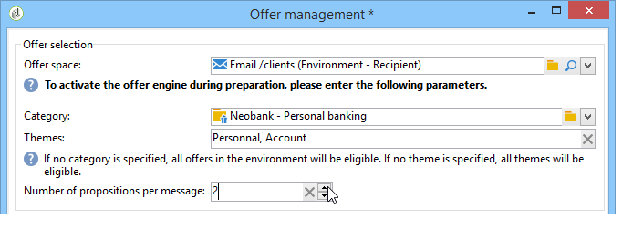
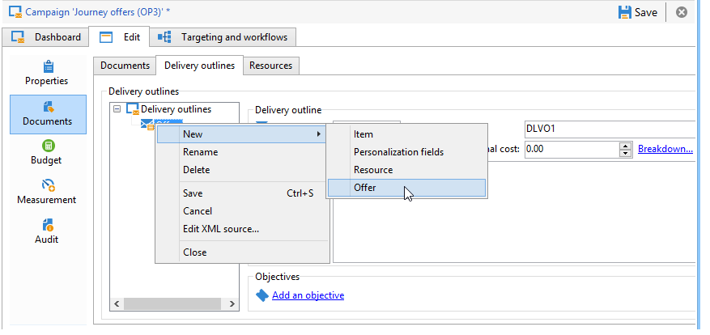

# 透過助理整合優惠方案{#integrating-an-offer-via-the-assistant}

建立傳送時，有兩種整合選件的可能方法：

* 在傳遞內文中呼叫優惠方案引擎。
* 透過行銷活動的傳遞大網參考優惠方案。 此方法通常用於紙張行銷活動。

## 透過呼叫優惠方案引擎進行傳遞 {#delivering-with-a-call-to-the-offer-engine}

若要在行銷活動期間展示優惠方案，只需根據所選管道建立傳統傳遞動作。 按一下工具列中的&#x200B;**[!UICONTROL Offers]**&#x200B;圖示，在定義傳遞內容時呼叫優惠方案引擎。

在本節[&#128279;](../../delivery/using/about-direct-mail-channel.md)中進一步瞭解直接郵件傳遞[。 在本節](../../campaign/using/setting-up-marketing-campaigns.md)中進一步瞭解行銷活動。

### 將優惠方案插入傳遞的主要步驟 {#main-steps-for-inserting-an-offer-into-a-delivery}

若要將優惠方案主張插入傳遞中，請套用下列步驟：

1. 在傳送視窗中，按一下「選件」圖示。

   

1. 選取符合優惠方案環境的空間。

   

1. 若要調整引擎對優惠方案的選擇，請選取要呈現的優惠方案所屬類別，或選取一/數個主題。 我們建議一次只使用其中一個欄位，以避免多載限制。

   

   

1. 指定您要插入傳遞內文的選件數目。

   

1. 選取&#x200B;**[!UICONTROL Exclude non-eligible recipients]**&#x200B;選項（如有必要）。 如需詳細資訊，請參閱呼叫優惠方案引擎[&#128279;](#parameters-for-calling-offer-engine)的引數。

   

1. 如有必要，請選取&#x200B;**[!UICONTROL Do not display anything if no offers are selected]**&#x200B;選項。 如需詳細資訊，請參閱呼叫優惠方案引擎[&#128279;](#parameters-for-calling-offer-engine)的引數。

   

1. 使用合併欄位將屬性插入傳遞內容。 可用的主張數量取決於引擎呼叫的設定方式，而其順序則取決於優惠方案的優先順序。

   

1. 照常完成內容並傳送您的內容。

   

### 用於呼叫優惠方案引擎的引數 {#parameters-for-calling-offer-engine}

* **[!UICONTROL Space]** ：必須選取優惠方案環境的空間，才能啟用優惠方案引擎。
* **[!UICONTROL Category]** ：優惠排序的特定資料夾。 如果未指定類別，則優惠方案引擎將會考慮環境中包含的所有優惠方案，除非選取了主題。
* **[!UICONTROL Themes]** ：類別中上游定義的關鍵字。 這些當作篩選，可讓您在一組類別中選取優惠方案，以縮小要呈現的優惠方案數量。
* **[!UICONTROL Number of propositions]** ：引擎傳回的可插入傳遞主體的選件數目。 如果它們未插入訊息中，仍會產生，但不會顯示優惠方案。
* **[!UICONTROL Exclude non-eligible recipients]** ：此選項可讓您針對沒有足夠的合格優惠方案，來啟用或停用收件者排除功能。 合格主張的數量可能低於要求的主張數量。 如果核取此方塊，則沒有足夠主張的收件者將會從傳遞中排除。 如果您未選取此選項，這些收件者將不會被排除，但他們不會擁有要求的建議數量。
* **[!UICONTROL Do not display anything if no offer is selected]** ：此選項可讓您選擇當其中一個主張不存在時，如何處理訊息。 核取此方塊時，不會顯示缺少主張的表示，且不會出現此主張的訊息內容。 如果未核取此方塊，則訊息本身會在傳送期間取消，收件者將不再接收任何訊息。

### 在傳遞中插入優惠方案主張 {#inserting-an-offer-proposition-into-a-delivery}

要呈現的優惠方案表示法會透過合併欄位插入傳遞的正文中。 主張的數量會在優惠引擎呼叫的引數中定義。

您可以使用優惠的欄位進行個人化傳送，若是電子郵件，則使用轉譯函式。

## 透過傳遞大網傳遞 {#delivering-with-delivery-outlines}

您也可以使用傳送大綱，在傳送中顯示優惠方案。

如需傳遞概要的詳細資訊，請參閱[Campaign - MRM](../../campaign/using/marketing-campaign-deliveries.md#associating-and-structuring-resources-linked-via-a-delivery-outline)指南。

1. 建立新行銷活動或存取現有行銷活動。
1. 透過行銷活動的&#x200B;**[!UICONTROL Edit]** > **[!UICONTROL Documents]**&#x200B;索引標籤存取傳遞大綱。
1. 新增大綱，然後以滑鼠右鍵按一下大綱並選取&#x200B;**[!UICONTROL New]** > **[!UICONTROL Offer]**，然後儲存行銷活動，以插入您想要的所有優惠方案。

   

1. 建立您有權存取其傳遞大網的傳遞（例如，直接郵件傳遞）。
1. 編輯傳遞時，按一下&#x200B;**[!UICONTROL Select a delivery outline]**。

   >[!NOTE]
   >
   >根據傳遞型別，此選項可在&#x200B;**[!UICONTROL Properties]** > **[!UICONTROL Advanced]**&#x200B;功能表（例如電子郵件傳遞）中找到。

   

1. 使用&#x200B;**[!UICONTROL Offers]**&#x200B;按鈕後，您可以設定優惠方案空間，以及要在傳遞中呈現的優惠方案數量。

   

1. 使用個人化欄位將主張新增至傳遞內文（如需詳細資訊，請參閱[將優惠方案主張插入傳遞](#inserting-an-offer-proposition-into-a-delivery)區段），或在直接郵件傳遞的情況下，透過編輯擷取檔案格式將主張新增至傳遞。

   將從傳遞大網中參照的優惠方案中選取主張。

   >[!NOTE]
   >
   >如果優惠是直接在傳遞中產生，則優惠排名和權重的相關資訊只會儲存在主張表格中。
