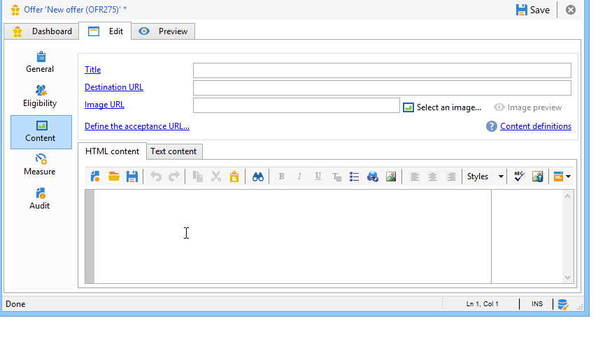
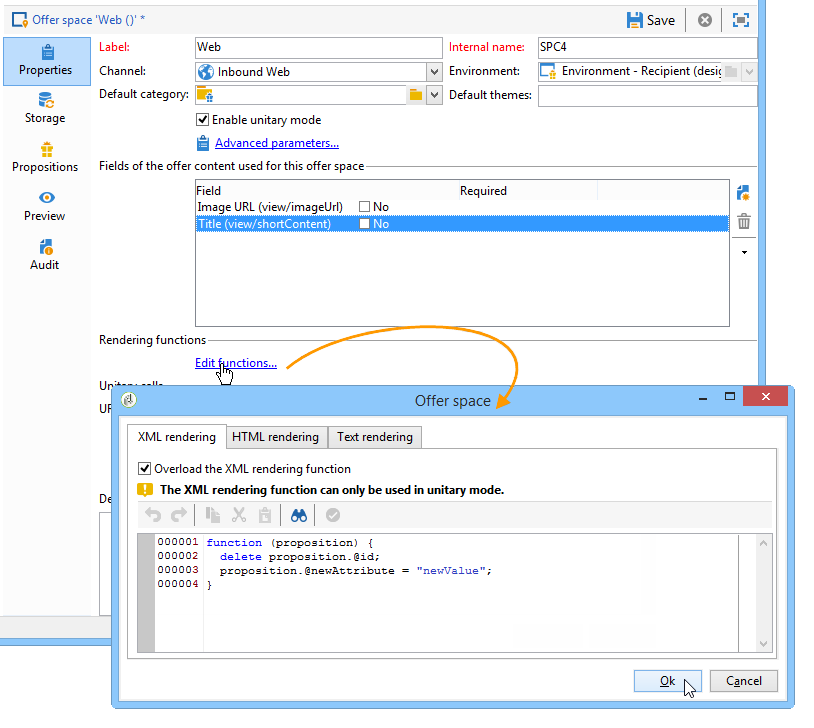

# 透過JavaScript進行整合（用戶端）{#integration-via-javascript-client-side}

若要在網頁中呼叫互動引擎，請直接將對JavaScript程式碼的呼叫插入網頁。 此呼叫會傳回定位

元素。

Adobe建議使用JavaScript整合方法。

呼叫URL的指令碼如下所示：

```
<script id="interactionProposalScript" src="https://<SERVER_URL>/nl/interactionProposal.js?env=" type="text/javascript"></script>
```

&quot;**env**&quot;參數接收專用於匿名交互的即時環境的內部名稱。

若要呈現選件，我們需要在Adobe Campaign中建立環境和選件空間，然後設定HTML頁面。

下列使用案例詳細說明透過JavaScript整合選件的可能選項。

## HTML模式 {#html-mode}

### 呈現匿名優惠 {#presenting-an-anonymous-offer}

1. **準備互動引擎**

   開啟Adobe Campaign介面並準備匿名環境。

   建立連結至匿名環境的選件空間。

   建立連結至選件空間的選件及其表示法。

1. **HTML頁面的內容**

   HTML頁面必須包含

   元素，其中包含@id屬性，其值為已建立的選件空間的內部名稱(「i_internal name space」)。 選件將透過「互動」插入此元素。

   在我們的範例中，@id屬性會接收&quot;i_SPC12&quot;值，其中&quot;SPC12&quot;是先前建立的選件空間的內部名稱：

   ```
   <div id="i_SPC12"></div>
   ```

   在我們的範例中，呼叫指令碼的URL如下（「OE3」是即時環境的內部名稱）:

   ```
   <script id="interactionProposalScript" src="https://instance.adobe.org:8080/nl/interactionProposal.js?env=OE3" type="text/javascript"></script>
   ```

   >[!CAUTION]
   >
   >標 `<script>` 簽不得自行關閉。

   此靜態呼叫會自動產生動態呼叫，其中包含互動引擎所需的所有參數。

   此行為可讓您在相同頁面上使用數個選件空格，由對引擎的單一呼叫管理。

1. **HTML頁面的結果**

   選件表示法的內容會由互動引擎傳回至HTML頁面：

   ```
   <div id="banner_header">
     <div id="i_SPC12">
       <table>
         <tbody>
           <tr>
             <td><h3>Fly to Japan!</h3></td>
           </tr>
           <tr>
             <td></td>
             <td>
               <p>Discover Japan for 2 weeks at an unbelievable price!!</p>
               <p><b>2345 Dollars - All inclusive</b></p>
             </td>
           </tr>
         </tbody>
       </table>
     </div>
     <script src="https://instance.adobe.org:8080/nl/interactionProposal.js?env=OE3" id="interactionProposalScript" type="text/javascript"></script>
   </div>
   ```

### 呈現已識別的選件 {#presenting-an-identified-offer}

若要向已識別的連絡人提供選件，程式與此處詳述的程式類似：提 [供匿名優惠](#presenting-an-anonymous-offer)。 在網頁內容中，您需要新增下列指令碼，以識別呼叫引擎期間的連絡人：

```
<script type="text/javascript">
  interactionTarget = <contact_identifier>;
</script>
```

1. 前往網頁將會呼叫的選件空間，按一下並新增一 **[!UICONTROL Advanced parameters]** 或多個識別碼。

   

   在此範例中，識別碼是複合的，因為它是以電子郵件和收件者名稱為基礎。

1. 在網頁顯示期間，指令碼評估可讓您將收件者ID傳遞至選件引擎。 如果ID是複合的，則按鍵會以與進階設定中使用的相同順序顯示，並以|.

   在下列範例中，該連絡人已登入網站，在呼叫互動引擎時，由於其電子郵件和姓名而被識別。

   ```
   <script type="text/javascript">
     interactionTarget = myEmail|myName;
   </script>
   ```

### 使用HTML演算功能 {#using-an-html-rendering-function}

若要自動產生HTML選件表示法，您可以使用轉換函式。

1. 前往選件空間，然後按一下 **[!UICONTROL Edit functions]** 連結。
1. Select **[!UICONTROL Overload the HTML rendering function]**.
1. 前往標籤 **[!UICONTROL HTML rendering]** 並插入與選件空間中為選件內容定義之欄位相符的變數。

   

   在此範例中，選件會以橫幅的形式顯示在網頁中，並由可點選的影像和標題所組成，這些標題與選件內容中定義的欄位相符。

## XML模式 {#xml-mode}

### 呈現選件 {#presenting-an-offer}

互動功能可讓您將XML節點傳回至呼叫選件引擎的HTML頁面。 此XML節點可由客戶端開發的功能來處理。

對互動引擎的呼叫如下所示：

```
<script type="text/javascript" id="interactionProposalScript" src="https://<SERVER_URL>/nl/interactionProposal.js?env=&cb="></script>
```

&quot;**env**&quot;參數接收即時環境的內部名稱。

&quot;**cb**&quot;參數接收函式的名稱，該名稱將讀取包含（回呼）命題的引擎返回的XML節點。 此參數為可選參數。

&quot;**t**&quot;參數只會接收目標的值，僅用於已識別的互動。 此參數也可與interactionTarget變 **數一起傳遞** 。 此參數為可選參數。

&quot;**c**&quot;參數接收類別的內部名稱清單。 此參數為可選參數。

「**th**」參數會接收主題清單。 此參數為可選參數。

&quot;**gctx**&quot;參數會接收整個頁面的呼叫資料全域（內容）。 此參數為可選參數。

傳回的XML節點如下所示：

```
<propositions>
 <proposition id="" offer-id="" weight="" rank="" space="" div=""> //proposition identifiers
   ...XML content defined in Adobe Campaign...
 </proposition>
 ...
</propositions>
```

下列使用案例詳細說明在Adobe Campaign中要進行的設定，以啟用XML模式，然後在HTML頁面中顯示對引擎的呼叫結果。

1. **建立環境和選件空間**

   如需建立環境的詳細資訊，請參 [閱即時／設計環境](../../interaction/using/live-design-environments.md)。

   如需建立選件空間的詳細資訊，請參閱「建立 [選件空間」](../../interaction/using/creating-offer-spaces.md)。

1. **擴充選件結構以新增欄位**

   此方案將定義以下欄位：標題2和價格。

   範例中的架構名稱為 **cus:offer**

   ```
   <srcSchema _cs="Marketing offers (cus)" created="2013-01-18 17:14:20.762Z" createdBy-id="0"
              desc="" entitySchema="xtk:srcSchema" extendedSchema="nms:offer" img="nms:offer.png"
              label="Marketing offers" labelSingular="Marketing offers" lastModified="2013-01-18 15:20:18.373Z"
              mappingType="sql" md5="F14A7AA009AE1FCE31B0611E72866AC3" modifiedBy-id="0"
              name="offer" namespace="cus" xtkschema="xtk:srcSchema">
     <createdBy _cs="Administrator (admin)"/>
     <modifiedBy _cs="Administrator (admin)"/>
     <element img="nms:offer.png" label="Marketing offers" labelSingular="Marketing offer"
              name="offer">
       <element label="Content" name="view">
         <element label="Price" name="price" type="long" xml="true"/>
         <element label="Title 2" name="title2" type="string" xml="true"/>
   
         <element advanced="true" desc="Price calculation script." label="Script price"
                  name="price_jst" type="CDATA" xml="true"/>
         <element advanced="true" desc="Title calculation script." label="Script title"
                  name="title2_jst" type="CDATA" xml="true"/>
       </element>
     </element>
   </srcSchema>
   ```

   >[!CAUTION]
   >
   >每個元素必須定義兩次。 CDATA(&quot;_jst&quot;)類型元素可以包含個性化欄位。
   >
   >不要忘記更新資料庫結構。 如需詳細資訊，請參閱[本小節](../../configuration/using/updating-the-database-structure.md)。

   >[!NOTE]
   >
   >您可以擴充選件結構，以批次和統一模式，以及任何格式（文字、HTML和XML）新增欄位。

1. **擴充選件公式以編輯新欄位並修改現有欄位**

   編輯選 **件(nsm)輸入** 表單。

   在「檢視」區段中，插入兩個新欄位，其中包含下列內容：

   ```
   <input label="Title 2" margin-right="5" prebuildSubForm="false" type="subFormLink"
                        xpath="title2_jst">
                   <form label="Edit title 2" name="editForm" nothingToSave="true">
                     <input nolabel="true" toolbarAlign="horizontal" type="jstEdit"
                            xpath="." xpathInsert="/ignored/customizeTitle2">
                       <container>
                         <input menuId="viewMenuBuilder" options="inbound" type="customizeBtn"
                                xpath="/ignored/customizeTitle2"/>
                       </container>
                     </input>
                   </form>
                 </input>
                 <input nolabel="true" type="edit" xpath="title2_jst"/>
   
                 <input label="Price" margin-right="5" prebuildSubForm="false" type="subFormLink"
                        xpath="price_jst">
                   <form label="Edit price" name="editForm" nothingToSave="true">
                     <input nolabel="true" toolbarAlign="horizontal" type="jstEdit"
                            xpath="." xpathInsert="/ignored/customizePrice">
                       <container>
                         <input menuId="viewMenuBuilder" options="inbound" type="customizeBtn"
                                xpath="/ignored/customizePrice"/>
                       </container>
                     </input>
                   </form>
                 </input>
                 <input colspan="2" label="Prix" nolabel="true" type="number" xpath="price_jst"/>
   ```

   注釋掉目標URL欄位：

   

   >[!CAUTION]
   >
   >()表單的字 `<input>`段必須指向在建立的模式中定義的CDATA類型元素。

   選件表示形式中的轉換如下所示：

   

   已 **[!UICONTROL Title 2]** 新增 **[!UICONTROL Price]** 和欄位，且不再 **[!UICONTROL Destination URL]** 顯示欄位。

1. **建立選件**

   如需建立選件的詳細資訊，請參 [閱建立選件](../../interaction/using/creating-an-offer.md)。

   在下列使用案例中，選件的輸入方式如下：

   

1. 核准選件或讓其他人核准選件，然後在最後一個步驟建立的選件空間上啟動選件，以便在連結的即時環境中使用。
1. **HTML頁面上的引擎呼叫和結果**

   在HTML頁面中呼叫互動引擎的情形如下：

   ```
   <script id="interactionProposalScript" src="https://<SERVER_URL>/nl/interactionProposal.js?env=OE7&cb=alert" type="text/javascript">
   ```

   &quot;env ****&quot;參數的值是即時環境的內部名稱。

   &quot;**cb**&quot;參數的值是需要解譯引擎返回的XML節點的函式名稱。 在我們的範例中，呼叫的函式會開啟一個模式視窗(alert()函式)。

   交互引擎返回的XML節點如下所示：

   ```
   <propositions>
    <proposition id="a28002" offer-id="10322005" weight="1" rank="1" space="SPC14" div="i_SPC14">
     <xmlOfferView>
      <title>Travel to Russia</title>
      <price>3456</price>
      <description>Discover this vacation package!INCLUDES 10 nights. FEATURES buffet breakfast daily. BONUS 5th night free.</description>
      <image>
       <path>https://myinstance.com/res/Track/ae1d2113ed732d58a3beb441084e5960.jpg</path>
       <alt>Travel to Russia</alt>
      </image>
     </xmlOfferView>
    </proposition>
   </propositions>
   ```

### 使用演算功能 {#using-a-rendering-function-}

您可使用XML轉換功能來建立選件簡報。 此函式將修改在調用引擎期間返回到HTML頁面的XML節點。

1. 前往選件空間，然後按一下 **[!UICONTROL Edit functions]** 連結。
1. Select **[!UICONTROL Overload the XML rendering function]**.
1. 前往標籤 **[!UICONTROL XML rendering]** 並插入所要的函式。

   函式可以如下所示：

   ```
   function (proposition) {
     delete proposition.@id;
     proposition.@newAttribute = "newValue";
   } 
   ```



