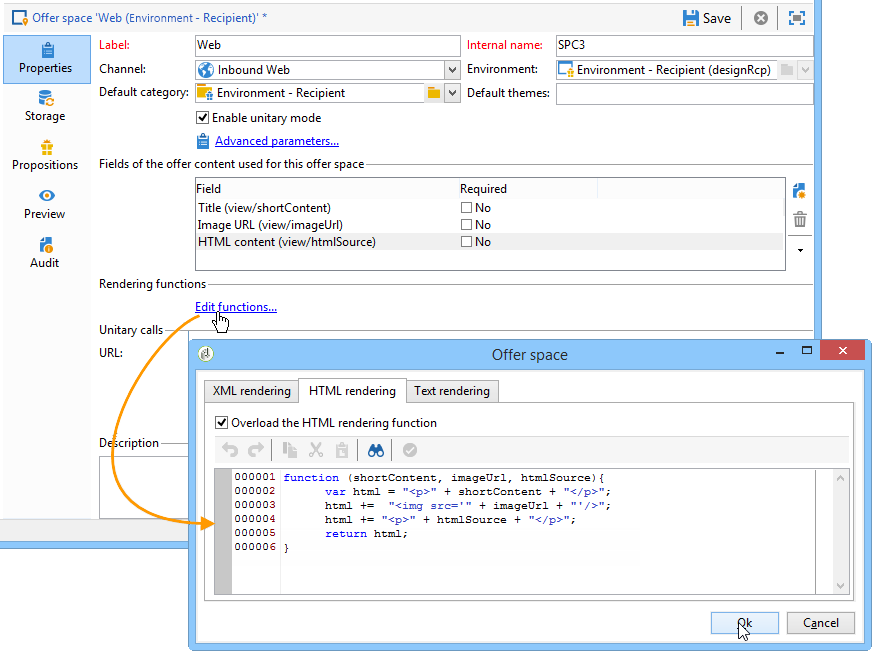

# 透過 JavaScript 進行整合 (用戶端){#integration-via-javascript-client-side}


若要在網頁中呼叫互動引擎，請直接在頁面中插入JavaScript程式碼的呼叫。 此呼叫會傳回鎖定目標中的選件內容

個元素.

Adobe建議使用JavaScript整合方法。

指令碼呼叫URL看起來像這樣：

```
<script id="interactionProposalScript" src="https://<SERVER_URL>/nl/interactionProposal.js?env=" type="text/javascript"></script>
```

「**環境**「引數會收到匿名互動專屬之即時環境的內部名稱。

若要呈現優惠方案，我們需要在Adobe Campaign中建立環境和優惠方案空間，然後設定HTML頁面。

下列使用案例詳細說明透過JavaScript整合選件的可能選項。

## HTML模式 {#html-mode}

### 呈現匿名優惠 {#presenting-an-anonymous-offer}

1. **準備互動引擎**

   開啟Adobe Campaign介面並準備匿名環境。

   建立連結至匿名環境的優惠方案空間。

   建立連結至優惠方案空間的優惠方案及其表現。

1. **HTML頁面的內容**

   HTML頁面必須包含

   元素的@id屬性，其值為已建立之選件空間（「i_internal名稱空間」）的內部名稱。 選件會由Interaction插入此元素。

   在我們的範例中，@id屬性會收到「i_SPC12」值，其中「SPC12」是先前建立之優惠空間的內部名稱：

   ```
   <div id="i_SPC12"></div>
   ```

   在我們的範例中，呼叫指令碼的URL如下（「OE3」是即時環境的內部名稱）：

   ```
   <script id="interactionProposalScript" src="https://instance.adobe.org:8080/nl/interactionProposal.js?env=OE3" type="text/javascript"></script>
   ```

   >[!IMPORTANT]
   >
   >此 `<script>` 標籤不得為自動結束。

   此靜態呼叫會自動產生動態呼叫，其中包含互動引擎所需的所有引數。

   此行為可讓您在同一個頁面上使用數個選件空間，以便透過對引擎的單一呼叫來管理。

1. **HTML頁面中的結果**

   優惠方案表示的內容會由互動引擎傳回HTML頁面：

   ```
   <div id="banner_header">
     <div id="i_SPC12">
       <table>
         <tbody>
           <tr>
             <td><h3>Fly to Japan!</h3></td>
           </tr>
           <tr>
             <td></td>
             <td>
               <p>Discover Japan for 2 weeks at an unbelievable price!!</p>
               <p><b>2345 Dollars - All inclusive</b></p>
             </td>
           </tr>
         </tbody>
       </table>
     </div>
     <script src="https://instance.adobe.org:8080/nl/interactionProposal.js?env=OE3" id="interactionProposalScript" type="text/javascript"></script>
   </div>
   ```

### 呈現已識別的優惠 {#presenting-an-identified-offer}

若要向已識別的連絡人顯示優惠方案，程式與此處詳述的類似： [呈現匿名優惠](#presenting-an-anonymous-offer). 在網頁的內容中，您需要新增以下指令碼，以在呼叫引擎期間識別聯絡人：

```
<script type="text/javascript">
  interactionTarget = <contact_identifier>;
</script>
```

1. 前往網頁將呼叫的優惠方案空間，按一下 **[!UICONTROL Advanced parameters]** 並新增一或多個識別鍵。

   

   在此範例中，識別索引鍵是複合的，因為它同時以電子郵件和收件者名稱為基礎。

1. 在網頁顯示期間，指令碼評估可讓您將收件者ID傳遞至優惠方案引擎。 如果ID是複合的，則鍵會以與進階設定相同的順序顯示，並以分隔 |.

   在下列範例中，連絡人已登入網站，並因其電子郵件和名稱而在呼叫互動引擎時被識別。

   ```
   <script type="text/javascript">
     interactionTarget = myEmail|myName;
   </script>
   ```

### 使用HTML演算函式 {#using-an-html-rendering-function}

若要自動產生HTML選件表示，您可以使用演算功能。

1. 前往優惠方案空間，然後按一下 **[!UICONTROL Edit functions]** 連結。
1. 選取 **[!UICONTROL Overload the HTML rendering function]**。
1. 前往 **[!UICONTROL HTML rendering]** 定位並插入與優惠方案空間中針對優惠方案內容定義的欄位相符的變數。

   

   在此範例中，優惠方案會以橫幅的形式顯示在網頁中，且由可點按的影像以及符合優惠方案內容中定義欄位的標題所組成。

## XML模式 {#xml-mode}

### 正在呈現優惠方案 {#presenting-an-offer}

互動可讓您將XML節點傳回至呼叫優惠方案引擎的HTML頁面。 此XML節點可由要在客戶端開發的函式來處理。

對互動引擎的呼叫如下所示：

```
<script type="text/javascript" id="interactionProposalScript" src="https://<SERVER_URL>/nl/interactionProposal.js?env=&cb="></script>
```

「**環境**&quot;引數會收到即時環境的內部名稱。

「**cb**&quot;引數會接收將讀取由包含（回撥）主張的引擎傳回的XML節點的函式名稱。 此引數為選用。

「**t**&quot;引數僅會針對已識別的互動接收目標的值。 此引數也可以與 **interactionTarget** 變數中。 此引數為選用。

「**c**&quot;引數會收到類別的內部名稱清單。 此引數為選用。

「**th**&quot;引數會收到主題清單。 此引數為選用。

「**gctx**&quot;引數會接收整個頁面的呼叫資料全域（內容）。 此引數為選用。

傳回的XML節點如下所示：

```
<propositions>
 <proposition id="" offer-id="" weight="" rank="" space="" div=""> //proposition identifiers
   ...XML content defined in Adobe Campaign...
 </proposition>
 ...
</propositions>
```

以下使用案例詳細說明要在Adobe Campaign中執行的設定以啟用XML模式，然後在HTML頁面中顯示呼叫引擎的結果。

1. **建立環境和優惠方案空間**

   有關建立環境的詳細資訊，請參閱 [即時/設計環境](../../interaction/using/live-design-environments.md).

   有關建立優惠方案空間的詳細資訊，請參閱 [建立優惠方案空間](../../interaction/using/creating-offer-spaces.md).

1. **擴充優惠方案結構以新增欄位**

   此結構描述將定義下列欄位：標題編號2和價格。

   此範例中的結構描述名稱為 **cus：offer**

   ```
   <srcSchema _cs="Marketing offers (cus)" created="2013-01-18 17:14:20.762Z" createdBy-id="0"
              desc="" entitySchema="xtk:srcSchema" extendedSchema="nms:offer" img="nms:offer.png"
              label="Marketing offers" labelSingular="Marketing offers" lastModified="2013-01-18 15:20:18.373Z"
              mappingType="sql" md5="F14A7AA009AE1FCE31B0611E72866AC3" modifiedBy-id="0"
              name="offer" namespace="cus" xtkschema="xtk:srcSchema">
     <createdBy _cs="Administrator (admin)"/>
     <modifiedBy _cs="Administrator (admin)"/>
     <element img="nms:offer.png" label="Marketing offers" labelSingular="Marketing offer"
              name="offer">
       <element label="Content" name="view">
         <element label="Price" name="price" type="long" xml="true"/>
         <element label="Title 2" name="title2" type="string" xml="true"/>
   
         <element advanced="true" desc="Price calculation script." label="Script price"
                  name="price_jst" type="CDATA" xml="true"/>
         <element advanced="true" desc="Title calculation script." label="Script title"
                  name="title2_jst" type="CDATA" xml="true"/>
       </element>
     </element>
   </srcSchema>
   ```

   >[!IMPORTANT]
   >
   >每個元素需要定義兩次。 CDATA (&quot;_jst&quot;)型別元素可包含個人化欄位。
   >
   >別忘了更新資料庫結構。 如需詳細資訊，請參閱[本章節](../../configuration/using/updating-the-database-structure.md)。

   >[!NOTE]
   >
   >您可以擴充優惠方案結構，以批次和單一模式及任何格式(文字、HTML和XML)新增欄位。

1. **擴充優惠方案公式以編輯新欄位並修改現有欄位**

   編輯 **選件(nsm)** 輸入表單。

   在「檢視」區段中，插入兩個含有以下內容的新欄位：

   ```
   <input label="Title 2" margin-right="5" prebuildSubForm="false" type="subFormLink"
                        xpath="title2_jst">
                   <form label="Edit title 2" name="editForm" nothingToSave="true">
                     <input nolabel="true" toolbarAlign="horizontal" type="jstEdit"
                            xpath="." xpathInsert="/ignored/customizeTitle2">
                       <container>
                         <input menuId="viewMenuBuilder" options="inbound" type="customizeBtn"
                                xpath="/ignored/customizeTitle2"/>
                       </container>
                     </input>
                   </form>
                 </input>
                 <input nolabel="true" type="edit" xpath="title2_jst"/>
   
                 <input label="Price" margin-right="5" prebuildSubForm="false" type="subFormLink"
                        xpath="price_jst">
                   <form label="Edit price" name="editForm" nothingToSave="true">
                     <input nolabel="true" toolbarAlign="horizontal" type="jstEdit"
                            xpath="." xpathInsert="/ignored/customizePrice">
                       <container>
                         <input menuId="viewMenuBuilder" options="inbound" type="customizeBtn"
                                xpath="/ignored/customizePrice"/>
                       </container>
                     </input>
                   </form>
                 </input>
                 <input colspan="2" label="Prix" nolabel="true" type="number" xpath="price_jst"/>
   ```

   註解目的地URL欄位：

   

   >[!IMPORTANT]
   >
   >( `<input>`)表單必須指向已建立架構中定義的CDATA型別元素。

   優惠方案宣告表單中的轉譯如下所示：

   

   此 **[!UICONTROL Title 2]** 和 **[!UICONTROL Price]** 欄位已新增，而且 **[!UICONTROL Destination URL]** 欄位不再顯示。

1. **建立優惠方案**

   如需建立優惠方案的詳細資訊，請參閱 [建立優惠方案](../../interaction/using/creating-an-offer.md).

   在下列使用案例中，輸入選件的方式如下：

   

1. 核准優惠或由其他人核准，然後在最後一個步驟建立的優惠方案空間上啟用它，以便在連結的即時環境中可用。
1. **HTML頁面上的引擎呼叫和結果**

   對HTML頁面中互動引擎的呼叫看起來像這樣：

   ```
   <script id="interactionProposalScript" src="https://<SERVER_URL>/nl/interactionProposal.js?env=OE7&cb=alert" type="text/javascript">
   ```

   「」的值&#x200B;**環境**「引數是即時環境的內部名稱。

   「」的值&#x200B;**cb**&quot;parameter是函式的名稱，需要解譯引擎傳回的XML節點。 在我們的範例中，呼叫的函式會開啟一個模型視窗(alert()函式)。

   互動引擎傳回的XML節點如下所示：

   ```
   <propositions>
    <proposition id="a28002" offer-id="10322005" weight="1" rank="1" space="SPC14" div="i_SPC14">
     <xmlOfferView>
      <title>Travel to Russia</title>
      <price>3456</price>
      <description>Discover this vacation package!INCLUDES 10 nights. FEATURES buffet breakfast daily. BONUS 5th night free.</description>
      <image>
       <path>https://myinstance.com/res/Track/ae1d2113ed732d58a3beb441084e5960.jpg</path>
       <alt>Travel to Russia</alt>
      </image>
     </xmlOfferView>
    </proposition>
   </propositions>
   ```

### 使用演算函式 {#using-a-rendering-function-}

您可以使用XML演算函式來建立優惠方案簡報。 此函式將修改在呼叫引擎期間傳回HTML頁面的XML節點。

1. 前往優惠方案空間，然後按一下 **[!UICONTROL Edit functions]** 連結。
1. 選取 **[!UICONTROL Overload the XML rendering function]**。
1. 前往 **[!UICONTROL XML rendering]** 定位並插入所需的函式。

   函式看起來可能像這樣：

   ```
   function (proposition) {
     delete proposition.@id;
     proposition.@newAttribute = "newValue";
   } 
   ```


