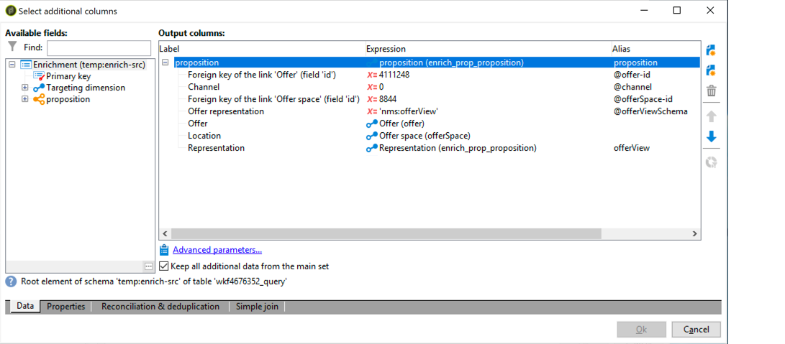

# 互動最佳實務{#interaction-best-practices}


## 一般性建議 {#general-recommendations}

本節提供在Adobe Campaign Classic中管理「互動」模組的最佳實務方法，包括適用性規則、預先定義的篩選器、工作流程活動和資料庫選項。

Adobe Campaign的互動需要謹慎管理，才能有效運作。 您必須在聯絡人數與優惠方案類別和優惠方案數目之間找到平衡。 若未謹慎處理這些因素，您的Adobe Campaign例項可能會遇到問題。

### 實作 {#implementation}

以下列出實作和設定互動時應謹記的重要元素。

* 對於批次引擎（通常用於傳出通訊，例如電子郵件），吞吐量是主要考量，因為可以同時處理多個連絡人。 典型的瓶頸是資料庫效能。
* 單一引擎的主要限制（通常用於傳入通訊，例如網站上的橫幅）是延遲，因為有人預期會有答案。 典型的瓶頸是CPU效能。
* 優惠方案目錄設計對Adobe Campaign Classic效能有重大影響。
* 當有許多優惠方案時，將它們分割為數個優惠方案目錄。

### 適用性規則 {#eligibility-rules}

以下列出資格規則的一些最佳實務。

* 簡化規則。 規則複雜性會影響效能，因為它會延長查詢時間。 複雜規則是指具有超過五個條件的任何規則。
* 為了提高效能，可以用跨多個選件共用的不同預先定義篩選器來劃分規則。
* 將限制最嚴格的優惠方案類別規則放在樹狀結構中盡可能最高的位置。 這樣，他們會先篩選出最多的聯絡人，減少目標數量，並防止其被進一步規則處理。
* 將最昂貴的規則放在樹的底部進行時間或處理。 如此一來，這些規則只會在剩餘的目標對象上執行。
* 從特定類別開始，以避免掃描整個樹。
* 為了節省處理時間，請預先計算匯總，而非使用連結建立複雜規則。 要執行此操作，請嘗試將客戶資料儲存在可在適用性規則中查詢的參考表格中。
* 使用最小權數來限制查詢數。
* 建議每個優惠方案空間的優惠方案數量有限。 這可確保更快速地擷取任何指定空間中的選件。
* 使用索引，尤其是常用的查詢欄。

### 主張表 {#proposition-table}

以下列出有關主張表格的一些最佳實務。

* 使用最少的規則數量，以盡快處理。
* 限制主張表中的記錄數：僅保留跟蹤其狀態更新所需的記錄以及規則需要的記錄，然後將其歸檔到其他系統。
* 對主張表執行密集的資料庫維護，例如重建索引或重新建立表。
* 限制每個目標所請求的主張數。 請勿設定超出您實際要使用的項目。
* 盡可能避免在規則條件中加入。

## 管理優惠方案的秘訣與技巧 {#tips-managing-offers}

本節包含管理優惠方案和使用Adobe Campaign Classic中互動模組的更詳細建議。

### 在電子郵件傳送中使用多個優惠方案空間 {#multiple-offer-spaces}

將選件納入傳送時，通常會透過擴充活動（或其他類似活動），在促銷活動工作流程的上游選取選件。

在「擴充」活動中選取選件時，您可以選擇要使用哪個選件空間。 不過，無論選取的優惠方案空間為何，傳遞自訂功能表取決於傳遞中設定的優惠方案空間。

在下列範例中，傳送中選取的優惠方案空間為 **[!UICONTROL Email (Environment - Recipient)]**:


如果您在傳送中選取的選件空間未設定HTML呈現功能，您就不會在傳送功能表中看到，且將無法供選取。 同樣地，這與擴充活動中選取的選件空間無關。

在下列範例中，HTML呈現函式可在下拉式清單中使用，因為傳送中選取的選件空間具有呈現函式：


此函式會插入程式碼，例如： `<%@ include proposition="targetData.proposition" view="rendering/html" %>`.

當您選取主張時， **[!UICONTROL view]** 屬性如下：
* &quot;rendering/html&quot;:html呈現。 它使用HTML呈現函式。
* &quot;offer/view/html&quot;:html內容。 它不使用HTML呈現函式。 它只包含HTML欄位。

當您在單一電子郵件傳送中包含多個選件空間，且其中部分內容具有呈現函式，而部分內容沒有，您必須記住哪些選件使用哪些選件空間，哪些選件空間具有呈現函式。

因此，為避免任何問題，建議所有選件空間都定義一個HTML呈現函式，即使您的選件空間僅需要HTML內容亦然。

### 在命題日誌表中設定排名 {#rank-proposition-log-table}

當生成或接受命題時，選件空間能夠將資料儲存在命題表中：


不過，這只會套用至入站互動。

使用對外互動時，以及在不使用互動模組使用對外選件時，也可以在主張表格中儲存其他資料。

工作流臨時表中名稱與命題表中的欄位名稱匹配的任何欄位都會複製到命題表中的相同欄位。

例如，在擴充中手動選取選件（不使用互動）時，標準欄位的定義如下：



可新增其他欄位，例如@rank欄位：


由於主張表中有一個名為@rank的欄位，因此將複製工作流臨時表中的值。

有關在主張表中儲存其他欄位的詳細資訊，請參見 [透過工作流程整合優惠方案](../../interaction/using/integrating-an-offer-via-a-workflow.md#storing-offer-rankings-and-weights).

對於具有互動的對外優惠方案，當選取了數個優惠方案且您想記錄它們在電子郵件中的顯示順序時，這個用法很有幫助。

您也可以直接在主張表格中儲存其他中繼資料，例如目前的支出層級，以保留在產生選件時有關支出的歷史記錄。

使用傳出互動時，如上例所示，可新增@rank欄位，但其值會根據互動傳回的順序自動設定。 例如，如果您使用互動來選取三個選件，@rank欄位會傳回值1、2和3。

使用「互動」和手動選取選件時，使用者可以結合這兩種方法。 例如，使用者可以手動將手動選取的選件@rank欄位設為1，並對互動傳回的選件使用如&quot;1 + @rank&quot;的運算式。 假設「互動」選取三個選件，則兩個方法傳回的選件會排名1-4:


### 擴充nms:offer方案 {#extending-nms-offer-schema}

擴充nms:offer結構時，請務必遵循已設定的現成結構：
* 為下的內容儲存定義任何新欄位 `<element name="view">`.
* 每個新欄位需要定義兩次。 一次作為常規XML欄位，另一次作為CDATA XML欄位，名稱后面附加「_jst」。 例如：

   ```
   <element label="Price" name="price" type="long" xml="true"/>
   <element advanced="true" label="Script price" name="price_jst" type="CDATA" xml="true"/>
   ```

* 任何包含要追蹤之URL的欄位都必須放在 `<element name="trackedUrls">` 可在 `<element name="view" >`.
