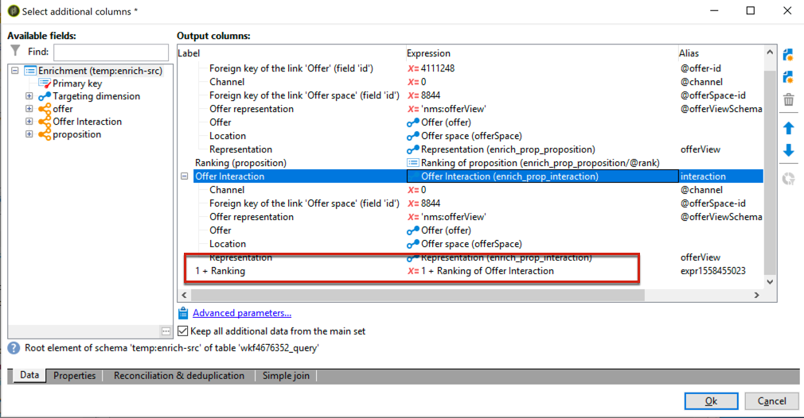

# 互動最佳實務{#interaction-best-practices}

## 一般性建議 {#general-recommendations}

本節介紹在Adobe Campaign Classic中管理「互動」模組的最佳實務方法，包括資格規則、預先定義的篩選條件、工作流程活動和資料庫選項。

Adobe Campaign中的互動需要謹慎的管理，才能有效運作。 您必須在聯繫人數和選件類別和選件數之間找到平衡。 如果未仔細處理這些因素，您的Adobe Campaign例項可能會遇到問題。

### 實作 {#implementation}

以下列出實施和設定互動時應牢記的重要元素。

* 對於批次引擎（通常用於出站通訊，如電子郵件），吞吐量是主要考慮因素，因為可以同時處理多個聯繫人。 典型的瓶頸是資料庫效能。
* 單一引擎的主要限制（通常用於傳入通訊，例如網站上的橫幅）是延遲，因為有人期待答案。 典型的瓶頸是CPU效能。
* 選件目錄設計對Adobe Campaign Classic的效能有巨大影響。
* 當有許多選件時，請將它們分割成數個選件目錄。

### 資格規則 {#eligibility-rules}

以下列出有關資格規則的一些最佳實務。

* 簡化規則。 規則複雜性會影響效能，因為它會擴充查詢。 複雜規則是任何具有5個以上條件的規則。
* 若要提高效能，可以在不同的預先定義篩選條件中劃分規則，這些篩選條件會在多個選件間共用。
* 將限制最嚴格的選件類別規則放在樹狀結構中最高的位置。 這樣，他們會先過濾掉大多數聯繫人，減少目標數量，並防止被更多規則處理。
* 在樹的底部放置最昂貴的時間或處理規則。 執行此動作時，這些規則只會在剩餘的目標對象上執行。
* 從特定類別開始，以避免掃描整個樹。
* 為節省處理時間，請預先計算匯整，而不是使用連結建立複雜規則。 若要這麼做，請嘗試將客戶資料儲存在參考表格中，以便在資格規則中查閱。
* 使用最小權重數來限制查詢數。
* 建議每個選件空間有限數量的選件。 如此可確保在任何指定空間中更快擷取選件。
* 使用索引，尤其是常用的查詢欄。

### 命題表 {#proposition-table}

以下列出關於主張表格的一些最佳做法。

* 使用最少的規則，讓處理更快速。
* 限制命題表中的記錄數：只保存跟蹤其狀態更新和規則所需的記錄，然後將它們存檔到另一個系統。
* 對命題表執行密集的資料庫維護，如重建索引或重新建立表。
* 限制每個目標所詢問的主張數。 請勿設定您實際要使用的項目。
* 盡可能避免在規則條件中加入連接。

## 管理優惠的秘訣與訣竅 {#tips-managing-offers}

本節包含有關管理選件和使用Adobe Campaign Classic中「互動」模組的更詳細建議。

### 在電子郵件傳送中使用多個選件空間 {#multiple-offer-spaces}

在傳送中納入選件時，選件通常會在促銷活動工作流程中透過「擴充」活動（或其他類似活動）的上游選取。

在「擴充」活動中選取選件時，您可以選擇要使用的選件空間。 不過，無論選取的選件空間為何，傳送自訂功能表會視傳送中設定的選件空間而定。

在下列範例中，傳送中選取的選件空間為 **[!UICONTROL Email (Environment - Recipient)]**:


如果您在傳送中選取的選件空間未設定HTML轉換功能，您就無法在傳送功能表中看到，也無法供選取。 同樣地，這與Enrichment活動中選擇的選件空間無關。

在下列範例中，HTML轉譯功能可在下拉式清單中使用，因為傳送中選取的選件空間具有轉譯功能：


此函式插入代碼，例如： `<%@ include proposition="targetData.proposition" view="rendering/html" %>`。

當您選擇提案時，屬性的 **[!UICONTROL view]** 值如下：
* &quot;rendering/html&quot;:html轉換。 它使用HTML轉換功能。
* 「選件／檢視/html」:html內容。 它不使用HTML轉換功能。 它只包含HTML欄位。

當您在單一電子郵件傳送中包含多個選件空間，且其中有些選件具有轉換功能，而有些則沒有轉換功能時，您必須記得哪些選件使用了哪些選件提供了空間，哪些選件具有轉換功能。

因此，為避免任何問題，建議所有選件空間都定義HTML轉換函式，即使選件空間只需要HTML內容亦然。

### 在命題日誌表中設定排名 {#rank-proposition-log-table}

在生成或接受主張時，選件空間能夠將資料儲存在命題表中：


不過，這僅適用於傳入互動。

此外，在使用對外互動時，以及在不使用「互動」模組的情況下使用對外選件時，也可以將其他資料儲存在提案表格中。

名稱與命題表中的欄位名稱匹配的工作流臨時表中的任何欄位都會複製到命題表中的同一欄位中。

例如，在Enrichment中手動選取選件（不含Interaction）時，標準欄位的定義如下：


可新增其他欄位，例如@rank欄位：


由於命題表中有一個名為@rank的欄位，因此將複製工作流臨時表中的值。

如需將其他欄位儲存在提案表格中的詳細資訊，請參 [閱透過工作流程整合選件](../../interaction/using/integrating-an-offer-via-a-workflow.md#storing-offer-rankings-and-weights)。

對於具有互動的對外選件，當選取數個選件且您想要記錄這些選件在電子郵件中的顯示順序時，這項功能會很有用。

您也可以直接將其他中繼資料儲存在提案表格中，例如目前的支出等級，以保存有關產生選件時的支出歷史記錄。

使用「對外互動」時，可以新增@rank欄位，如上例所示，但其值會根據「互動」傳回的順序自動設定。 例如，如果您使用「互動」來選取三個選件，@rank欄位會傳回值1、2和3。

使用「互動」並手動選取選件時，使用者可結合這兩種方式。 例如，使用者可手動將手動選取的選件的@rank欄位設為1，並對「互動」傳回的選件使用「1 + @rank」之類的運算式。 假設「互動」選取三個選件，兩個方法傳回的選件將會排名1-4:



### 擴展nms:offer模式 {#extending-nms-offer-schema}

在擴展nms:offer架構時，請確保遵循已設定的現成結構：
* 在下定義任何新的內容儲存欄位 `<element name="view">`。
* 每個新欄位必須定義兩次。 一次是常規XML欄位，一次是名稱附加「_jst」的CDATA XML欄位。 例如：

   ```
   <element label="Price" name="price" type="long" xml="true"/>
   <element advanced="true" label="Script price" name="price_jst" type="CDATA" xml="true"/>
   ```

* 任何包含要追蹤之URL的欄位，都必須放 `<element name="trackedUrls">` 在下方，位於下方 `<element name="view" >`。