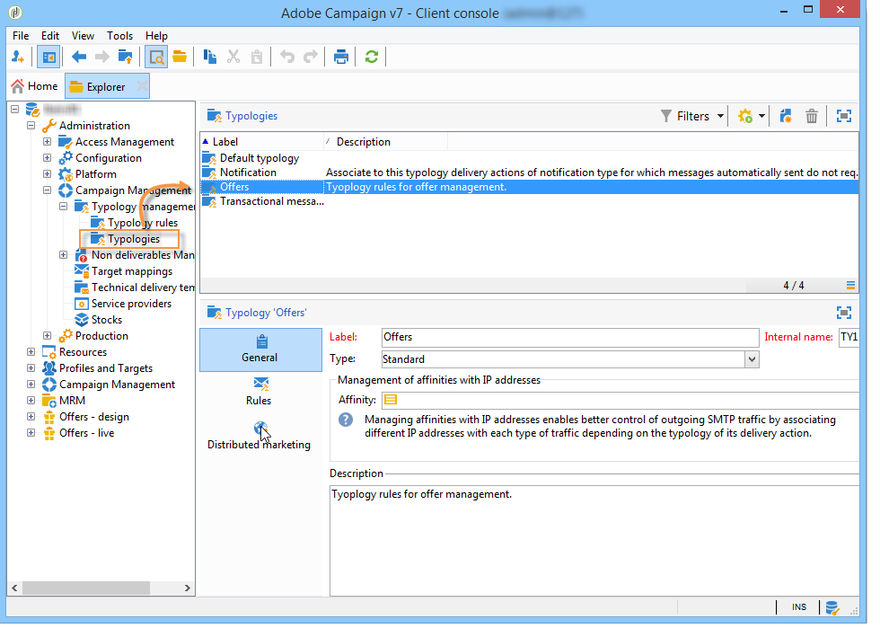
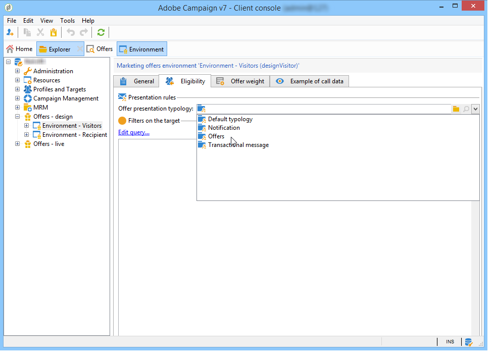
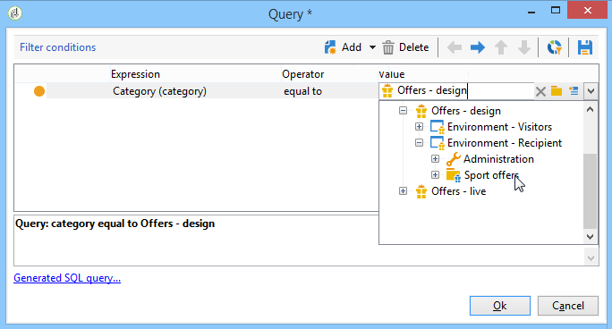
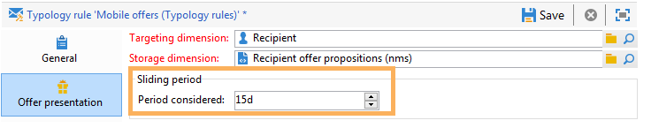

# 管理優惠方案簡報{#managing-offer-presentation}

## 演示規則概述{#presentation-rules-overview}

交互功能允許您使用演示規則控制優惠方案的流程。 這些是「互動」專屬的規則是類型規則。 它們可讓您根據已向收件者提出的主張的歷史，排除優惠方案。 環境會參考這些參數

## 建立和參考優惠方案簡報規則{#creating-and-referencing-an-offer-presentation-rule}

1. 前往&#x200B;**[!UICONTROL Administration]** > **[!UICONTROL Campaign management]** > **[!UICONTROL Typology management]** > **[!UICONTROL Typology rules]**&#x200B;節點。
1. 建立類型規則，並選擇&#x200B;**[!UICONTROL Offer presentation]**&#x200B;類型。

   

1. 指定應套用規則的管道。

   

1. 設定規則的應用程式條件。 有關詳細資訊，請參閱[演示規則設定](#presentation-rule-settings)。
1. 前往&#x200B;**[!UICONTROL Administration]** > **[!UICONTROL Campaign execution]** > **[!UICONTROL Typology management]** > **[!UICONTROL Typologies]**&#x200B;節點，並建立將所有&#x200B;**[!UICONTROL Offer presentation]**&#x200B;類型規則分組的類型。

   

1. 建立類型後，將游標置於類型規則上，並在您剛建立的類型中將其分組。

   

1. 在選件環境中，使用下拉式清單參考類型。

   

## 演示規則設定{#presentation-rule-settings}

### 應用程式標準{#application-criteria-}

**[!UICONTROL General]**&#x200B;索引標籤中可用的應用程式條件可讓您指定要套用簡報規則的選件。 若要這麼做，您需要建立查詢並選擇相關選件，如下所述。

1. 在類型規則中，按一下&#x200B;**[!UICONTROL Edit the rule application conditions...]**&#x200B;連結以建立查詢。

   

1. 在查詢視窗中，您可以對您要套用類型規則的選件套用篩選器。

   例如，您可以選取優惠方案類別。

   

### 選件維度{#offer-dimensions}

在&#x200B;**[!UICONTROL Offer presentation]**&#x200B;標籤中，必須為演示規則指定與環境中配置的維相同的維。

**[!UICONTROL Targeting dimension]**&#x200B;與收件者表重合(預設為：nms:recipients)，將接收優惠方案。 **[!UICONTROL Storage dimension]**&#x200B;與包含連結到目標維的主張歷史記錄（預設情況下：nms:postitionRcp）的表一致。

>[!NOTE]
>
>您也可以使用非標準表格。 如果您想使用特定目標維度，則需要使用目標對應來建立表格和專用環境。 如需詳細資訊，請參閱[建立優惠方案環境](../../interaction/using/live-design-environments.md#creating-an-offer-environment)。

### 時段 {#period}

這是從優惠方案展示日期開始的滑動期間。 它為優惠方案的有效性設定了時限。 該規則不適用於在此期間之後提出的建議。

期間從主張日期前的&#x200B;**n**&#x200B;天開始，並在之後的&#x200B;**n**&#x200B;天結束，其中&#x200B;**n**&#x200B;與在&#x200B;**[!UICONTROL Period considered]**&#x200B;欄位中輸入的數相對應：

* 若是傳入空間，主張日期即為優惠方案簡報日期。
* 對於出站空間，主張日期是傳送聯絡日期（例如在目標工作流程中輸入的傳送日期）。

使用箭頭可更改天數或直接輸入句點（例如「2d 6h」）。

### 命題數{#number-of-propositions}

可以設定在排除有關報價之前可以提出的最高數量的建議。

使用箭頭更改優惠方案的數量。

## 定義命題和收件人{#defining-propositions-and-recipients}

**[!UICONTROL Propositions to count]**&#x200B;部分允許您指定收件者和主張，如果&#x200B;**[!UICONTROL General]**&#x200B;頁簽中的選件在主張歷史記錄中出現特定次數，則它們將導致排除這些選件。

### 篩選命題{#filtering-propositions}

您可以根據渠道、相關選件或先前分配的命題的狀態選擇過濾標準以排除命題。

這些條件代表展示規則最常使用的應用程式。 若要使用其他條件，您可以使用&#x200B;**[!UICONTROL Limit propositions...]**&#x200B;連結建立查詢。 有關詳細資訊，請參閱[建立對命題](#creating-a-query-on-propositions)的查詢一節。

* **在通道上篩選**

   **[!UICONTROL On the same channel only]** :可讓您在索引標籤中指定的管道上排除優惠方案 **[!UICONTROL General]** 主張。

   例如，在&#x200B;**[!UICONTROL General]**&#x200B;索引標籤中為規則指定的通道是電子郵件。 如果規則套用的選件到目前為止僅在Web通道上提供，互動引擎可以在電子郵件傳送中呈現選件。 不過，一旦電子郵件呈現優惠方案後，互動引擎就會選擇不同的管道來呈現優惠方案。

   >[!NOTE]
   >
   >我們討論的是通道，而不是空間。 如果規則必須排除Web頻道上的優惠方案，則網站上不會顯示以兩個空格（例如橫幅和頁面內文）呈現的優惠方案（如果之前已經呈現過）。
   >
   >對於與優惠方案簡報相關的工作流程，只有在&#x200B;**[!UICONTROL All channels]**&#x200B;上設定規則時，才會正確考慮這些規則。

* **篩選選件**

   此篩選器可讓您限制要計算特定優惠方案集的優惠方案主張。

   **[!UICONTROL All offers]** :預設值。不會套用任何篩選器至選件。

   **[!UICONTROL Offer being presented]** :索引標籤中指定 **[!UICONTROL General]** 的選件若已呈現，則會排除。

   **[!UICONTROL Offers from the same category]** :如果已顯示來自相同類別的選件，則會排除選件。

   **[!UICONTROL The offers which the rule applies to]** :在索引標籤中定義數個 **[!UICONTROL General]** 優惠方案時，會考量這組優惠方案中的每個優惠方案主張，並在達到主張臨界值時，結束為排除所有優惠方案。

   例如，選件2、3和5是在&#x200B;**[!UICONTROL General]**&#x200B;索引標籤中定義。 建議的最大數量設定為2。 如果選件2和5各呈現一次，則計算的命題數為2。 因此，將不會顯示選件3。

* **依主張狀態篩選**

   此篩選器可讓您為要在主張歷程記錄中考慮的優惠方案主張選擇最頻繁的狀態。

   **[!UICONTROL Regardless of the proposition status]** :預設值。沒有對命題狀態應用任何篩選器。

   **[!UICONTROL Accepted or rejected propositions]** :可讓您排除先前呈現且已接受或拒絕的選件。

   **[!UICONTROL Accepted propositions]** :可讓您排除先前呈現且已接受的選件。

   **[!UICONTROL Rejected propositions]** :可讓您排除先前呈現且遭拒絕的選件。

### 定義收件者{#defining-recipients}

若要指定收件者，請按一下&#x200B;**[!UICONTROL Edit the query from the targeting dimension...]**&#x200B;連結並選取規則所關注的收件者。

### 建立對命題{#creating-a-query-on-propositions}的查詢

要指定要通過查詢計算的主張，請按一下&#x200B;**[!UICONTROL Limit propositions...]**&#x200B;連結並指定要考慮的標準。

在以下示例中，在兩次演示之後要計算的命題是&#x200B;**特殊優惠方案**&#x200B;類別中&#x200B;**呼叫中心**&#x200B;空間的主題，其權重小於&#x200B;**20**。

