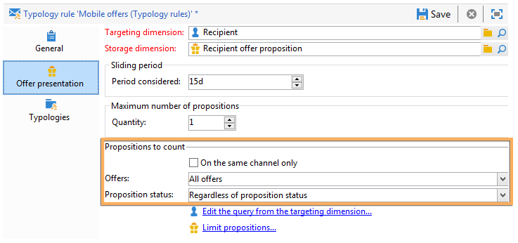

# 管理優惠方案簡報{#managing-offer-presentation}

## 簡報規則概觀 {#presentation-rules-overview}

互動可讓您使用簡報規則控制優惠方案主張的流程。 這些專屬於互動的規則是型別規則。 它們可讓您根據已傳送給收件者的建議歷史記錄排除優惠。 它們會在環境中參照

## 建立和參考優惠方案簡報規則 {#creating-and-referencing-an-offer-presentation-rule}

1. 前往 **[!UICONTROL Administration]** > **[!UICONTROL Campaign management]** > **[!UICONTROL Typology management]** > **[!UICONTROL Typology rules]** 節點。
1. 建立型別規則，然後選擇 **[!UICONTROL Offer presentation]** 型別。

   

1. 指定應套用規則的管道。

   

1. 設定規則的應用程式條件。 有關詳細資訊，請參閱 [簡報規則設定](#presentation-rule-settings).
1. 前往 **[!UICONTROL Administration]** > **[!UICONTROL Campaign execution]** > **[!UICONTROL Typology management]** > **[!UICONTROL Typologies]** 節點，並建立將全部群組的型別 **[!UICONTROL Offer presentation]** 輸入規則。

   

1. 建立型別後，將游標置於型別規則上，並將其群組至您剛建立的型別。

   

1. 在您的優惠方案環境中，使用下拉式清單來參考型別。

   

## 簡報規則設定 {#presentation-rule-settings}

### 應用程式條件 {#application-criteria-}

中可用的應用程式條件 **[!UICONTROL General]** 索引標籤可讓您指定簡報規則將套用的優惠方案。 為此，您需要建立查詢並選擇相關選件，如下所述。

1. 在型別規則中，按一下 **[!UICONTROL Edit the rule application conditions...]** 連結以建立您的查詢。

   

1. 在查詢視窗中，您可以對要套用型別規則的選件套用篩選。

   例如，您可以選取優惠方案類別。

   

### 優惠方案維度 {#offer-dimensions}

在 **[!UICONTROL Offer presentation]** 標籤，您必須為簡報規則指定與環境中設定的相同維度。

此 **[!UICONTROL Targeting dimension]** 與收件者表格一致(預設： `nms:recipients`)將收到優惠方案主張的使用者。 此 **[!UICONTROL Storage dimension]** 與包含連結至目標維度的主張歷程記錄的表格一致(依預設： `nms:propositionRcp`)。

>[!NOTE]
>
>您也可以使用非標準表格。 如果您想要使用特定目標維度，您將需要使用目標對應建立表格以及專用環境。 有關詳細資訊，請參閱 [建立優惠方案環境](../../interaction/using/live-design-environments.md#creating-an-offer-environment).

### 期間 {#period}

這是從優惠方案呈現日期開始的滑動期間。 它設定優惠方案主張有效性的時間限制。 此規則不適用於在此期間以外提出的優惠方案主張。

期間開始 **n** 主張日期和結束日期前的天數 **n** 幾天後，其中 **n** 對應至 **[!UICONTROL Period considered]** 欄位：

* 對於傳入空間，主張日期是優惠方案展示日期。
* 對於傳出空間，主張日期是傳送聯絡日期（例如在目標定位工作流程中輸入的傳送日期）。

使用箭頭變更天數或直接輸入期間（例如「2d 6h」）。

### 主張數量 {#number-of-propositions}

可以在排除相關優惠方案之前設定可提出的最大建議數量。

使用箭頭來變更優惠方案主張的數量。

## 定義主張和收件者 {#defining-propositions-and-recipients}

此 **[!UICONTROL Propositions to count]** 區段可讓您同時指定收件者和主張，這將導致排除中定義的優惠。 **[!UICONTROL General]** 標籤（如果這些事件在主張歷史記錄中出現特定次數）。

### 篩選主張 {#filtering-propositions}

您可以選取篩選條件，以根據頻道、相關優惠或先前指派主張的狀態來排除主張。

這些條件代表簡報規則最常使用的應用程式。 若要使用其他條件，您可以使用 **[!UICONTROL Limit propositions...]** 連結。 有關詳細資訊，請參閱 [建立主張的查詢](#creating-a-query-on-propositions) 區段。

* **在頻道上篩選**

  **[!UICONTROL On the same channel only]** ：可讓您在「 」中指定的頻道上排除優惠方案主張。 **[!UICONTROL General]** 標籤。

  例如，在中為規則指定的管道 **[!UICONTROL General]** 索引標籤是電子郵件。 如果規則套用的優惠方案目前僅在Web channel上提供，則互動引擎可以在電子郵件傳遞中顯示優惠方案。 不過，一旦以電子郵件呈現優惠方案後，互動引擎就會選擇不同的頻道來呈現優惠方案。

  >[!NOTE]
  >
  >我們談論的是頻道而非空間。 如果規則必須排除Web Channel上的優惠方案，則原本會以兩個空格顯示在網站上的優惠方案（例如在橫幅和頁面內文中），如果優惠方案之前已經顯示，則不會在網站上顯示。
  >
  >對於涉及優惠方案呈現的工作流程，只有在設定規則時，才會正確考量規則。 **[!UICONTROL All channels]**.

* **在選件上篩選**

  此篩選器可讓您將要計算的優惠方案主張限製為特定優惠方案集。

  **[!UICONTROL All offers]** ：預設值。 沒有篩選器套用至選件。

  **[!UICONTROL Offer being presented]** ：中指定的選件 **[!UICONTROL General]** 索引標籤會在其已顯示的情況下排除。

  **[!UICONTROL Offers from the same category]** ：如果已顯示相同類別的優惠方案，則會排除優惠方案。

  **[!UICONTROL The offers which the rule applies to]** ：在中定義數個選件時 **[!UICONTROL General]** 索引標籤中，此優惠方案組中的每個優惠方案主張都會列入考量，並在達到主張臨界值時排除所有優惠方案。

  例如，選件2、3和5定義於 **[!UICONTROL General]** 標籤。 主張的最大數量設為2。 如果選件2和5各自呈現一次，則計算出的主張數量將為2。 因此，我們永遠不會展示選件3。

* **在主張狀態上篩選**

  此篩選器可讓您選擇要在主張歷程記錄中考慮的優惠方案主張的最常見狀態。

  **[!UICONTROL Regardless of the proposition status]** ：預設值。 主張狀態未套用任何篩選器。

  **[!UICONTROL Accepted or rejected propositions]** ：可讓您排除先前顯示且已接受或拒絕的優惠。

  **[!UICONTROL Accepted propositions]** ：可讓您排除先前已接受的報價。

  **[!UICONTROL Rejected propositions]** ：可讓您排除先前顯示且已拒絕的優惠。

### 定義收件者 {#defining-recipients}

若要指定收件者，請按一下 **[!UICONTROL Edit the query from the targeting dimension...]** 連結並選取規則關注的收件者。

### 建立主張的查詢 {#creating-a-query-on-propositions}

若要指定透過查詢計算的建議，請按一下 **[!UICONTROL Limit propositions...]** 連結並指定要考慮的條件。

在以下範例中，兩個簡報之後要計算的主張是 **特別優惠** 類別，針對 **呼叫中心** 間距，重量如下 **20**.

