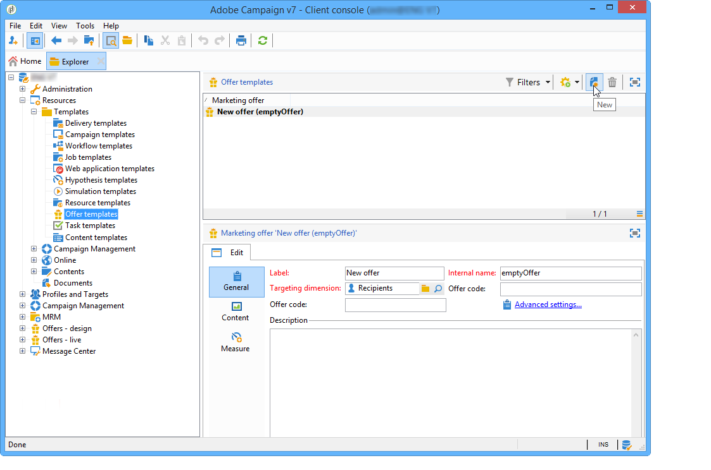

# 管理優惠方案範本{#managing-offer-templates}

Adobe Campaign中提供立即可用的優惠方案範本。 您可以在建立優惠方案、複製優惠方案或調整其設定以符合您的需求後，使用這些優惠方案。 您也可以建立自己的範本。 範本選件儲存在資料夾中 **資源** > **範本** > **優惠方案範本**.

## 建立優惠方案範本 {#creating-an-offer-template}

若要建立範本選件，請遵循下列步驟：

1. 前往 **資源** > **範本** > **優惠方案範本**.
1. 按一下 **新增** 圖示。

   

1. 套用與一般優惠方案相同的程式來設定範本，然後按一下以儲存範本 **儲存**.

## 複製現有範本 {#duplicate-an-existing-template}

若要複製優惠方案範本（無論是否為現成可用），請執行以下步驟：

1. 前往 **資源>範本>優惠方案範本**.
1. 使用滑鼠，以滑鼠右鍵按一下要複製的範本並選取 **複製** 從下拉式功能表。

   

1. 如有必要，請設定您希望範本中顯示的設定，然後按一下以儲存範本 **儲存**.

建立優惠方案時，現在會提供此範本。

